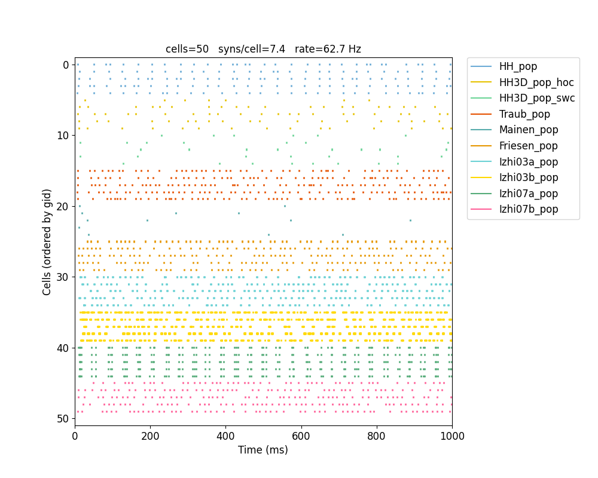
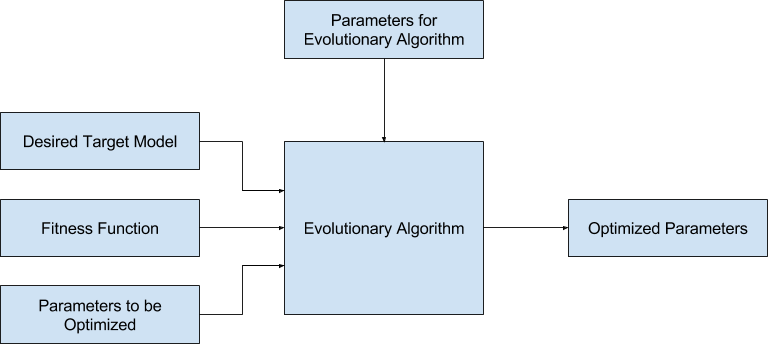

Advanced Features
=======================================

.. _importing_cells:

Importing externally-defined cell models
---------------------------------------

NetPyNE provides support for internally defining cell properties of for example Hodgkin-Huxley type cells with one or multiple compartments, or Izhikevich type cells (eg. see :ref:`tutorial`). However, it is also possible to import previously defined cells in external files eg. in hoc cell templates, or cell classes, using the ``importCellParams()`` method. This method will convert all the cell information into the required NetPyNE format. This way it is possible to make use of cells which have been implemented separately.

The ``cellRule = netParams.importCellParams(label, conds, fileName, cellName, cellArgs={}, importSynMechs=False)`` method takes as arguments the label of the new cell rule, the name of the file where the cell is defined (either .py or .hoc files), and the name of the cell template (hoc) or class (python). Optionally, a set of arguments can be passed to the cell template/class (eg. ``{'type': 'RS'}``). If you wish to import the synaptic mechanisms parameters, you can set the ``importSynMechs=True``. The method returns the new cell rule so that it can be further modified.

NetPyNE contains NO built-in information about any of the cell models being imported. Importing is based on temporarily instantiating the external cell model and reading all the required information (geometry, topology, distributed mechanisms, point processes, etc.).

Below we show example of importing 10 different cell models from external files. For each one we provide the required files as well as the NetPyNE code. Make sure you run ``nrnivmodl`` to compile the mod files for each example. The list of example cell models is:

* :ref:`import_HH`
* :ref:`import_HH3D_hoc`
* :ref:`import_HH3D_swc`
* :ref:`import_Traub`
* :ref:`import_Mainen`
* :ref:`import_Friesen`
* :ref:`import_Izhi03a`
* :ref:`import_Izhi03b`
* :ref:`import_Izhi07a`
* :ref:`import_Izhi07b`

Additionally, we provide an example NetPyNE file (:download:`tut_import.py <code/tut_import.py>`) which imports all 10 cell models, creates a population of each type, provides background inputs, and randomly connects all cells. To run the example you also need to download all the files where cells models are defined and the mod files (see below). The resulting raster is shown below:

.. _import_HH:

Hodgkin-Huxley model
^^^^^^^^^^^^^^^^^^^^

*Description:* A 2-compartment (soma and dendrite) cell with ``hh`` and ``pas`` mechanisms, and synaptic mechanisms. Defined as a Python class.

*Required files:*
:download:`HHCellFile.py <code/HHCellFile.py>`

*NetPyNE Code* ::

	netParams.importCellParams(
		label='PYR_HH_rule', 
		conds={'cellType': 'PYR', 'cellModel': 'HH'},
		fileName='HHCellFile.py', 
		cellName='HHCellClass', 
		importSynMechs=True)

.. _import_HH3D_hoc:

Hodgkin-Huxley model with 3D geometry (from .hoc)
^^^^^^^^^^^^^^^^^^^^^^^^^^^^^^^^^^^^^^^^^^^^^^^^^

*Description:* A multi-compartment cell. Defined as a HOC cell template. Only the cell geometry is included. Example of importing only geometry, and then adding biophysics (``hh`` and ``pas`` channels) from NetPyNE.

*Required files:*
:download:`geom.hoc <code/geom.hoc>`

*NetPyNE Code:* ::

	cellRule = netParams.importCellParams(
		label='PYR_HH3D_hoc', 
		conds={'cellType': 'PYR', 'cellModel': 'HH3D'}, 
		fileName='geom.hoc', 
		cellName='E21', 
		importSynMechs=False)
	
	cellRule['secs']['soma']['mechs']['hh'] = {'gnabar': 0.12, 'gkbar': 0.036, 'gl': 0.003, 'el': -70} # soma hh mechanism
	
	for secName in cellRule['secs']:
	 	cellRule['secs'][secName]['mechs']['pas'] = {'g': 0.0000357, 'e': -70}
	 	cellRule['secs'][secName]['geom']['cm'] = 1

.. _import_HH3D_swc:

Hodgkin-Huxley model with 3D geometry (from .swc)
^^^^^^^^^^^^^^^^^^^^^^^^^^^^^^^^^^^^^^^^^^^^^^^^^

*Description:* A multi-compartment cell, with imported morphology from an SWC file. Only the cell geometry is included. Example of importing only geometry, and then adding biophysics (``hh`` and ``pas`` channels) from NetPyNE.

Importing a morphology into NetPyNE from an SWC file is simple, but NetPyNE does no testing or validation of morphologies, so you should ensure your morphology file is accurate and valid before using it in NetPyNE.

*Required files:*
:download:`BS0284.swc <code/BS0284.swc>`

*NetPyNE Code:* ::

	cellRule = netParams.importCellParams(
		label='PYR_HH3D_swc', 
		conds={'cellType': 'PYR', 'cellModel': 'HH3D'}, 
		fileName='BS0284.swc', 
		cellName='swc_cell')
	
	netParams.renameCellParamsSec('PYR_HH3D_swc_rule', 'soma_0', 'soma')  # rename imported section 'soma_0' to 'soma'
	
	for secName in cellRule['secs']:
	 	cellRule['secs'][secName]['mechs']['pas'] = {'g': 0.0000357, 'e': -70}
	 	cellRule['secs'][secName]['geom']['cm'] = 1
	 	if secName.startswith('soma'):
			cellRule['secs'][secName]['mechs']['hh'] = {'gnabar': 0.12, 'gkbar': 0.036, 'gl': 0.003, 'el': -70}

.. _import_Traub:

Traub model
^^^^^^^^^^^^

*Description:* Traub cell model defined as hoc cell template. Requires multiple mechanisms defined in mod files. Downloaded from ModelDB and modified to remove calls to figure plotting and others. The ``km`` mechanism was renamed ``km2`` to avoid collision with a different ``km`` mechanism required for the Traub cell model. Synapse added from NetPyNE.

ModelDB link: http://senselab.med.yale.edu/ModelDB/showmodel.cshtml?model=20756

*Required files:*
:download:`pyr3_traub.hoc <code/pyr3_traub.hoc>`,
:download:`ar.mod <code/mod/ar.mod>`,
:download:`cad.mod <code/mod/cad.mod>`,
:download:`cal.mod <code/mod/cal.mod>`,
:download:`cat.mod <code/mod/cat.mod>`,
:download:`k2.mod <code/mod/k2.mod>`,
:download:`ka.mod <code/mod/ka.mod>`,
:download:`kahp.mod <code/mod/kahp.mod>`,
:download:`kc.mod <code/mod/kc.mod>`,
:download:`kdr.mod <code/mod/kdr.mod>`,
:download:`km2.mod <code/mod/km2.mod>`,
:download:`naf.mod <code/mod/naf.mod>`,
:download:`nap.mod <code/mod/nap.mod>`

*NetPyNE Code:* ::

	cellRule = netParams.importCellParams(
		label='PYR_Traub_rule', 
		conds= {'cellType': 'PYR', 'cellModel': 'Traub'}, 
		fileName='pyr3_traub.hoc', 
		cellName='pyr3')
	
	somaSec = cellRule['secLists']['Soma'][0] 
	
	cellRule['secs'][somaSec]['spikeGenLoc'] = 0.5

.. _import_Mainen:

Mainen model
^^^^^^^^^^^^

*Description:* Mainen cell model defined as python class. Requires multiple mechanisms defined in mod files. Adapted to python from hoc ModelDB version. Synapse added from NetPyNE.

ModelDB link: http://senselab.med.yale.edu/ModelDB/showModel.cshtml?model=2488 (old hoc version)

*Required files:*
:download:`mainen.py <code/mainen.py>`,
:download:`cadad.mod <code/mod/cadad.mod>`,
:download:`kca.mod <code/mod/kca.mod>`,
:download:`km.mod <code/mod/km.mod>`,
:download:`kv.mod <code/mod/kv.mod>`,
:download:`naz.mod <code/mod/naz.mod>`,
:download:`Nca.mod <code/mod/Nca.mod>`

*NetPyNE Code:* ::

	netParams.importCellParams(
		label='PYR_Mainen_rule', 
		conds={'cellType': 'PYR', 'cellModel': 'Mainen'}, 
		fileName='mainen.py', 
		cellName='PYR2')

.. _import_Friesen:

Friesen model 
^^^^^^^^^^^^^^

*Required files:* Friesen cell model defined as python class. Requires multiple mechanisms (including point processes) defined in mod files. Spike generation happens at the ``axon`` section (not the ``soma``). This is indicated in NetPyNE adding the ``spikeGenLoc`` item to the ``axon`` section entry, and specifying the section location (eg. 0.5).

*Required files:*
:download:`friesen.py <code/friesen.py>`,
:download:`A.mod <code/mod/A.mod>`,
:download:`GABAa.mod <code/mod/GABAa.mod>`,
:download:`AMPA.mod <code/mod/AMPA.mod>`,
:download:`NMDA.mod <code/mod/NMDA.mod>`,
:download:`OFThpo.mod <code/mod/OFThpo.mod>`,
:download:`OFThresh.mod <code/mod/OFThresh.mod>`,
:download:`netcon.inc <code/netcon.inc>`,
:download:`ofc.inc <code/mod/ofc.inc>`

*NetPyNE Code:* ::

	cellRule = netParams.importCellParams(
		label='PYR_Friesen_rule', 
		conds={'cellType': 'PYR', 'cellModel': 'Friesen'}, 
		fileName='friesen.py', 
		cellName='MakeRSFCELL')
	
	cellRule['secs']['axon']['spikeGenLoc'] = 0.5  # spike generator location.

.. _import_Izhi03a:

Izhikevich 2003a model (independent voltage variable)
^^^^^^^^^^^^^^^^^^^^^^^^^^^^^^^^^^^^^^^^^^^^^^^^^^^^^^

*Description:* Izhikevich, 2003 cell model defined as python class. Requires point process defined in mod file. This version is added to a section but does not employ the section voltage or synaptic mechanisms. Instead it uses its own internal voltage variable and synaptic mechanism. This is indicated in NetPyNE adding the ``vref`` item to the point process entry, and specifying the name of the internal voltage variable (``V``).

Modeldb link: https://senselab.med.yale.edu/modeldb/showModel.cshtml?model=39948

*Required files:*
:download:`izhi2003Wrapper.py <code/izhi2003Wrapper.py>`,
:download:`izhi2003a.mod <code/mod/izhi2003a.mod>`

*NetPyNE Code:* ::

	cellRule = netParams.importCellParams(
		label='PYR_Izhi03a_rule', 
		conds={'cellType': 'PYR', 'cellModel':'Izhi2003a'},
		fileName='izhi2003Wrapper.py', 
		cellName='IzhiCell',  
		cellArgs={'type':'tonic spiking', 'host':'dummy'})

	cellRule['secs']['soma']['pointps']['Izhi2003a_0']['vref'] = 'V' # specify that uses its own voltage V

.. _import_Izhi03b:

Izhikevich 2003b model (uses section voltage)
^^^^^^^^^^^^^^^^^^^^^^^^^^^^^^^^^^^^^^^^^^^^^^

*Description:* Izhikevich, 2003 cell model defined as python class. Requires point process defined in mod file. This version is added to a section and shares the section voltage and synaptic mechanisms. A synaptic mechanism is added from NetPyNE during the connection phase.

Modeldb link: https://senselab.med.yale.edu/modeldb/showModel.cshtml?model=39948

*Required files:*
:download:`izhi2003Wrapper.py <code/izhi2003Wrapper.py>`,
:download:`izhi2003b.mod <code/mod/izhi2003b.mod>`

*NetPyNE Code:* ::

	netParams.importCellParams(
		label='PYR_Izhi03b_rule', 
		conds={'cellType': 'PYR', 'cellModel':'Izhi2003b'},
		fileName='izhi2003Wrapper.py', 
		cellName='IzhiCell',  
		cellArgs={'type':'tonic spiking'})

.. _import_Izhi07a:

Izhikevich 2007a model (independent voltage variable)
^^^^^^^^^^^^^^^^^^^^^^^^^^^^^^^^^^^^^^^^^^^^^^^^^^^^^

*Description:* Izhikevich, 2007 cell model defined as python clas. Requires point process defined in mod file. This version is added to a section but does not employ the section voltage or synaptic mechanisms. Instead it uses its own internal voltage variable and synaptic mechanism. This is indicated in NetPyNE adding the ``vref`` item to the point process entry, and specifying the name of the internal voltage variable (``V``). The cell model includes several internal synaptic mechanisms, which can be specified as a list in NetPyNE by adding the ``synList`` item to the point process entry.

Modeldb link: https://senselab.med.yale.edu/modeldb/showModel.cshtml?model=39948

*Required files:*
:download:`izhi2007Wrapper.py <code/izhi2007Wrapper.py>`,
:download:`izhi2007a.mod <code/mod/izhi2007a.mod>`

*NetPyNE Code:* ::

	cellRule = netParams.importCellParams(
		label='PYR_Izhi07a_rule', 
		conds={'cellType': 'PYR', 'cellModel':'Izhi2007a'}, 
		fileName='izhi2007Wrapper.py', 
		cellName='IzhiCell',  
		cellArgs={'type':'RS', 'host':'dummy'})
	
	cellRule['secs']['soma']['pointps']['Izhi2007a_0']['vref'] = 'V' # specify that uses its own voltage V
	
	cellRule['secs']['soma']['pointps']['Izhi2007a_0']['synList'] = ['AMPA', 'NMDA', 'GABAA', 'GABAB']  # specify its own synapses

.. _import_Izhi07b:

Izhikevich 2007b model (uses section voltage)
^^^^^^^^^^^^^^^^^^^^^^^^^^^^^^^^^^^^^^^^^^^^^^

*Description:* Izhikevich, 2007 cell model defined as python class. Requires point process defined in mod file. This version is added to a section and shares the section voltage and synaptic mechanisms. 

Modeldb link: https://senselab.med.yale.edu/modeldb/showModel.cshtml?model=39948

*Required files:*
:download:`izhi2007Wrapper.py <code/izhi2007Wrapper.py>`,
:download:`izhi2007b.mod <code/mod/izhi2007b.mod>`

*NetPyNE Code:* ::

	netParams.importCellParams(
		label='PYR_Izhi07b_rule', 
		conds={'cellType': 'PYR', 'cellModel':'Izhi2007b'},
		fileName='izhi2007Wrapper.py', 
		cellName='IzhiCell',  
		cellArgs={'type':'RS'})

The full code to import all cell models above and create a network with them is available here: :download:`tut_import.py <code/tut_import.py>`.

Parameter Optimization of a Simple Neural Network Using An Evolutionary Algorithm
---------------------------------------------------------------------------------

This tutorial provides an example of how to use
\ `inspyred <https://www.google.com/url?q=https://pypi.python.org/pypi/inspyred&sa=D&ust=1498757041054000&usg=AFQjCNFsnbnVRsDVjaPnkPZvpkGEUhvqmA>`__\ ,
an evolutionary algorithm toolkit, to optimize parameters in our prior
\ `tut2.py <https://www.google.com/url?q=http://www.neurosimlab.org/netpyne/tutorial.html?highlight%3Dtut2%23network-parameters-tutorial-2&sa=D&ust=1498757041054000&usg=AFQjCNHhqESFuColxjg-1qT_Y_qvNbOISg>`__\ \*\*
neural network--modified to remove any code relating to initiating
network simulation and output display--, such that it achieves a target
average firing rate around (~) 17 Hz.

\*\*Some modification is required near the end of the tut2.py code, to
remove any code relating to initiating network simulation and output
display, all of which has now been handled in the new top level code
(:download:`tut_optimization.py <code/tut_optimization.py>`):

.. code-block:: python

  # Create network and run simulation
  # sim.createSimulateAnalyze(netParams = netParams, simConfig = simConfig)   # line commented out

  # import pylab; pylab.show()  # if figures appear empty   # line commented out

excerpt from tut2.py

Additional Background Reading
^^^^^^^^^^^^^^^^^^^^^^^^^^^^^^
`A description of the
algorithm <https://www.google.com/url?q=https://en.wikipedia.org/wiki/Evolutionary_algorithm&sa=D&ust=1498757041056000&usg=AFQjCNH6OIVTnmce_hlIexUok_PoJcZomA>`__\  methodology
that will be used to optimize the simple neural network in this example.

Introduction
^^^^^^^^^^^^^
Using the inspyred python package to find neural network parameters so
that some property of the network (e.g. firing rate) matches a desired
target can be broken down into 3 steps. First, 1) defining a desired
target model (in this case, some measurable value) and fitness
function--fitness defined here as a calculable value that represents how
close a neural network with a given parameters matches the target.
Subsequently, it is necessary to 2) determine the appropriate neural
network parameters to modify to achieve that model/value. Finally,
3) appropriate parameters for the evolutionary algorithm are defined.
Ultimately, If the inputs to the evolutionary algorithm are appropriate,
then over successive iterations, the parameters determined by the
evolutionary algorithm should generate models closer to the target.

Particularizing these 3 steps to our example we get:

1. Defining a desired target model and fitness function.

Defining a desired target model is largely arbitrary, some constraints
being that there must be a way to adjust parameters such that the
results are closer to the target model than before (or that fitness is
improved), and that there must be a way to evaluate the fitness of a
model with given parameters. In this case, our target model is a neural
network that achieves an average firing rate of 17 Hz. The fitness for
such a model can be defined as the difference between the average firing
rate of a certain model and the target firing rate of 17 Hz.

2. Selecting the model parameters to be optimized.

If a parameter can in some way alter the fitness of the final model, it
may be an appropriate candidate for optimization, depending on what the
model is seeking to achieve. As well as a host of other parameters,
altering the probability, weight or delay of the synaptic connections in
the neural network can affect the average firing rate. In this example,
we will optimize the values of the probability, weight and delay of
connections from the sensory to the motor population.

3. Selecting appropriate parameters for the evolutionary algorithm.

inspyred allows customization of the various components of the
evolutionary algorithm, including:

-   a selector that determines which sets of parameter values become
   parents and thus which parameter values will be used to form the next
   generation in the evolutionary iteration,
-  a variator that determines how each current iteration of parameter
   sets is formed from the previous iteration,
-  a replacer which determines whether previous sets of parameter values
   are brought into the next iteration,
-  a terminator which defines when to end evolutionary iterations,
-  an observer which allows for tracking of parameter values through
   each evolutionary iteration.

        

Using inspyred
^^^^^^^^^^^^^^^^^^^^^^^^^^^^^^^^^
The evolutionary algorithm is implemented the ec module from the
inspyred package:

.. code-block:: python

  from inspyred import ec # import evolutionary computation from inspyred

excerpt from tut\_optimization.py

ec includes a class for the evolutionary computation algorithm:
ec.EvolutionaryComputation(), which allows entering parameters to
customize the algorithm. The evolutionary algorithm involves random
processes (e.g. randomly mutating genes) and so requires random number
generator. In this case we will use python's Random() method, which we
initialize using a specific seed value so that we can reproduce the
results in the future:

.. code-block:: python

  # create random seed for evolutionary computation algorithm
  rand = Random()
  rand.seed(1)

  # instantiate evolutionary computation algorithm
  my_ec = ec.EvolutionaryComputation(rand)

excerpt from tut\_optimization.py

Parameters for the evolutionary algorithm are then established for our
ec evolutionary computation instance by assigning various variator,
replacer, terminator and observer elements--essentially toggling
specific components of the algorithm-- to ec.selectors, ec.variators,
ec.replacers, ec.terminators, ec.observers:

.. code-block:: python

  #toggle variators
  my_ec.variator = [ec.variators.uniform_crossover, # implement uniform crossover & gaussian replacement
                  ec.variators.gaussian_mutation]   
  my_ec.replacer = ec.replacers.generational_replacement   # implement generational replacement

  my_ec.terminator = ec.terminators.evaluation_termination # termination dictated by no. evaluations

  #toggle observers
  my_ec.observer = [ec.observers.stats_observer,  # print evolutionary computation statistics
                  ec.observers.plot_observer,   # plot output of the evolutionary computation as graph
                  ec.observers.best_observer]   # print the best individual in the population to screen

excerpt from ex_optimization.py

where:

+----------------------------------------+--------------------------------------+
| ec.variators.uniform\_crossover        | variator where coin flip to          |
|                                        | determine whether 'mom' or 'dad'     |
|                                        | element is inherited by offspring    |
+----------------------------------------+--------------------------------------+
| ec.variators.gaussian\_mutation        | variator implements gaussian         |
|                                        | mutation which makes use of bounder  |
|                                        | function as specified                |
|                                        | in: my\_ec.evolve(...,bounder=ec.Bou |
|                                        | nder(minParamValues, maxParamValues) |
|                                        | ,...)                                |
|                                        |                                      |
+----------------------------------------+--------------------------------------+
| ec.replacers.generational\_replacement | replacer implements generational     |
|                                        | replacement with elitism (as         |
|                                        | specified in                         |
|                                        | my\_ec.evolve(...,num\_elites=1,...) |
|                                        | ,                                    |
|                                        | where the existing generation is     |
|                                        | replaced by offspring, and           |
|                                        | <num\_elites> existing individuals   |
|                                        | will survive if they have better     |
|                                        | fitness than the offspring           |
+----------------------------------------+--------------------------------------+
| ec.terminators.evaluation\_termination | terminator runs based on the number  |
|                                        | of evaluations that have occurred    |
+----------------------------------------+--------------------------------------+
| ec.observers.stats\_observer           | indicates how many of the generated  |
|                                        | individuals (parameter sets) will be |
|                                        | selected for the next evolutionary   |
|                                        | iteration.                           |
+----------------------------------------+--------------------------------------+
| ec.observers.plot\_observer            | indicates the rate of mutation, or   |
|                                        | the rate at which values for each    |
|                                        | parameter (probability, weight and   |
|                                        | delay) taken from a prior generation |
|                                        | are altered in the next generation   |
+----------------------------------------+--------------------------------------+
| ec.observers.best\_observer            | sets the number of parameters that   |
|                                        | will be optimized to 3,              |
|                                        | corresponding to the length of       |
|                                        | [probability, weight, delay].        |
+----------------------------------------+--------------------------------------+

These predefined selector, variator, replacer, terminator and observer
elements as well as other options can be found in the \ `inspyred
documentation <https://www.google.com/url?q=http://pythonhosted.org/inspyred/reference.html&sa=D&ust=1498757041077000&usg=AFQjCNFBCOo0cPqRvxb64xHSlOOQANVWcw>`__\ .

FInally, the evolutionary computation algorithm instance includes a
method: my\_ec.evolve() , which will move through successive
evolutionary iterations evaluating different parameter sets until the
terminating condition is achieved. This function comes with multiple
arguments, with two significant arguments being the generator and
evaluator functions. A function call for  my\_ec.evolve() will look
similar to the following:

.. code-block:: python

  # call evolution iterator

  final_pop = my_ec.evolve(generator=generate_netparams, # assign model parameter generator to iterator generator
                        evaluator=evaluate_netparams, # assign fitness function to iterator evaluator
                        pop_size=10,
                        maximize=False,                   
                        bounder=ec.Bounder(minParamValues, maxParamValues),
                        max_evaluations=50,
                        num_selected=10,
                        mutation_rate=0.2,
                        num_inputs=3,
                        num_elites=1)

excerpt from tut\_optimization.py

where:

+--------------------------------------+--------------------------------------+
| pop\_size=10                         | means that each generation of        |
|                                      | parameter sets will consist of 10    |
|                                      | individuals                          |
+--------------------------------------+--------------------------------------+
| maximize=False                       | means that we are taking higher      |
|                                      | fitness to correspond to minimal     |
|                                      | values in terms of difference        |
|                                      | between model firing frequency and   |
|                                      | 17 Hz                                |
+--------------------------------------+--------------------------------------+
| bounder=ec.Bounder(minParamValues,   | defines boundaries for each of the   |
|                    maxParamValues)   | parameters. The format to describe   |
|                                      | the minimum and maximum values for   |
|                                      | the parameters we are seeking to     |
|                                      | optimize: minParamValues is an array |
|                                      | of minimum of values corresponding   |
|                                      | to [probability, weight, delay], and |
|                                      | maxParamValues is the array of       |
|                                      | maximum values.                      |
+--------------------------------------+--------------------------------------+
| max\_evaluations=50                  | indicates how many parameter sets    |
|                                      | are evaluated prior termination of   |
|                                      | the evolutionary iterations          |
+--------------------------------------+--------------------------------------+
| num\_selected=10                     | indicates how many of the generated  |
|                                      | individuals (parameter sets) will be |
|                                      | selected for the next evolutionary   |
|                                      | iteration.                           |
+--------------------------------------+--------------------------------------+
| mutation\_rate=0.2                   | indicates the rate of mutation, or   |
|                                      | the rate at which values for each    |
|                                      | parameter (probability, weight and   |
|                                      | delay) taken from a prior generation |
|                                      | are altered in the next generation   |
+--------------------------------------+--------------------------------------+
| num\_inputs=3                        | sets the number of parameters that   |
|                                      | will be optimized to 3,              |
|                                      | corresponding to the length of       |
|                                      | [probability, weight, delay].        |
+--------------------------------------+--------------------------------------+
| num\_elites=1                        | sets the number of elites to 1. That |
|                                      | is, one individual from the existing |
|                                      | generation may be retained (as       |
|                                      | opposed to a complete generational   |
|                                      | replacement) if it has better        |
|                                      | fitness than an individual selected  |
|                                      | from the offspring.                  |
+--------------------------------------+--------------------------------------+

The generator and evaluator arguments expect user defined functions as
inputs, with generator used to define a population of initial parameter
value sets for the very first iteration, and evaluator being the fitness
function that will be used to evaluate each model for how close it is to
the target. In this example, the generator is a fairly straightforward
function which creates an initial set of parameter values (i.e.
[probability, weight, delay] ) by drawing from a parameterized uniform
distribution:

.. code-block:: python

  # return a set of initialParams which contains a [probability, weight, delay]

  def generate_netparams(random, args):

      size = args.get('num_inputs')
      initialParams = [random.uniform(minParamValues[i], maxParamValues[i]) for i in range(size)]

  return initialParams

excerpt from tut\_optimization.py

The fitness function involves taking a list of sets of parameter values,
i.e. : [ [ a0, b0, c0], [a1, b1, c1], [a2, b2, c2], ... , [an, bn, cn ]
] where a, b, c represent the parameter values and 1 through n
representing the individual number within the population, and
calculating a fitness score for each element of the list, which is then
returned as a list of fitness values (i.e. : [ f0, f1, f2, ... , fn ]
) corresponding to the initial sets of parameter values. It follows the
general template:

.. code-block:: python

  def evaluate_fitness(candidates, args):
     fitness = []
     for candidate in candidates:
         fit = some_fitness_function(candidate)
         fitness.append(fit)
     return fitness

excerpt from tut\_optimization.py

The actual code that is used to serve as    
 some\_fitness\_function(candidate)    is described below:

 

Overview of the Fitness Function
^^^^^^^^^^^^^^^^^^^^^^^^^^^^^^^^^^^^^^^^^^^^^^^^^^^
The fitness function in this case involves 1) creating a neural network
with the given parameters, 2) simulating it to find the average firing
rate, then 3) comparing this firing rate to a target firing rate.

1. Creating a neural network with the parameters to evaluate

We will employ the NetPyNE defined network in tut2.py, and modify
the [probability, weight, delay] parameters. This  involves redefining
specific values found in tut2.py found within the connectivity rule
between the S and M populations:    netParams.connParams['S->M']   

.. code-block:: python

  ## Cell connectivity rules
  netParams.connParams['S->M'] = {      #  S -> M label
        'preConds': {'popLabel': 'S'},  # conditions of presyn cells
        'postConds': {'popLabel': 'M'}, # conditions of postsyn cells
        'probability': 0.5,             # probability of connection <-- to be optimized by evolutionary algorithm
        'weight': 0.01,                 # synaptic weight           <-- to be optimized by evolutionary algorithm
        'delay': 5,                     # transmission delay (ms)   <-- to be optimized by evolutionary algorithm
        'synMech': 'exc'}               # synaptic mechanism

excerpt from tut2.py

these values are replaced in the fitness function with the parameter
values generated by the evolutionary algorithm. As the fitness function
resides within a for loop iterating through the list of candidates (    
for icand,cand in enumerate(candidates):    ), the individual parameters
can be accessed as cand[0], cand[1], and cand[2]. Reassigning values to
the parameters in tut\_optimization.py can be done via the following
line:

.. code-block:: python

  tut2.netParams.connParams['S->M']['<parameter>'] = <value>

2. Simulating the created neural network and finding the average firing
   rate

Once the network parameters have been modified we can call the
sim.createSimulate() NetPyNE function to run the simulation. We will
pass as arguments the tut2 netParams and simConfig objects that we just
modified. Once the simulation has ran we will have access to the
simulation output via sim.simData. 

::

  # create network
  sim.createSimulate(netParams=tut2.netParams, simConfig=tut2.simConfig)

excerpt from tut\_optimization.py

3. Comparing the average firing rate to a target average firing rate

To calculate the average firing rate (in spikes/sec = Hz) of the
network, we divide the spikes that have occurred during the simulation,
by the number of neurons and the duration. A list of spike times and a
list of neurons can be accessed via the NetPyNE sim module:
 sim.simData['spkt'] and   sim.net.cells   . These are populated after
running   sim.createSimulate()  . From these lists, getting the number
of spike times and neurons is done by using python’s   len()   function.
The duration of the simulation can be accessed in the
tut\_optimization.py code  via        tut2.simConfig.duration    .  The
calculation for average firing rate is thus as follows:

.. code-block:: python

  # calculate firing rate
  numSpikes = float(len(sim.simData['spkt']))
  numCells = float(len(sim.net.cells))
  duration = tut2.simConfig.duration/1000.0
  netFiring = numSpikes/numCells/duration

excerpt from tut\_optimization.py

Finally, the average firing rate of the model is compared to the target
firing rate as follows:

.. code-block:: python

  # calculate fitness for this candidate
  fitness = abs(targetFiring - netFiring)  # minimize absolute difference in firing rate

excerpt from tut\_optimization.py

Displaying Findings
^^^^^^^^^^^^^^^^^^^^^^^^^^^^^^^^^^^^^^
The results of the evolutionary algorithm are displayed on the standard
output (terminal) as well as plotted using the matplotlib package. The
following lines are relevant to showing results of the various
candidates within the iterator:

.. code-block:: python

  for icand,cand in enumerate(candidates):
        ...
        print '\n CHILD/CANDIDATE %d: Network with prob:%.2f, weight:%.2f, delay:%.1f \n  firing rate: %.1f, FITNESS = %.2f \n'\
        %(icand, cand[0], cand[1], cand[2], netFiring, fitness)

excerpt from tut\_optimization.py

The first line:  for icand,cand in enumerate(candidates): is analogous
to the the iterator  for candidate in candidates:  used in the
pseudocode example above, except that the  enumerate() function will
also return an index--starting from 0-- for each element in the list,
and is used in the subsequent print statement.

This example also displays the generated candidate with average
frequency closest to 17 Hz. This candidate will exist in the final
generation, and possess the best fitness score (corresponding to a
minimum difference). Since   num\_elites=1   there is no risk that a
prior generation will have a candidate with a better fitness.

After the evolution finishes, to access the candidate with the best
fitness score, the final generation of candidates, which is returned by
the  my\_ec.evolve()   function is then sorted in reverse (least to
greatest), placing the candidate that achieves an average firing rate
closest to 17 Hz (and therefore has the minimum difference) at the start
of the list (or at position 0). We will use NetPyNE to visualize the
output of this network, by setting the optimized parameters, simulating
the network and plotting a raster plot. The code that performs this task
is isolated below:

.. code-block:: python

  final_pop = my_ec.evolve(...)
  ...
  # plot raster of top solutions
  final_pop.sort(reverse=True)         # sort final population so best fitness (minimum difference) is first in list
  bestCand = final_pop[0].candidate   # bestCand <-- candidate in first position of list
  tut2.simConfig.analysis['plotRaster'] = True                      # plotting
  tut2.netParams.connParams['S->M']['probability'] = bestCand[0]    # set tut2 values to corresponding
  tut2.netParams.connParams['S->M']['weight'] = bestCand[1]         # best candidate values
  tut2.netParams.connParams['S->M']['delay'] = bestCand[2]
  sim.createSimulateAnalyze(netParams=tut2.netParams, simConfig=tut2.simConfig) # run simulation

excerpt from tut\_optimization.py

The code for neural network optimization through evolutionary algorithm used in this tutorial can be found here: :download:`tut_optimization.py <code/tut_optimization.py>`.

.. Cell density and connectivity as a function of cell location
.. ------------------------------------------------------------

.. Create population as list of individual cells 
.. ------------------------------------------------
.. (eg. measured experimentally)

.. Adding connectivity functions
.. ------------------------------

.. Adding cell classes
.. --------------------

