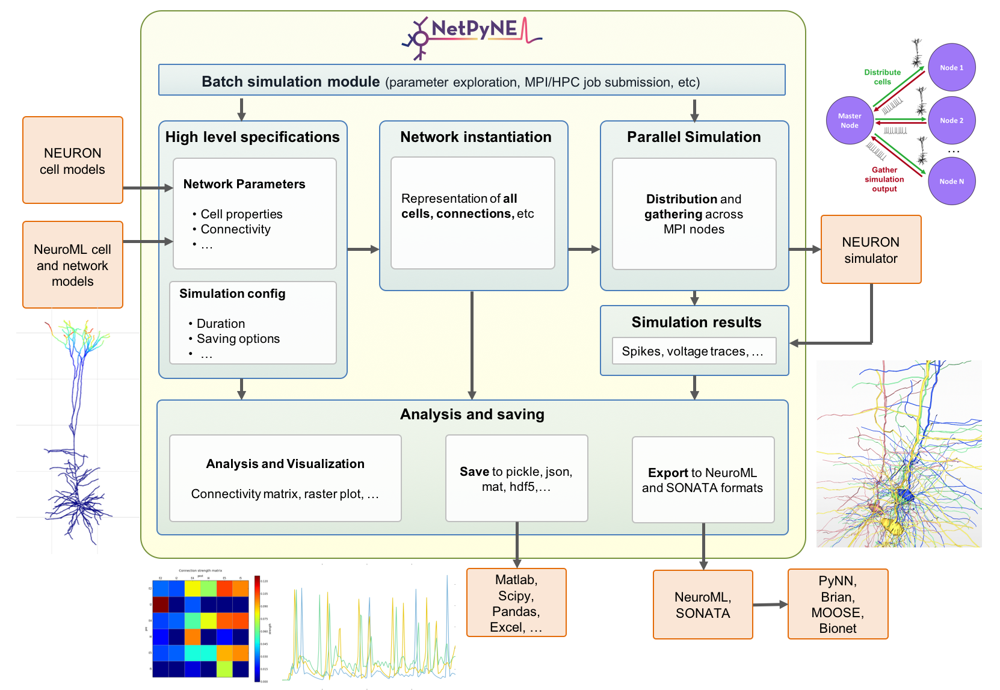

.. NetPyNE documentation master file, created by
   sphinx-quickstart on Tue Dec 29 13:37:18 2015.
   You can adapt this file completely to your liking, but it should at least
   contain the root `toctree` directive.

Welcome to NetPyNE's documentation!
=======================================

NetPyNE is a python package to facilitate the development, parallel simulation and analysis of biological neuronal networks using the NEURON simulator.

We have also released an alpha version of the NetPyNE GUI -- `see video here (open in new tab) <https://www.youtube.com/watch?v=Hck_bLKm7v8>`_! See here `install instructions :ref:`install` and a `step-by-step tutorial <http://bit.ly/netpyne-ui-tut>`_! 

Join our `NetPyNE mailing list <https://groups.google.com/forum/#!forum/netpyne-mailing>`_ to receive updates on version releases and other major announcements.

Table of Contents
------------------

.. toctree::
   :maxdepth: 3
   
   overview
   install
   tutorial
   reference
   advanced

