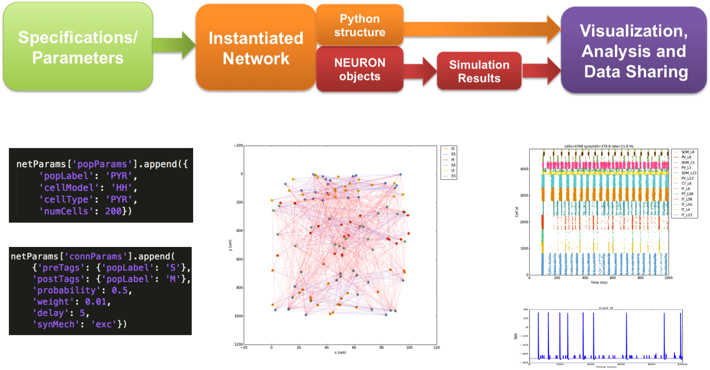

NetPyNE Overview
=======================================

What is NetPyNE?
----------------

NetPyNE (Network development Python package for NEURON) is a python package to facilitate the development, parallel simulation and analysis of biological neuronal networks using the NEURON simulator.
Although NEURON already enables multiscale simulation ranging from the molecular to the network level, NEURON for networks, often requiring parallel simulations, requires substantial programming. NetPyNE greatly facilitates the development and parallel simulation of biological neuronal networks in NEURON for experimentalists.  NetPyNe is also intended for experienced modelers, providing powerful features to incorporate complex anatomical and physiological data into models.

See our recent `poster at the Computational Neuroscience conference CNS16 <http://neurosimlab.org/salvadord/CNS16_poster.pdf>`_ for a nice overview!

What can I do with NetPyNE?
---------------------------

NetPyNE converts a set of high-level specifications into a NEURON model. Specifications are provided in a simple, standardized, declarative Python-based format. The user can define network populations and their properties, including cell type, number or density. For each cell type, the user can define morphology, biophysics and implementation, or choose to import these from existing files (HOC templates or Python classes). Cell models for each population can be easily changed, and several models can be combined to generate efficient hybrid networks, *e.g.,* composed of Hodgkin-Huxley multicompartment cells and Izhikevich point neurons. 

NetPyNE provides a flexible format to specify connectivity, with rules based on pre- and post-synaptic cell properties, such as cell type or location. Multiple connectivity functions are available, including all-to-all, probabilistic, convergent or divergent. Additionally, connectivity parameters (*e.g.,* weight, probability or delay) can be specified as a function of pre/post-synaptic spatial properties. This enables implementation of complex biological patterns, such as delays or connection probabilities that depend on distance between cells, or weights that depend on the post-synaptic neuron’s cortical depth. The subcellular distribution of synapses along the dendrites can be specified, and is automatically adapted to the morphology of each model neuron. Learning mechanisms, including spike-timing dependent plasticity and reinforcement learning, can be readily incorporated.

Using the high-level network specifications, NetPyNE instantiates the full model (all cells and connections) as a hierarchical Python structure including the NEURON objects necessary for simulation. Based on a set of simulation options (*e.g.,* duration, integration step), NetPyNE runs the model in parallel using MPI, eliminating the burdensome task of manually distributing the workload and gathering data across computing nodes. Optionally NetPyNE plots output data, such as spike raster plots, LFP power spectra, connectivity matrix, or intrinsic time-varying variables (*e.g.,* voltage) of any subset of cells. To facilitate data sharing, the package saves and loads the high-level specifications, instantiated network, and simulation results using common file formats (Pickle, Matlab, JSON or HDF5). NetPyNE can convert instantiated networks to and from NeuroML, a standard data format for exchanging models in computational neuroscience.

NetPyNE has been used to develop a variety of multiscale models: primary motor cortex with cortical depth-dependent connectivity; the claustrum; and sensorimotor cortex that learns to control a virtual arm. The package is easily installed via pip, and includes comprehensive online documentation, a step-by-step tutorial and example networks.

Major Features
--------------

* Converts a set of high-level specifications into a NEURON network model. 

* Specifications are provided in a simple, standardized, declarative Python-based format.

* Can easily define:

	* *Populations*: cell type and model, number of neurons or density, spatial extent, ...
	* *Cell properties*: Morphology, biophysics, implementation, ...
	* *Synaptic mechanisms*: Time constants, reversal potential, implementation, ...
	* *Stimulation*: Spike generators, current clamps, spatiotemporal properties, ...
	* *Connectivity rules*: conditions of pre- an post-synaptic cells, different functions, ...
	* *Simulation configuration*: duration, saving and analysis, graphical output, ... 

* Cell properties highlights:

	* Import existing HOC and Python defined cell models into NetPyNE format.
	* Readily change model implementation *e.g.,* from Hodgkin-Huxley multicompartment to Izhikevich point neuron
	* Combine multiple cell models into hybrid networks for efficient large-scale networks.

* Connectivity rules highlights:

	* Flexible connectivity rules based on pre- and post-synaptic cell properties (*e.g.,* cell type or location). 
	* Connectivity functions available: all-to-all, probabilistic, convergent, divergent, and explicit list.  
	* Can specify parameters (*e.g.,* weight, probability or delay) as a function of pre/post-synaptic spatial properties, *e.g.,* delays or probability that depend on distance between cells or cortical depth.
	* Can specify subcellular distribution of synapses along the dendrites, and will be automatically adapted to the morphology of each model neuron. 
	* Can easily add learning mechanisms to synapses, including STDP and reinforcement learning.

* Generates NEURON network instance ready for MPI parallel simulation -- takes care of cell distribution and gathering of data.

* Analysis and plotting of network and simulation output:
	* Raster plot
	* Spike histogram of all cells, populations or single cells
	* Intrinsic cell variables (voltages, currents, conductances) plots
	* Local field potential (LFP) calculation and plots (time-resolved and power spectra)
	* Connectivity matrix at cell or population level (weights, num connections, efficiency, probability, ...)
	* 2D representation of network cell locations and connections

* Facilitates data sharing: 
	* Can save/load high-level specs, network instance, simulation configuration and simulation results.
	* Multiple formats supported: pickle, Matlab, JSON, CSV, HDF5
	* Can export/import to/from NeuroML, the standard format for neural models.

Questions, suggestions and contributions
-----------------------------------------

NetPyNE is currently being developed and supported by the Neurosim lab (http://neurosimlab.org) .

NetPyNE is open source and available at https://github.com/Neurosim-lab/netpyne .

For questions or suggestions please add an Issue to github. 

For contributions (which are more than welcome!) please fork the repository and make a Pull Request with your changes.

For further information please contact salvadordura@gmail.com.

Publications
-------------

About NetPyNE 
^^^^^^^^^^^^^^^^

- Dura-Bernal S, Suter BA, Neymotin SA, Shepherd GMG, Lytton WW. **Modeling the subcellular distribution of synaptic connections in cortical microcircuits.** *Society for Neurosciecne (SFN), 2016*.

- Dura-Bernal S, Suter BA, Neymotin SA, Kerr CC, Quintana A, Gleeson P, Shepherd GMG, Lytton WW. **NetPyNE: a Python package for NEURON to facilitate development and parallel simulation of biological neuronal networks.** *Computational Neuroscience (CNS), 2016.*

- Gleeson P, Marin B, Sadeh S, Quintana A, Cantarelli M, Dura-Bernal S, Lytton WW, Davison A, Silver RA. **A set of curated cortical models at multiple scales on Open Source Brain.** *Computational Neuroscience (CNS), 2016*.

- Dura-Bernal S, Suter BA, Neymotin SA, Quintana AJ, Gleeson P, Shepherd GMG, Lytton WW. **Normalized cortical depth (NCD) as a primary coordinate system for cell connectivity in cortex: experiment and model.** *Society for Neuroscience (SFN), 2015.*

Using NetPyNE
^^^^^^^^^^^^^^^^^^

- Lytton WW, Seidenstein AH, Dura-Bernal S, McDougal RA, Schurmann F, Hines ML. **Simulation neurotechnologies for advancing brain research: Parallelizing large networks in NEURON.** *Neural Computation, 2016.*

- Dura-Bernal S, Menzies RS, McLauchlan C, van Albada SJ, Kedziora DJ, Neymotin SA, Lytton WW, Kerr CC. **Effect of network size on computational capacity.** *Computational Neuroscience (CNS), 2016.*
