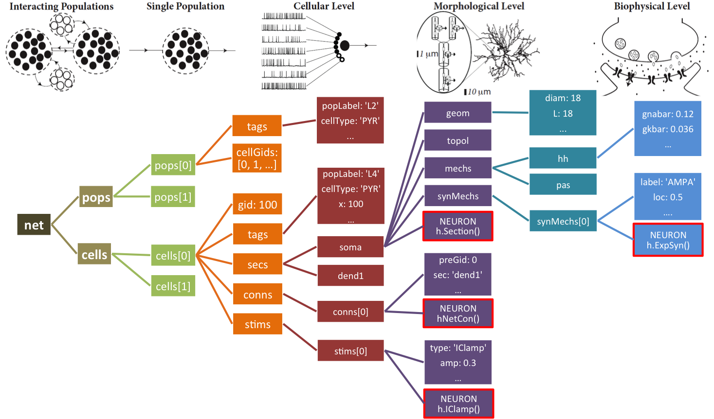

Overview
=======================================

What is NetPyNE?
----------------

NetPyNE is a python package to facilitate the development and parallel simulation of biological cell networks using the NEURON simulator.

.. image:: figs/overview.png
	:width: 80%
	:align: center

The modularized framework allows the user to define the network parameters (including cell populations, cell properties and conectivity rules) and the simulation configuration (eg. duration, integration step, plotting options etc) using a simple and flexible format. The format is based solely on Python dictionaries and lists and does not require the NEURON simulator, or even the netpyne package. Therefore, the model specifications/parameters are independent from the model execution/simulation.

Based on these input parameters, the framework instantiates the network as a hierarchical python structure, and creates the NEURON objects required to simulate the network. The user can then easily run a parallel simulation (using mpi) and plot graphs such as raster plots or cell voltage traces. The framework allows to save the data generated at each stages (model specifications, instantiated network, and simulation results) into different formats (eg. pickle, json, mat).

The framework was designed in collaboration with experimentalists with the aim of facilitating the incorporation of anatomical and physiological data into network models. It therefore includes powerful features such as the ability to define connectivity rules based on any set of arbitrary cell attributes, define cell density and connectivity as a function of cortical depth, or easily exchange the cell model (eg. Izhikevich vs multicompartment) employed for a given population. However, the underlying complexity is hidden to the user, who can use a use the simple Python-based interface to specify these features, run simulations and share models and data.

Therefore, the package is useful both for beginners with little knowledge of NEURON, as well as for experienced users who wish to easily develop and share networks with complex cell property and connectivity rules.

Main Features
--------------

* Clear separation (modularization) of parameter specifications, network instantiation and NEURON simulation code. 
* Easy-to-use, standardized, flexible, extensible and NEURON-independent format to specify parameters:
	* Populations
	* Cell property rules 
	* Connectivity rules
	* Simulation configuration
* Support for normalized cortical depth (yfrac) dependence of cell density and connectivity.
* Easy specification, importing and swapping of cell models (eg. point neuron vs multicompartment)
* Support for hybrid networks eg. combining point and multicompartment neurons. 
* Multiple connectivity functions (eg. full, random, probabilistic) with optional parameters (eg. delay range)
* Support for user-defined connectivity functions.
* Populations, cell properties and connectivity rules can include reference to annotations (eg. for provenance).
* NEURON-independent instantiation of network (all cells, connections, ...) using Python objects and containers.
* NEURON-specific instantiation of network ready for simulation.
* Enables sharing of Python-based network objects, which can then be instantiated and simulated in NEURON.
* Easy MPI parallel simulation of network, including cell distribution across nodes and gathering of data from all nodes.
* Analysis and visualization of network (eg. connectivity matrix) and simulation output (eg. voltage traces, raster plot)
* Data exporting/sharing to several formats (pickle, Matlab, JSON, HDF5, NeuroML) of the following:
	* Parameters/specifications
	* Instantiated networks
	* Simulation results
