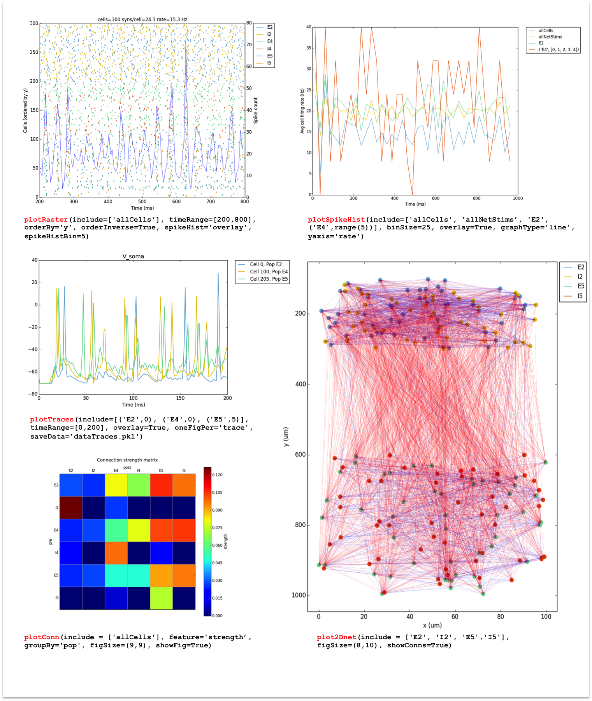

.. _package_reference:

Package Reference
=======================================

Model components and structure
-------------------------------

Creating a network model requires:

* An object ``netParams`` of class ``specs.NetParams`` with the network parameters.

* An object ``simConfig`` of class ``specs.SimConfig`` with the simulation configuration options.

* A call to the method(s) to create and run the network model, passing as arguments the above dictionaries, e.g. ``createSimulateAnalyze(netParams, simConfig)``.

These components can be included in a single or multiple python files. This section comprehensively describes how to define the network parameters and simulation configuration options, as well as the methods available to create and run the network model.

Network parameters
-------------------------

The ``netParams`` object of class ``NetParams`` includes all the information necessary to define your network. It is compoased of the following ordered dictionaries:

* ``popParams`` - populations in the network and their parameters

* ``cellParams`` - cell property rules and their associated parameters (e.g. cell geometry)

* ``synMechParams`` - synaptic mechanisms and their parameters

* ``connParams`` - network connectivity rules and their associated parameters. 

* ``subConnParams`` - network subcellular connectivity rules and their associated parameters. 

* ``stimSourceParams`` - stimulation sources parameters. 

* ``stimTargetParams`` - mapping between stimulation sources and target cells. 

.. image:: figs/netparams.png
	:width: 60%
	:align: center

Each of this ordered dicts can be filled in directly or using the NetParams object methods. Both ways are equivalent, but the object methods provide checks on the syntax of the parameters being added. Below are 2 equivalent ways of adding an item to the popParams ordered dictionary::

	from netpyne import specs
	netParams = specs.NetParams()

	# Method 1: direct
	netParams.popParams['Pop1'] = {'cellType': 'PYR', 'cellModel': 'HH''numCells': 20}

	# Method 2: using object method
	netParams.addPopParams(label='Pop1', params={'cellType': 'PYR', 'cellModel': 'HH''numCells': 20})

The ``netParams`` organization is consistent with the standard sequence of events that the framework executes internally:

* creates a ``Network`` object and adds inside a set of ``Population`` and ``Cell`` objects based on ``popParams``

* sets the cell properties based on ``cellParams`` (checking which cells match the conditions of each rule) 

* creates a set of connections based on ``connParams`` and ``subConnParams`` (checking which presynpatic and postsynaptic cells match the conn rule conditions), and using the synaptic parameters in ``synMechParams``.

* add stimulation to the cells based on ``stimSourceParams`` and ``stimTargetParams``.

The image below illustrates this process:

.. image:: figs/process.png
	:width: 50%
	:align: center

Additionally, ``netParams`` contains the following customizable single-valued attributes (e.g. ``netParams.sizeX = 100``):

* **scale**: Scale factor multiplier for number of cells (default: 1)

* **shape**: Shape of network: 'cuboid', 'cylinder' or 'ellipsoid' (default: 'cuboid')

* **sizeX**: x-dimension (horizontal length) network size in um (default: 100)

* **sizeY**: y-dimension (vertical height or cortical depth) network size in um (default: 100)

* **sizeZ**: z-dimension (horizontal depth) network size in um (default: 100)

* **defaultWeight**: Default connection weight, in ms (default: 1)

* **defaultDelay**: Default connection delay, in ms (default: 1)

* **propVelocity**: Conduction velocity in um/ms (e.g. 500 um/ms = 0.5 m/s) (default: 500)

* **scaleConnWeight**: Connection weight scale factor (excludes NetStims) (default: 1)

* **scaleConnWeightNetStims**: Connection weight scale factor for NetStims (default: 1)

* **scaleConnWeightModels**: Connection weight scale factor for each cell model, e.g. {'HH': 0.1, 'Izhi': 0.2} (default: {})

* **popTagsCopiedToCells**: List of tags that will be copied from the population to the cells (default: ['pop', 'cellModel', 'cellType'])

Other arbitrary entries to the ``netParams`` dict can be added and used in the custom defined functions for connectivity parameters (see :ref:`function_string`). 

.. _pop_params:

Population parameters 
^^^^^^^^^^^^^^^^^^^^^^^^^^

Each item of the ``popParams`` ordered dictionary consists of a key and value. The key is an arbitrary label for the population, which will be assigned to all cells as the tag ``pop``, and can be used as condition to apply specific connectivtiy rules.

The value consists in turn of a dictionary with the parameters of the population, an includes the following fields:

* **cellType** - Arbitrary cell type attribute/tag assigned to all cells in this population; can be used as condition to apply specific cell properties. 
	e.g. 'Pyr' (for pyramidal neurons) or 'FS' (for fast-spiking interneurons)

* **numCells**, **density** or **gridSpacing** - The total number of cells in this population, the density in neurons/mm3, or the fixed grid spacing (only one of the three is required). 
	The volume occupied by each population can be customized (see ``xRange``, ``yRange`` and ``zRange``); otherwise the full network volume will be used (defined in ``netParams``: ``sizeX``, ``sizeY``, ``sizeZ``).
	
	``density`` can be expressed as a function of normalized location (``xnorm``, ``ynorm`` or ``znorm``), by providing a string with the variable and any common Python mathematical operators/functions. e.g. ``'1e5 * exp(-ynorm/2)'``.

	``gridSpacing`` is the spacing between cells (in um). The total number of cells will be determined based on spacing and ``sizeX``, ``sizeY``, ``sizeZ``. e.g. ``10``.

* **cellModel** - Arbitrary cell model attribute/tag assigned to all cells in this population; can be used as condition to apply specific cell properties. 
	e.g. 'HH' (standard Hodkgin-Huxley type cell model) or 'Izhi2007' (Izhikevich 2007 point neuron model). 

* **xRange** or **xnormRange** - Range of neuron positions in x-axis (horizontal length), specified 2-element list [min, max]. 
	``xRange`` for absolute value in um (e.g. [100,200]), or ``xnormRange`` for normalized value between 0 and 1 as fraction of ``sizeX`` (e.g. [0.1,0.2]).

* **yRange** or **ynormRange** - Range of neuron positions in y-axis (vertical height=cortical depth), specified 2-element list [min, max]. 
	``yRange`` for absolute value in um (e.g. [100,200]), or ``ynormRange`` for normalized value between 0 and 1 as fraction of ``sizeY`` (e.g. [0.1,0.2]).

* **zRange** or **znormRange** - Range of neuron positions in z-axis (horizontal depth), specified 2-elemnt list [min, max]. 
	``zRange`` for absolute value in um (e.g. [100,200]), or ``znormRange`` for normalized value between 0 and 1 as fraction of ``sizeZ`` (e.g. [0.1,0.2]).

Examples of standard population::

	netParams.popParams['Sensory'] = {'cellType': 'PYR', 'cellModel': 'HH', 'ynormRange':[0.2, 0.5], 'density': 50000}

The ``addPopParams(label, params)`` method of the class ``netParams`` can be used to add an item to ``popParams``. If working interactively, this has the advantage of checking the syntax of the parameters added::
 
	netParams.addPopParams('Sensory', {'cellType': 'PYR', 'cellModel': 'HH', 'ynormRange':[0.2, 0.5], 'density': 50000})

It is also possible to create populations of artificial cells, i.e. point processes that generate spike events but don't have sections (e.g. NetStim, VecStim or IntFire2). In this case the ``cellModel`` field will specify the name of the point process mechanism, and the properties of the mechanism will be specified as additional fields. Note, since artificial cells are simpler they don't require to define separate cell parameters in the ``netParams.cellParams`` structure. For example, below are the fields required to create a population of NetStims (NEURON's artificial spike generator):

* **pop** - An arbitrary label for this population assigned to all cells; can be used to as condition to apply specific connectivtiy rules. (e.g. 'background')

* **cellModel** - Needs to be set to ``NetStim``.

* **rate** - Firing rate in Hz (note this is the inverse of the NetStim interval property).

* **noise** - Fraction of noise in NetStim (0 = deterministic; 1 = completely random).

* **number** - Max number of spikes generated (default = 1e12)

* **seed** - Seed for randomizer (optional; defaults to value set in simConfig.seeds['stim'])

* **numCells** - Number of cells

Example of NetStim population::
	
	netParams.popParams['background'] = {'cellModel': 'NetStim', 'rate': 100, 'noise': 0.5, 'numCells': 100}  # background inputs

Finally, it is possible to define a population composed of individually-defined cells by including the list of cells in the ``cellsList`` dictionary field. Each element of the list of cells will in turn be a dictionary containing any set of cell properties such as ``cellLabel`` or location (e.g. ``x`` or ``ynorm``). An example is shown below::

	cellsList.append({'cellLabel':'gs15', 'x': 1, 'ynorm': 0.4 , 'z': 2})
	cellsList.append({'cellLabel':'gs21', 'x': 2, 'ynorm': 0.5 , 'z': 3})
	netParams.popParams['IT_cells'] = {'cellModel':'Izhi2007b', 'cellType':'IT', 'cellsList': cellsList} #  IT individual cells

.. _cell_property_rules:

Cell property rules
^^^^^^^^^^^^^^^^^^^^^^^^

The rationale for using cell property rules is that you can apply cell properties to subsets of neurons that match certain criteria, e.g. only those neurons of a given cell type, and/or of a given population, and/or within a certain range of locations. 

Each item of the ``cellParams`` ordered dict consists of a key and a value. The key is an arbitrary label to identify this cell rule. The value consists of a dictionary that defines a cell property rule, containing the following fields:

* **conds** - Set of conditions required to apply the properties to a cell. 
	Defined as a dictionary with the attributes/tags of the cell and the required values, e.g. {'cellType': 'PYR', 'cellModel': 'HH'}. 

* **secs** - Dictionary containing the sections of the cell, each in turn containing the following fields (can omit those that are empty):

	* **geom**: Dictionary with geometry properties, such as ``diam``, ``L`` or ``Ra``. 
		Can optionally include a field ``pt3d`` with a list of 3D points, each defined as a tuple of the form ``(x,y,z,diam)``

	* **topol**: Dictionary with topology properties.
		Includes ``parentSec`` (label of parent section), ``parentX`` (parent location where to make connection) and ``childX`` (current section --child-- location where to make connection).
	
	* **mechs**: Dictionary of density/distributed mechanisms.
		The key contains the name of the mechanism (e.g. ``hh`` or ``pas``)
		The value contains a dictionary with the properties of the mechanism (e.g. ``{'g': 0.003, 'e': -70}``).

	* **ions**: Dictionary of ions.
		The key contains the name of the ion (e.g. ``na`` or ``k``)
		The value contains a dictionary with the properties of the ion (e.g. ``{'e': -70}``).
	
	* **pointps**: Dictionary of point processes (excluding synaptic mechanisms). 
		The key contains an arbitrary label (e.g. 'Izhi')
		The value contains a dictionary with the point process properties (e.g. ``{'mod':'Izhi2007a', 'a':0.03, 'b':-2, 'c':-50, 'd':100, 'celltype':1})``. 
		
		Apart from internal point process variables, the following properties can be specified for each point process:

		* ``mod``,the name of the NEURON mechanism, e.g. ``'Izhi2007a'``
		* ``loc``, section location where to place synaptic mechanism, e.g. ``1.0``, default=0.5.
		* ``vref`` (optional), internal mechanism variable containing the cell membrane voltage, e.g. ``'V'``.
		* ``synList`` (optional), list of internal mechanism synaptic mechanism labels, e.g. ['AMPA', 'NMDA', 'GABAB']

	* **vinit** - (optional) Initial membrane voltage (in mV) of the section (default: -65)
	e.g. ``cellRule['secs']['soma']['vinit'] = -72``

	* **spikeGenLoc** - (optional) Indicates that this section is responsible for spike generation (instead of the default 'soma'), and provides the location (segment) where spikes are generated.
	e.g. ``cellRule['secs']['axon']['spikeGenLoc'] = 1.0``

* **secLists** - (optional) Dictionary of sections lists (e.g. {'all': ['soma', 'dend']})

Example of two cell property rules added using different valid approaches::

	## PYR cell properties (HH)
	cellRule = {'conds': {'cellType': 'PYR', 'cellModel': 'HH'},  'secs': {}}

	soma = {'geom': {}, 'mechs': {}}  # soma properties
	soma['geom'] = {'diam': 18.8, 'L': 18.8, 'Ra': 123.0, 'pt3d': []}
	soma['geom']['pt3d'].append((0, 0, 0, 20))
	soma['geom']['pt3d'].append((0, 0, 20, 20))
	soma['mechs']['hh'] = {'gnabar': 0.12, 'gkbar': 0.036, 'gl': 0.003, 'el': -70} 

	dend = {'geom': {}, 'topol': {}, 'mechs': {}}  # dend properties
	dend['geom'] = {'diam': 5.0, 'L': 150.0, 'Ra': 150.0, 'cm': 1}
	dend['topol'] = {'parentSec': 'soma', 'parentX': 1.0, 'childX': 0}
	dend['mechs']['pas'] = {'g': 0.0000357, 'e': -70} 

	cellRule['secs'] = {'soma': soma, 'dend': dend}
	netParams.cellParams['PYR_HH'] = cellRule  # add rule dict to list of cell property rules

	## PYR cell properties (Izhi)
	cellRule = {'conds': {'cellType': 'PYR', 'cellModel': 'Izhi2007'},  'secs': {}}

	cellRule['secs']['soma'] = {'geom': {}, 'pointps':{}}  # soma properties
	cellRule['secs']['soma']['geom'] = {'diam': 18.8, 'L': 18.8, 'Ra': 123.0}
	cellRule['secs']['soma']['pointps']['Izhi'] = {'mod':'Izhi2007a', 'vref':'V', 'a':0.03, 'b':-2, 'c':-50, 'd':100, 'celltype':1}

	netParams.cellParams['PYR_Izhi'] = cellRule  # add rule to list of cell property rules

.. note:: As in the examples above, you can use temporary variables/structures (e.g. ``soma`` or ``cellRule``) to facilitate the creation of the final dictionary ``netParams.cellParams``.

.. ​note:: Several cell properties may be applied to the same cell if the conditions match. The latest cell properties will overwrite previous ones if there is an overlap.

.. note:: You can directly create or modify the cell parameters via ``netParams.cellParams``, e.g. ``netParams.cellParams['PYR_HH']['secs']['soma']['geom']['L']=16``. 

.. seealso:: Cell properties can be imported from an external file. See :ref:`importing_cells` for details and examples.

Synaptic mechanisms parameters
^^^^^^^^^^^^^^^^^^^^^^^^^^^^^^

To define the parameteres of a synaptic mechanism, add items to the ``synMechParams`` ordered dict. You can use the addSynMechParams(label,params) method. Each ``synMechParams`` item consists of a key and value. The key is a an arbitrary label for this mechanism, which will be used to reference in the connectivity rules. The value is a dictionary of the synaptic mechanism parameters with the following fields:

* ``mod`` - the NMODL mechanism name (e.g. 'ExpSyn'); note this does not always coincide with the name of the mod file.

* mechanism parameters (e.g. ``tau`` or ``e``) - these will depend on the specific NMODL mechanism.

* ``selfNetCon`` (optional) - Dict with parameters of NetCon between the cell voltage and the synapse, required by some synaptic mechanisms such as the homeostatic synapse (hsyn). e.g. ``'selfNetCon': {'sec': 'soma' , threshold': -15, 'weight': -1, 'delay': 0}`` (by default the source section, 'sec' = 'soma')

Synaptic mechanisms will be added to cells as required during the connection phase. Each connectivity rule will specify which synaptic mechanism parameters to use by referencing the appropiate label. 

Example of synaptic mechanism parameters for a simple excitatory synaptic mechanism labeled ``NMDA``, implemented using the ``Exp2Syn`` model, with rise time (``tau1``) of 0.1 ms, decay time (``tau2``) of 5 ms, and equilibrium potential (``e``) of 0 mV:

.. code-block:: python

	## Synaptic mechanism parameters
	netParams.synMechParams['AMPA'] = {'mod': 'Exp2Syn', 'tau1': 0.1, 'tau2': 5.0, 'e': 0}  # NMDA synaptic mechanism

Connectivity rules
^^^^^^^^^^^^^^^^^^^^^^^^

The rationale for using connectivity rules is that you can create connections between subsets of neurons that match certain criteria, e.g. only presynaptic neurons of a given cell type, and postsynaptic neurons of a given population, and/or within a certain range of locations. 

Each item of the ``connParams`` ordered dictionary consists of a key and value. The key is an arbitrary label used as reference for this connectivity rule. The value contains a dictionary that defines the connectivity rule parameters and includes the following fields:

* **preConds** - Set of conditions for the presynaptic cells. 
	Defined as a dictionary with the attributes/tags of the presynaptic cell and the required values e.g. ``{'cellType': 'PYR'}``. 

	Values can be lists, e.g. ``{'pop': ['Exc1', 'Exc2']}``. For location properties, the list values correspond to the min and max values, e.g. ``{'ynorm': [0.1, 0.6]}``

* **postConds** - Set of conditions for the postynaptic cells. 
	Same format as ``preConds`` (above).

* **sec** (optional) - Name of target section on the postsynaptic neuron (e.g. ``'soma'``). 
	If omitted, defaults to 'soma' if exists, otherwise to first section in the cell sections list.

	If ``synsPerConn`` > 1, a list of sections or sectionList can be specified, and synapses will be distributed uniformly along the specified section(s), taking into account the length of each section.

* **loc** (optional) - Location of target synaptic mechanism (e.g. ``0.3``)
	If omitted, defaults to 0.5.

	If have list of ``synMechs``, can have single loc for all, or list of locs (one per synMech, e.g. for 2 synMechs: ``[0.4, 0.7]``).

	If have ``synsPerConn`` > 1, can have single loc for all, or list of locs (one per synapse, e.g. if ``synsPerConn`` = 3: ``[0.4, 0.5, 0.7]``)

	If have both a list of ``synMechs`` and ``synsPerConn`` > 1, can have a 2D list for each synapse of each synMech (e.g. for 2 synMechs and ``synsPerConn`` = 3: ``[[0.2, 0.3, 0.5], [0.5, 0.6, 0.7]]``)

	The above only applies for a single target section, ``sec``. If a list of target sections is specified, the ``loc`` value has no effect, and synapses will be distributed uniformly along the specified section(s), taking into account the length of each section.

* **synMech** (optional) - Label (or list of labels) of target synaptic mechanism on the postsynaptic neuron (e.g. ``'AMPA'`` or ``['AMPA', 'NMDA']``). 

	If omitted employs first synaptic mechanism in the cell synaptic mechanisms list.

	If have list, a separate connection is created to each synMech; and a list of weights, delays and/or locs can be provided.  

* **synsPerConn** (optional) - Number of individual synaptic connections (*synapses*) per cell-to-cell connection (*connection*).

	Can be defined as a function (see :ref:`function_string`).

	If omitted, defaults to 1.

	The weights, delays and/or locs for each synapse can be specified as a list, or a single value can be used for all.

	When > 1 and a single section is specified, the locations of synapses can be specified as a list in ``loc``.

	When > 1, if ``loc`` is a single value or omitted, or if a list of target sections is specified, synapses will be distributed uniformly along the specified section(s), taking into account the length of each section.

	
* **weight** (optional) - Strength of synaptic connection (e.g. ``0.01``). 
	Associated to a change in conductance, but has different meaning and scale depending on the synaptic mechanism and cell model. 

	Can be defined as a function (see :ref:`function_string`).

	If omitted, defaults to ``netParams.defaultWeight = 1``.

	If have list of ``synMechs``, can have single weight for all, or list of weights (one per synMech, e.g. for 2 synMechs: ``[0.1, 0.01]``).

	If have ``synsPerConn`` > 1, can have single weight for all, or list of weights (one per synapse, e.g. if ``synsPerConn`` = 3: ``[0.2, 0.3, 0.4]``)

	If have both a list of ``synMechs`` and ``synsPerConn`` > 1, can have a 2D list for each synapse of each synMech (e.g. for 2 synMechs and ``synsPerConn`` = 3: ``[[0.2, 0.3, 0.4], [0.02, 0.04, 0.03]]``)

* **delay** (optional) - Time (in ms) for the presynaptic spike to reach the postsynaptic neuron.
	Can be defined as a function (see :ref:`function_string`).

	If omitted, defaults to ``netParams.defaultDelay = 1``

	If have list of ``synMechs``, can have single delay for all, or list of delays (one per synMech, e.g. for 2 synMechs: ``[5, 7]``).

	If have ``synsPerConn`` > 1, can have single weight for all, or list of weights (one per synapse, e.g. if ``synsPerConn`` = 3: ``[4, 5, 6]``)

	If have both a list of ``synMechs`` and ``synsPerConn`` > 1, can have a 2D list for each synapse of each synMech (e.g. for 2 synMechs and ``synsPerConn`` = 3: ``[[4, 6, 5], [9, 10, 11]]``)

* **threshold** (optional) - Threshold (in mV) to detect spike in source.

	If omitted, defaults to ``netParams.defaultThreshold = 0``

* **probability** (optional) - Probability of connection between each pre- and postsynaptic cell (0 to 1).

	Can be defined as a function (see :ref:`function_string`).

	Sets ``connFunc`` to ``probConn`` (internal probabilistic connectivity function).

	Overrides the ``convergence``, ``divergence`` and ``fromList`` parameters.

* **convergence** (optional) - Number of pre-synaptic cells connected to each post-synaptic cell.

	Can be defined as a function (see :ref:`function_string`).

	Sets ``connFunc`` to ``convConn`` (internal convergence connectivity function).

	Overrides the ``divergence`` and ``fromList`` parameters; has no effect if the ``probability`` parameters is included.

* **divergence** (optional) - Number of post-synaptic cells connected to each pre-synaptic cell.

	Can be defined as a function (see :ref:`function_string`).
	
	Sets ``connFunc`` to ``divConn`` (internal divergence connectivity function).

	Overrides the ``fromList`` parameter; has no effect if the ``probability`` or ``convergence`` parameters are included.

* **connList** (optional) - Explicit list of connections between individual pre- and post-synaptic cells.

	Each connection is indicated with relative ids of cell in pre and post populations, e.g. ``[[0,1],[3,1]]`` creates a connection between pre cell 0 and post cell 1; and pre cell 3 and post cell 1.

	Weights, delays and locs can also be specified as a list for each of the individual cell connection. These lists can be 2D or 3D if combined with multiple synMechs and synsPerConn > 1 (the outer dimension will correspond to the connList).

	Sets ``connFunc`` to ``fromList`` (explicit list connectivity function).

	Has no effect if the ``probability``, ``convergence`` or ``divergence`` parameters are included.

* **connFunc** (optional) - Internal connectivity function to use. 
	Its automatically set to ``probConn``, ``convConn``, ``divConn`` or ``fromList``, when the ``probability``, ``convergence``, ``divergence`` or ``connList`` parameters are included, respectively. Otherwise defaults to ``fullConn``, ie. all-to-all connectivity.

	User-defined connectivity functions can be added.

* **shape** (optional) - Modifies the conn weight dynamically during the simulation based on the specified pattern.
	Contains a dictionary with the following fields:

		``'switchOnOff`` - times at which to switch on and off the weight 
	
		``'pulseType'`` - type of pulse to generate; either 'square' or 'gaussian'
	
		``'pulsePeriod'`` - period (in ms) of the pulse 
	
		``'pulseWidth'`` - width (in ms) of the pulse

	Can be used to generate complex stimulation patterns, with oscillations or turning on and off at specific times.

	e.g. ``'shape': {'switchOnOff': [200, 800], 'pulseType': 'square', 'pulsePeriod': 100, 'pulseWidth': 50}``

* **plasticity** (optional) - Plasticity mechanism to use for this connections.
	Requires 2 fields: ``mech`` to specifiy the name of the plasticity mechanism, and ``params`` containing a dictionary with the parameters of the mechanism 

	e.g. ``{'mech': 'STDP', 'params': {'hebbwt': 0.01, 'antiwt':-0.01, 'wmax': 50, 'RLon': 1 'tauhebb': 10}}``

Example of connectivity rules:

.. code-block:: python

	## Cell connectivity rules
	netParams.connParams['S->M'] = {
		'preConds': {'pop': 'S'}, 
		'postConds': {'pop': 'M'},  #  S -> M
		'sec': 'dend',					# target postsyn section
		'synMech': 'AMPA',					# target synaptic mechanism
		'weight': 0.01, 				# synaptic weight 
		'delay': 5,					# transmission delay (ms) 
		'probability': 0.5}				# probability of connection		

	netParams.connParams['bg->all'] = {
		'preConds': {'pop': 'background'}, 
		'postConds': {'cellType': ['S','M'], 'ynorm': [0.1,0.6]}, # background -> S,M with ynrom in range 0.1 to 0.6
		'synReceptor': 'AMPA',					# target synaptic mechanism 
		'weight': 0.01, 					# synaptic weight 
		'delay': 5}						# transmission delay (ms) 

	netParams.connParams['yrange->HH'] = {
	    {'preConds': {'y': [100, 600]}, 
	    'postConds': {'cellModel': 'HH'}, # cells with y in range 100 to 600 -> cells implemented using HH models
	    'synMech': ['AMPA', 'NMDA'],  # target synaptic mechanisms
	    'synsPerConn': 3, 		# number of synapses per cell connection (per synMech, ie. total syns = 2 x 3)
	    'weight': 0.02,			# single weight for all synapses
	    'delay': [5, 10],		# different delays for each of 3 synapses per synMech 
	    'loc': [[0.1, 0.5, 0.7], [0.3, 0.4, 0.5]]}           # different locations for each of the 6 synapses

.. _function_string:

Functions as strings
^^^^^^^^^^^^^^^^^^^^^^^

Some of the parameters (``weight``, ``delay``, ``probability``, ``convergence`` and ``divergence``) can be provided using a string that contains a function. The string will be interpreted internally by NetPyNE and converted to the appropriate lambda function. This string may contain the following elements:

* Numerical values, e.g. '3.56'

* All Python mathematical operators: '+', '-', '*', '/', '%', '**' (exponent), etc.

* Python mathematical functions: 'sin', 'cos', 'tan', 'exp', 'sqrt', 'mean', 'inf'

* Python random number generation functions: 'random', 'randint', 'sample', 'uniform', 'triangular', 'gauss', 'betavariate', 'expovariate', 'gammavariate' (see https://docs.python.org/2/library/math.html for details)

* Cell location variables:
	* 'pre_x', 'pre_y', 'pre_z': pre-synaptic cell x, y or z location.

	* 'pre_ynorm', 'pre_ynorm', 'pre_znorm': normalized pre-synaptic cell x, y or z location.
	
	* 'post_x', 'post_y', 'post_z': post-synaptic cell x, y or z location.
	
	* 'post_xnorm', 'post_ynorm', 'post_znorm': normalized post-synaptic cell x, y or z location.
	
	* 'dist_x', 'dist_y', 'dist_z': absolute Euclidean distance between pre- and postsynaptic cell x, y or z locations.
	
	* 'dist_xnorm', 'dist_ynorm', 'dist_znorm': absolute Euclidean distance between normalized pre- and postsynaptic cell x, y or z locations.
	
	* 'dist_2D', 'dist_3D': absolute Euclidean 2D (x and z) or 3D (x, y and z) distance between pre- and postsynaptic cells.

	* 'dist_norm2D', 'dist_norm3D': absolute Euclidean 2D (x and z) or 3D (x, y and z) distance between normalized pre- and postsynaptic cells.

	
* Single-valued numerical network parameters defined in the ``netParams`` dictionary. Existing ones can be customized, and new arbitrary ones can be added. The following parameters are available by default:
	* 'sizeX', 'sizeY', 'sizeZ': network size in um (default: 100)

	* 'defaultWeight': Default connection weight, in ms (default: 1)

	* 'defaultDelay': Default connection delay, in ms (default: 1)

	* 'propVelocity': Conduction velocity in um/ms (default: 500)

String-based functions add great flexibility and power to NetPyNE connectivity rules. They enable the user to define a wide variety of connectivity features, such as cortical-depth dependent probability of connection, or distance-dependent connection weights. Below are some illustrative examples:

* Convergence (num presyn cells targeting postsyn) uniformly distributed between 1 and 15:

	.. code-block:: python

		netParams.connParams[...] = {
			'convergence': 'uniform(1,15)',
		# ... 

* Connection delay set to minimum value of 0.2 plus a gaussian distributed value with mean 13.0 and variance 1.4:
	
	.. code-block:: python

		netParams.connParams[...] = {
			'delay': '0.2 + gauss(13.0,1.4)',
		# ...

* Same as above but using variables defined in the ``netParams`` dict:

	.. code-block:: python

		netParams['delayMin'] = 0.2
		netParams['delayMean'] = 13.0
		netParams['delayVar'] = 1.4

		# ...

		netParams.connParams[...] = {
			'delay': 'delayMin + gauss(delayMean, delayVar)',
		# ...

* Connection delay set to minimum ``defaultDelay`` value plus 3D distance-dependent delay based on propagation velocity (``propVelocity``):

	.. code-block:: python

		netParams.connParams[...] = {
			'delay': 'defaultDelay + dist_3D/propVelocity',
		# ...

* Probability of connection dependent on cortical depth of postsynaptic neuron:

	.. code-block:: python

		netParams.connParams[...] = {
			'probability': '0.1+0.2*post_y', 
		# ...

* Probability of connection decaying exponentially as a function of 2D distance, with length constant (``lengthConst``) defined as an attribute in netParams:

	.. code-block:: python

		netParams.lengthConst = 200

		# ...

		netParams.connParams[...] = {
			'probability': 'exp(-dist_2D/lengthConst)', 
		# ...

.. _stimulation:

Stimulation
^^^^^^^^^^^^^^^^^^^

Two data structures are used to specify cell stimulation parameters: ``stimSourceParams`` to define the parameters of the sources of stimulation; and ``stimTargetParams`` to specify what cells will be applied what source of stimulation (mapping of sources to cells).

Each item of the ``stimSourceParams`` ordered dictionary consists of a key and a value, where the key is an arbitrary label to reference this stimulation source (e.g. 'electrode_current'), and the value is a dictionary of the source parameters:

	* **type** - Point process used as stimulator; allowed values: 'IClamp', 'VClamp', 'SEClamp', 'NetStim' and 'AlphaSynapse'.

		Note that NetStims can be added both using this method, or by creating a population of 'cellModel': 'NetStim' and adding the appropriate connections.

	* **stim params** (optional) - These will depend on the type of stimulator (e.g. for 'IClamp' will have 'delay', 'dur' and 'amp')

		Can be defined as a function (see :ref:`function_string`). Note for stims it only makes sense to use parameters of the postsynatic cell (e.g. 'post_ynorm').

Each item of the ``stimTargetParams`` specifies how to map a source of stimulation to a subset of cells in the network. The key is an arbitrary label for this mapping, and the value is a dictionary with the following parameters:

	* **source** - Label of the stimulation source (e.g. 'electrode_current').

	* **conditions** - Dictionary with conditions of cells where the stim will be applied. 
		Can include a field 'cellList' with the relative cell indices within the subset of cells selected (e.g. 'conds': {'cellType':'PYR', 'y':[100,200], 'cellList': [1,2,3]})

	* **sec** (optional) - Target section (default: 'soma')

	* **loc** (optional) - Target location (default: 0.5)
		Can be defined as a function (see :ref:`function_string`)

	* **synMech** (optional; only for NetStims) - Synaptic mechanism label to connect NetStim to 

	* **weight** (optional; only for NetStims) - Weight of connection between NetStim and cell 
		Can be defined as a function (see :ref:`function_string`)

	* **delay** (optional; only for NetStims) -  Delay of connection between NetStim and cell (default: 1)
		Can be defined as a function (see :ref:`function_string`)

	* **synsPerConn** (optional; only for NetStims) - Number of synapses of connection between NetStim and cell (default: 1)
		Can be defined as a function (see :ref:`function_string`)

The code below shows an example of how to create different types of stimulation and map them to different subsets of cells:

.. code-block:: python

	# Stimulation parameters

	## Stimulation sources parameters
	netParams.stimSourceParams['Input_1'] =  {'type': 'IClamp', 'delay': 10, 'dur': 800, 'amp': 'uniform(0.05,0.5)'}

	netParams.stimSourceParams['Input_2'] = {'type': 'VClamp', 'dur':[0,1,1], 'amp':[1,1,1],'gain':1, 'rstim':0, 'tau1':1, 'tau2':1, 'i':1}

	netParams.stimSourceParams(['Input_3'] = {'type': 'AlphaSynapse', 'onset': 'uniform(1,500)', 'tau': 5, 'gmax': 'post_ynorm', 'e': 0}

	netParams.stimSourceParams['Input_4'] = {'type': 'NetStim', 'interval': 'uniform(20,100)', 'number': 1000, 'start': 5, 'noise': 0.1}

	## Stimulation mapping parameters
	netParams.stimTargetParams['Input1->PYR'] = {
	    'source': 'Input_1', 
	    'sec':'soma', 
	    'loc': 0.5, 
	    'conds': {'pop':'PYR', 'cellList': range(8)}})

	netParams.stimTargetParams['Input3->Basket'] = {
	    'source': 'Input_3', 
	    'sec':'soma', 
	    'loc': 0.5, 
	    'conds': {'cellType':'Basket'}}

	netParams.stimTargetParams['Input4->PYR3'] = {
		'source': 'Input_4', 
		'sec':'soma', 
		'loc': 0.5, 
	    'weight': '0.1+gauss(0.2,0.05)',
	    'delay': 1,
		'conds': {'pop':'PYR3', 'cellList': [0,1,2,5,10,14,15]}}

.. _sim_config: 

Simulation configuration
--------------------------

.. - Want to have more control, customize sequence -- sim module related to sim; net module related to net
.. - Other structures are possible (flexibiliyty) - e.g. can read simCfg or netparams from disk file; can load existing net etc

Below is a list of all simulation configuration options (i.e. attributes of a SimConfig object) arranged by categories:

Related to the simulation and netpyne framework:

* **duration** - Duration of the simulation, in ms (default: 1000)
* **dt** - Internal integration timestep to use (default: 0.025)
* **hParams** - Dictionary with parameters of h module (default: {'celsius': 6.3, 'clamp_resist': 0.001})
* **cache_efficient** - Use CVode cache_efficient option to optimize load when running on many cores (default: False) 
* **cvode_active** - Use CVode variable time step (default: False)
* **seeds** - Dictionary with random seeds for connectivity, input stimulation, and cell locations (default: {'conn': 1, 'stim': 1, 'loc': 1})
* **createNEURONObj** - Create HOC objects when instantiating network (default: True)
* **createPyStruct** - Create Python structure (simulator-independent) when instantiating network (default: True)
* **gatherOnlySimData** - Omits gathering of net and cell data thus reducing gatherData time (default: False)
* **printRunTime** - Print run time at interval (in sec) specified here (eg. 0.1) (default: False) 
* **printPopAvgRates** - Print population avg firing rates after run (default: False)
* **includeParamsLabel** - Include label of param rule that created that cell, conn or stim (default: True)
* **timing** - Show and record timing of each process (default: True)
* **saveTiming** - Save timing data to pickle file (default: False)
* **verbose** - Show detailed messages (default: False)

Related to recording:

* **recordCells** - List of cells from which to record traces. Can include cell gids (e.g. 5), population labels (e.g. 'S' to record from one cell of the 'S' population), or 'all', to record from all cells. NOTE: All cells selected in the ``include`` argument of ``simConfig.analysis['plotTraces']`` will be automatically included in ``recordCells``. (default: [])
* **recordTraces** - Dict of traces to record (default: {} ; example: {'V_soma':{'sec':'soma','loc':0.5,'var':'v'}})
* **recordStim** - Record spikes of cell stims (default: False)
* **recordStep** - Step size in ms for data recording (default: 0.1)

Related to file saving:

* **saveDataInclude** = Data structures to save to file (default: ['netParams', 'netCells', 'netPops', 'simConfig', 'simData'])
* **simLabel** = Name of simulation (used as filename if none provided) (default: '')
* **saveFolder** = Path where to save output data (default: '')
* **filename** - Name of file to save model output (default: 'model_output')
* **timestampFilename**  - Add timestamp to filename to avoid overwriting (default: False)
* **savePickle** - Save data to pickle file (default: False)
* **saveJson** - Save dat to json file (default: False)
* **saveMat** - Save data to mat file (default: False)
* **saveTxt** - Save data to txt file (default: False)
* **saveDpk** - Save data to .dpk pickled file (default: False)
* **saveHDF5** - Save data to save to HDF5 file (default: False)
* **backupCfgFile** - Copy cfg file to folder, eg. ['cfg.py', 'backupcfg/'] (default: [])

.. _sim_config_analysis:

Related to plotting and analysis:

* **analysis** - Dictionary where each item represents a call to a function from the ``analysis`` module. The list of functions will be executed after calling the``sim.analysis.plotData()`` function, which is already included at the end of several wrappers (e.g. ``sim.createSimulateAnalyze()``).

	The dict key represents the function name, and the value can be set to ``True`` or to a dict containing the function ``kwargs``. i.e. ``simConfig.analysis[funcName] = kwargs``

	E.g. ``simConfig.analysis['plotRaster'] = True`` is equivalent to calling ``sim.analysis.plotRaster()``

	E.g. ``simConfig.analysis['plotRaster'] = {'include': ['PYR'], 'timeRange': [200,600], 'saveFig': 'PYR_raster.png'}`` is equivalent to calling ``sim.analysis.plotRaster(include=['PYR'], timeRange=[200,600], saveFig='PYR_raster.png')``

	The SimConfig objects also includes the method ``addAnalysis(func, params)``, which has the advantage of checking the syntax of the parameters (e.g. ``simConfig.addAnalysis('plotRaster', {'include': ['PYR'], 'timeRage': [200,600]})``)

	Availble analysis functions include ``plotRaster``, ``plotSpikeHist``, ``plotTraces``, ``plotConn`` and ``plot2Dnet``. A full description of each function and its arguments is available here: :ref:`analysis_functions`.

.. _package_functions:

Package functions
------------------

Once you have created your ``simConfig`` and ``netParams`` objects, you can use the package functions to instantiate, simulate and analyse the network. A list of available functions is shown below.

Simulation-related functions
^^^^^^^^^^^^^^^^^^^^^^^^^^^^

Wrappers:

* **sim.create(simConfig, netParams)** - wrapper to initialize, create the network and setup recording.
* **sim.simulate()** - wrapper to run the simulation and gather the data.
* **sim.analyze()** - wrapper to save and plot the data. 
* **sim.load(filename)** - wrapper to initialize, load net from file, and setup recording.

* **sim.createSimulate(simConfig, netParams)** - wrapper to create and simulate the network.
* **sim.createSimulateAnalyze(simConfig, netParams)** - wrapper to create, simulate and analyse the network.
* **sim.createExportNeuroML2(simConfig, netParams)** - wrapper to create and export network to NeuroML2.

* **sim.loadSimulate(simConfig, netParams)** - wrapper to load and simulate network.
* **sim.loadSimulateAnalyze(simConfig, netParams)** - wrapper to load, simulate and analyse the network.

Initialize and set up:

* **sim.initialize(simConfig, netParams)**
* **sim.setNet(net)**
* **sim.setNetParams(params)**
* **sim.setSimCfg(cfg)**
* **sim.createParallelContext()**
* **sim.setupRecording()**

Run and gather:

* **sim.runSim()**
* **sim.runSimWithIntervalFunc(interval, func)**
* **sim.gatherData()**

Saving and loading:

* **sim.saveData(filename)**
* **sim.loadSimCfg(filename)**
* **sim.loadNetParams(filename)**
* **sim.loadNet(filename)**
* **sim.loadSimData(filename)**
* **sim.loadAll(filename)**

Export and import:

* **sim.exportNeuroML2()**

Misc/utilities:

* **sim.cellByGid()**
* **sim.version()**
* **sim.gitversion()**

.. _analysis_functions:

Analysis-related functions
^^^^^^^^^^^^^^^^^^^^^^^^^^

* **analysis.plotRaster** (include = ['allCells'], timeRange = None, maxSpikes = 1e8, orderBy = 'gid', orderInverse = False, labels = 'legend', popRates = False, spikeHist = None, spikeHistBin = 5, syncLines = False, figSize = (10,8), saveData = None, saveFig = None, showFig = True)
    
    Plot raster (spikes over time) of network cells. Optional arguments:

    - *include*: List of cells to include (['all'|,'allCells'|,'allNetStims'|,120|,'L4'|,('L2', 56)|,('L5',[4,5,6])])
    - *timeRange*: Time range of spikes shown; if None shows all ([start:stop])
    - *maxSpikes*: maximum number of spikes that will be plotted (int)
    - *orderBy*: Unique numeric cell property to order y-axis by, e.g. 'gid', 'ynorm', 'y' ('gid'|'y'|'ynorm'|...)
    - *orderInverse*: Invert the y-axis order (True|False)
	- *labels*: Show population labels in a legend or overlayed on one side of raster ('legend'|'overlay'))
    - *popRates*: Include population rates ('legend'|'overlay')
    - *spikeHist*: overlay line over raster showing spike histogram (spikes/bin) (None|'overlay'|'subplot')
    - *spikeHistBin*: Size of bin in ms to use for histogram  (int)
    - *syncLines*: calculate synchorny measure and plot vertical lines for each spike to evidence synchrony (True|False)
    - *figSize*: Size of figure ((width, height))
    - *saveData*: File name where to save the final data used to generate the figure (None|'fileName')
    - *saveFig*: File name where to save the figure (None|'fileName')
    - *showFig*: Whether to show the figure or not (True|False)

    - Returns figure handle
    

* **analysis.plotSpikeHist** (include = ['allCells', 'eachPop'], timeRange = None, binSize = 5, overlay=True, graphType='line', yaxis = 'rate', figSize = (10,8), saveData = None, saveFig = None, showFig = True)
     
    Plot spike histogram. Optional arguments:

    - *include*: List of data series to include. Note: one line per item, not grouped (['all'|,'allCells'|,'allNetStims'|,120|,'L4'|,('L2', 56)|,('L5',[4,5,6])])
    - *timeRange*: Time range of spikes shown; if None shows all ([start:stop])
    - *binSize*: Size in ms of each bin (int)
    - *overlay*: Whether to overlay the data lines or plot in separate subplots  (True|False)
    - *graphType*: Type of graph to use (line graph or bar plot)  ('line'|'bar')
    - *yaxis*: Units of y axis (firing rate in Hz, or spike count) ('rate'|'count')
    - *figSize*: Size of figure ((width, height))
    - *saveData*: File name where to save the final data used to generate the figure (None|'fileName')
    - *saveFig*: File name where to save the figure (None|'fileName')
    - *showFig*: Whether to show the figure or not (True|False)

    - Returns figure handle
    

* **analysis.plotSpikePSD** (include = ['allCells', 'eachPop'], timeRange = None, binSize = 5, Fs = 200, overlay=True, yaxis = 'rate', figSize = (10,8), saveData = None, saveFig = None, showFig = True)
     
    Plot spikes power spectral density (PSD). Optional arguments:

    - *include*: List of data series to include. Note: one line per item, not grouped (['all'|,'allCells'|,'allNetStims'|,120|,'L4'|,('L2', 56)|,('L5',[4,5,6])])
    - *timeRange*: Time range of spikes shown; if None shows all ([start:stop])
    - *binSize*: Size in ms of each bin (int)
    - *Fs*: PSD sampling frequency used to calculate the Fourier frequencies (float)
    - *overlay*: Whether to overlay the data lines or plot in separate subplots  (True|False)
    - *figSize*: Size of figure ((width, height))
    - *saveData*: File name where to save the final data used to generate the figure (None|'fileName')
    - *saveFig*: File name where to save the figure (None|'fileName')
    - *showFig*: Whether to show the figure or not (True|False)

    - Returns figure handle and power array

* **analysis.plotTraces** (include = [], timeRange = None, overlay = False, oneFigPer = 'cell', rerun = False, figSize = (10,8), saveData = None, saveFig = None, showFig = True)
    
    Plot recorded traces (specified in ``simConfig.recordTraces)`. Optional arguments: 

    - *include*: List of cells for which to plot the recorded traces (['all'|,'allCells'|,'allNetStims'|,120|,'L4'|,('L2', 56)|,('L5',[4,5,6])])
    - *timeRange*: Time range of spikes shown; if None shows all ([start:stop])
    - *overlay*: Whether to overlay the data lines or plot in separate subplots (True|False)
    - *oneFigPer*: Whether to plot one figure per cell or per trace (showing multiple cells) ('cell'|'trace')
    - *rerun*: rerun simulation so new set of cells gets recorded (True|False)
    - *figSize*: Size of figure ((width, height))
    - *saveData*: File name where to save the final data used to generate the figure (None|'fileName')
    - *saveFig*: File name where to save the figure (None|'fileName')
    - *showFig*: Whether to show the figure or not (True|False)

    - Returns figure handles

* **plotShape** (showSyns = True, include = [], style = '.', siz=10, figSize = (10,8), saveData = None, saveFig = None, showFig = True): 
    
    Plot 3D cell shape using NEURON Interview PlotShape
    
    - *showSyns*: Show synaptic connections in 3D (True|False) 
    - *figSize*: Size of figure ((width, height))
    - *saveData*: File name where to save the final data used to generate the figure (None|'fileName')
    - *saveFig*: File name where to save the figure (None|'fileName')
    - *showFig*: Whether to show the figure or not (True|False)

    - Returns figure handles

* **analysis.plotConn** (include = ['all'], feature = 'strength', orderBy = 'gid', figSize = (10,10), groupBy = 'pop', saveData = None, saveFig = None, showFig = True)

    Plot network connectivity. Optional arguments:

    - *include*: List of cells to show (['all'|,'allCells'|,'allNetStims'|,120|,'L4'|,('L2', 56)|,('L5',[4,5,6])])
    - *feature*: Feature to show in connectivity matrix; the only features applicable to groupBy='cell' are 'weight', 'delay' and 'numConns'; 'strength' = weight * probability ('weight'|'delay'|'numConns'|'probability'|'strength'|'convergence'|'divergence')
    - *groupBy*: Show matrix for individual cells or populations ('pop'|'cell')
    - *orderBy*: Unique numeric cell property to order x and y axes by, e.g. 'gid', 'ynorm', 'y' (requires groupBy='cells') ('gid'|'y'|'ynorm'|...)
    - *figSize*: Size of figure ((width, height))
    - *saveData*: File name where to save the final data used to generate the figure (None|'fileName')
    - *saveFig*: File name where to save the figure (None|'fileName')
    - *showFig*: Whether to show the figure or not (True|False)

    - Returns figure handles

* **analysis.plot2DNet** (include = ['allCells'], figSize = (12,12), view = 'xy', showConns = True, saveData = None, saveFig = None, showFig = True)

    Plot 2D representation of network cell positions and connections. Optional arguments:

    - *include*: List of cells to show (['all'|,'allCells'|,'allNetStims'|,120|,'L4'|,('L2', 56)|,('L5',[4,5,6])])
    - *showConns*: Whether to show connections or not (True|False)
    - view: Perspective view, either front ('xy') or top-down ('xz')
    - *figSize*: Size of figure ((width, height))
    - *saveData*: File name where to save the final data used to generate the figure (None|'fileName')
    - *saveFig*: File name where to save the figure (None|'fileName')
    - *showFig*: Whether to show the figure or not (True|False)

    - Returns figure handles

* **analysis.nTE** (cells1 = [], cells2 = [], spks1 = None, spks2 = None, timeRange = None, binSize = 20, numShuffle = 30)

    Calculate normalized transfer entropy

    - *cells1*: Subset of cells from which to obtain spike train 1 (['all',|'allCells','allNetStims',|,120,|,'E1'|,('L2', 56)|,('L5',[4,5,6])])
    - *cells2*: Subset of cells from which to obtain spike train 2 (['all',|'allCells','allNetStims',|,120,|,'E1'|,('L2', 56)|,('L5',[4,5,6])])
    - *spks1*: Spike train 1; list of spike times; if omitted then obtains spikes from cells1 (list)
    - *spks2*: Spike train 2; list of spike times; if omitted then obtains spikes from cells2 (list)
    - *timeRange*: Range of time to calculate nTE in ms ([min, max])
    - *binSize*: Bin size used to convert spike times into histogram (int)
    - *numShuffle*: Number of times to shuffle spike train 1 to calculate TEshuffled; note: nTE = (TE - TEShuffled)/H(X2F|X2P) (int)

    - Returns nTE: normalized transfer entropy (float)

* **analysis.granger** (cells1 = [], cells2 = [], spks1 = None, spks2 = None, label1 = 'spkTrain1', label2 = 'spkTrain2',
	timeRange = None, binSize=5, plotFig = True, saveData = None, saveFig = None, showFig = True):
  
    Calculate and optionally plot Granger Causality 

    - *cells1*: Subset of cells from which to obtain spike train 1 (['all',|'allCells','allNetStims',|,120,|,'E1'|,('L2', 56)|,('L5',[4,5,6])])
    - cells2: Subset of cells from which to obtain spike train 2 (['all',|'allCells','allNetStims',|,120,|,'E1'|,('L2', 56)|,('L5',[4,5,6])])
    - *spks1*: Spike train 1; list of spike times; if omitted then obtains spikes from cells1 (list)
    - *spks2*: Spike train 2; list of spike times; if omitted then obtains spikes from cells2 (list)
    - *label1*: Label for spike train 1 to use in plot (string)
    - *label2*: Label for spike train 2 to use in plot (string)
    - *timeRange*: Range of time to calculate nTE in ms  ([min, max])
    - *binSize*: Bin size used to convert spike times into histogram 
    - *plotFig*: Whether to plot a figure showing Granger Causality Fx2y and Fy2x (True|False)
    - *saveData*: File name where to save the final data used to generate the figure (None|'fileName')
    - *saveFig*: File name where to save the figure (None|'fileName')
    - *showFig*: Whether to show the figure or not (True|False)

    Returns: 
    - *F*: list of freqs
    - *Fx2y*: causality measure from x to y 
    - *Fy2x*: causality from y to x 
    - *Fxy*: instantaneous causality between x and y 
    - *fig*: Figure handle 

NOTE: The *include* argument can have the following values:
	- 'all': all cells and netstims
	- 'allCells': only all cells
	- 'allNetStims': only all NetStims
	- 120: cell with gid 120
	- 'L4': all cells or NetStims in population 'L4'
	- ('L2', 56): cell with relative index 56 from population 'L2'
	- ('L5', [4,5,6]): cells with relative indices 4,5 and 6 from population 'L5'

The figure show usage examples for the different analysis functions:

.. _network_methods:

Network class methods
^^^^^^^^^^^^^^^^^^^^^^^

Methods to set up network

* **net.setParams()**
* **net.createPops()**
* **net.createCells()**
* **net.connectCells()**

Methods to modify network

* **net.modifyCells(params, updateMasterAllCells=False)**
	
	Modifies properties of cells in an instantiated network. The ``params`` argument is a dictionary with the following 2 items:

	- 'conds': dictionary of conditions to select cells that will be modified, with each item containing a cell tag (see list of cell tags available :ref:`cell_class_data_model`), and the desired value ([min, max] range format allowed).

		e.g. ``{'label': 'PYR_HH'}`` targets cells that were created using the cellParams rule labeled 'PYR_HH'.
		e.g. ``{'cellType': 'PYR', 'ynorm': [0.1, 0.6]} targets cells of type 'PYR' with normalized depth within 0.1 and 0.6.

	- 'secs': dictionary of sections using same format as for initial setting of cell property rules (see :ref:`cell_property_rules` or :ref:`cell_class_data_model` for details)

		e.g. ``{'soma': {'geom': {'L': 100}}}`` sets the soma length to 100 um. 

* **net.modifySynMechs(params, updateMasterAllCells=False)**

	Modifies properties of synMechs in an instantiated network. The ``params`` argument is a dictionary with the following 3 items:

	- 'conds': dictionary of conditions to select synMechs that will be modified, with each item containing a synMech tag, and the desired value ([min, max] range format allowed).

		e.g. ``{'label': 'AMPA', 'sec': 'soma', 'loc': [0, 0.5]}`` targets synMechs with the label 'AMPA', at the soma section, with locations between 0 and 0.5.

	- 'cellConds': dictionary of conditions to select target cells that will contain the synMechs to be modified, with each item containing a cell tag (see list of tags available :ref:`cell_class_data_model`), and the desired value ([min, max] range format allowed).

		e.g. ``{'pop': 'PYR', 'ynorm': [0.1, 0.6]}`` targets connections of cells from the 'PYR' population with normalized depth within 0.1 and 0.6.

	- '[synMech property]' (e.g. 'tau1' or 'e'): New value for stim property (note that properties depend on the type of synMech). Can include several synMech properties to modify.

* **net.modifyConns(params, updateMasterAllCells=False)**

	Modifies properties of connections in an instantiated network. The ``params`` argument is a dictionary with the following 3 items:

	- 'conds': dictionary of conditions to select connections that will be modified, with each item containing a conn tag (see list of conn tags available :ref:`cell_class_data_model`), and the desired value ([min, max] range format allowed).

		e.g. ``{'label': 'M->S'}`` targets connections that were created using the connParams rule labeled 'M->S'.
		e.g. ``{'weight': [0.4, 0.8], 'sec': 'soma'}`` targets connections with weight within 0.4 and 0.8, and that were made onto the 'soma' section. 

	- 'postConds': dictionary of conditions to select postsynaptic cells that will contain the connections to be modified, with each item containing a cell tag (see list of tags available :ref:`cell_class_data_model`), and the desired value ([min, max] range format allowed).

		e.g. ``{'pop': 'PYR', 'ynorm': [0.1, 0.6]}`` targets connections of cells from the 'PYR' population with normalized depth within 0.1 and 0.6.

	- 'weight' | 'threshold': New value for connection weight or threshold. Can include both.

* **net.modifyStims(params, updateMasterAllCells=False)**

	Modifies properties of stim in an instantiated network. The ``params`` argument is a dictionary with the following 3 items:

	- 'conds': dictionary of conditions to select stims that will be modified, with each item containing a stim tag (see list of stim tags available :ref:`cell_class_data_model`), and the desired value ([min, max] range format allowed).

		e.g. ``{'label': 'VClamp1->S'}`` targets stims that were created using the stimTargetParms rule labeled 'VClamp1->S'.
		e.g. ``{'source': 'IClamp2', 'dur': [100, 300]}`` targets stims that have as source 'Netstim2' (defined in stimSourceParams), with a duration between 100 and 300 ms.

	- 'cellConds': dictionary of conditions to select target cells that will contain the stims to be modified, with each item containing a cell tag (see list of tags available :ref:`cell_class_data_model`), and the desired value ([min, max] range format allowed).

		e.g. ``{'pop': 'PYR', 'ynorm': [0.1, 0.6]}`` targets connections of cells from the 'PYR' population with normalized depth within 0.1 and 0.6.

	- '[stim property]' (e.g. 'dur', 'amp' or 'delay'): New value for stim property (note that properties depend on the type of stim). Can include several stim properties to modify.

.. note:: The ``updateMasterAllCells`` argument ensures that the ``sim.net.allCells`` list in the master node is also updated with the modified parameters. By default this is set to False, since it slows down the modify functions, and ``sim.net.allCells`` will be updated automatically after running simulation and gathering data.

Population class methods 
^^^^^^^^^^^^^^^^^^^^^^^^^^^

* **pop.createCells()**
* **pop.createCellsFixedNum()**
* **pop.createCellsDensity()**
* **pop.createCellsList()**

Cell class methods 
^^^^^^^^^^^^^^^^^^^^^^^^^^^

* **cell.create()**
* **cell.createPyStruct()**
* **cell.createNEURONObj()**
* **cell.associateGid()**
* **cell.addConn()**
* **cell.addNetStim()**
* **cell.addIClamp()**	
* **cell.recordTraces()**
* **cell.recordStimSpikes()**

.. _data_model:

NetPyNE data model (structure of instantiated network and output data)
-----------------------------------------------------------------------

A representation of the instantiated network structure generated by NetPyNE is shown below:

.. image:: figs/netstruct.png
	:width: 90%
	:align: center

.. _dicts_dotnotation:

Accessing dictionaries using dot notation: Dict and ODict classes 
^^^^^^^^^^^^^^^^^^^^^^^^^^^^^^^^^^^^^^^^^^^^^^^^^^^^^^^^^^^^^^^^^^

In order to allow dot notation (a.b.c) to access NetPyNE structures we have added the Dict an ODict classes which are subclasses that inherit from the original Python dict and OrderedDict classes. All NetPyNE internal dictionaries are either of class Dict or ODict. Below are some features of the Dict class:
	
	* Can be accessed either using standard dict methods: ``a['b']['c']``, ``a.iteritems()``, ``a.keys()``, ``a.update()``, etc.), or attribute methods / dot notation: ``a.b.c=2``.

	* Missing elements are automatically added (note this can have undesired effects if you use the wrong keys): ``a=Dict(); a.b.c.d.e=1``

	* The constructor allows a dict (including nested dicts) and/or kwargs: ``a=Dict(b=1, c=2)`` or ``a=Dict({'a': 1, 'b': {'c': 2}})`

	* The method .todict() returns the dict version of Dict: ``a=Dict({'b':1}); a_dict=a.todict()``

	* Serialization via __getstate__() method (eg. when pickled) returns a normal dict (using .todict() method).

To specify the ``netParams`` you can use either standard dicts or the Dict() class. To use the Dict class you first need to import it via::
	
	from netpyne.specs import Dict

Examples of accessing NetPyNE structures via dot notation:

	* ``cellRule = Dict(); cellParam.secs.soma.mechs.hh = {'gnabar': 0.12, 'gkbar': 0.036}; cellParam.conds = {'cellType': 'IT'}``

	* ``netParams.cellParams.PYR_rule.secs.soma.mechs.hh.gnabar``

	* ``simConfig.analysis.plotRaster.include = ['all']``

	* ``sim.net.cells[0].secs.soma.mechs.nap.gbar = 0.1``

	* ``sim.net.cells[0].secs.soma.hSec(0.5).gbar_nap = 0.1``

	* ``sim.net.allCells[5].tags.pop``

	* ``sim.net.cells[0].conns[1].weight``

	* ``sim.net.cells[0].conns[1].hNetcon.weight[0]``	

	* ``sim.net.cells[0].stims[0].type``

	* ``sim.net.pops.PYRpop.tags``

	* ``sim.net.allPops.Mpop.cellGids``

	* ``sim.allSimData.spkt``

	* ``sim.allSimData.stims.cell_31.Input_4``

	* ``sim.allSimData.V_soma.cell_1``

Sim module
^^^^^^^^^^^

- net (Network object)
- cfg (SimConfig object)
- pc (h.ParallelContext object)
- nhosts (int)
- rank (int)
- timingData (Dict)

Network class
^^^^^^^^^^^^^^^

- pops (Dict of Pop objects)
- cells (list of Cell objects)
- params (NetParams object)

After gatherting from nodes:
- allCells (list of Dicts)
- allPops (list of Dicts)

Population class
^^^^^^^^^^^^^^^^^^

- cellGids (list)
- tags (Dict)

.. _cell_class_data_model:

Cell class
^^^^^^^^^^^^^

- gid (int)

- tags (Dict)
	- 'label'
	- 'pop'
	- 'cellModel'
	- 'cellType'
	- 'x', 'y', 'z'
	- 'xnorm', 'ynorm', 'znorm'	

- secs (Dict)
	- 'secName' (e.g. 'soma') (Dict)
		- 'hSec' (NEURON object)
		- 'geom' (Dict)
			- 'L'
			- 'diam'
			- 'pt3d' (list of tuples)
			- ...
		- 'topol' (Dict)
			- 'parentSec'
			- 'parentX'
			- 'childX'
		- 'mechs' (Dict)
			- 'mechName' (e.g. 'hh') (Dict)
				- 'gnabar'
				- 'gkbar'
				- ...
		- 'pointps' (Dict)
			- 'pointpName' (e.g. 'Izhi') (Dict)
				- 'hPointp' (NEURON object)
				- 'mod'
				- 'a'
				- 'b'
				- ...
		- 'synMechs' (list)
			- [0] (Dict)
				- 'hSyn': NEURON object
				- 'label'
				- 'loc'

- secLists (Dict)
	- 'secListName' (e.g. 'alldends') (list)

- conns (list)
	- [0] (Dict)
		- 'hNetCon': NEURON object
		- 'label'
		- 'preGid'
		- 'preLabel'
		- 'sec'
		- 'loc'
		- 'synMech'
		- 'weight'
		- 'threshold'

- stims (list)
	- [0] (Dict)
		- 'hIClamp' (NEURON object)
		- 'source'
		- 'type'
		- 'label'
		- 'sec'
		- 'loc'
		- 'amp'
		- 'dur'
		- 'delay'

Simulation output data (spikes, etc)
^^^^^^^^^^^^^^^^^^^^^^^^^^^^^^^^^^^^^

- sim.allSimData (Dict)

Data saved to file
^^^^^^^^^^^^^^^^^^^^^^^

* simConfig
* netParams
* net
* simData