.. _tutorial:

NetPyNE Tutorial
=======================================

This tutorial provides an overview of how to use the NetPyNE Python package to create a simple simulation of a network of neurons. 

Downloading and installation instructions for NetPyNE can be found here: :ref:`install`

A good understanding of Python nested dictionaries and lists is recommended, since they are are used to specify the parameters. There are many good online Python courses available, e.g. from `CodeAcademy <https://www.codecademy.com/catalog/language/python/>`_ or `Google <https://developers.google.com/edu/python/>`_.

.. seealso:: For a comprehensive description of all the features available in NetPyNE see :ref:`package_reference`.

.. _simple_example:

Tutorial 1: Quick and easy example
-----------------------------------------
To start in an encouraging way, we will implement the simplest example possible consisting of just three lines! This will create a simple network (200 randomly connected cells), run a one-second simulation, and plot the network spiking raster plot and the voltage trace of a cell. 

You will need to **download** the ``HHTut.py`` example parameter file (`download here <https://raw.githubusercontent.com/Neurosim-lab/netpyne/master/examples/HHTut/HHTut.py>`_ - right click and "Save as" to same folder you are working in).

The code looks like this (available here :download:`tut1.py <code/tut1.py>`)::

	import HHTut
	from netpyne import sim
	sim.createSimulateAnalyze(netParams = HHTut.netParams, simConfig = HHTut.simConfig)    

The first line imports the ``HHTut`` module with the network and simulation parameters. 

The second line imports the ``sim`` module from the ``netpyne`` package. The ``sim`` module provides functions to easily create and simulate networks based on these parameters.

The third line calls the ``createSimulateAnalyze`` function, which runs a standard sequence of commands to create and simulate the network, and save and plot data. It requires the following two arguments:

* ``netParams`` - an object of class NetParams to store network parameters (e.g. cell properties, populations, connectivity)

* ``simConfig`` - an object of class SimConfig to store simulation options (e.g. duration, dt, recording and plotting options, etc.)

In this case we are using a set of predefined parameters specified in the ``HHTut`` module (Hodgkin-Huxley network example). The ``HHTut`` module contains the two required objects: ``netParams`` and ``simConfig``. 

To run the model just execute the `tut1.py` script. One way to do this is to run this shell command::

	python tut1.py

If you successfully installed MPI (e.g. OpenMPI) and NEURON with MPI support, you can simulate the model in parallel using multiple cores/processors by typing:: 

	mpiexec -n 4 nrniv -python -mpi tut1.py

where you would replace the `4` with the number of cores you want to use.

If you want to avoid typing that long line every time, you can download this simple shell script (:download:`runsim <code/runsim>`) and just type::

	./runsim 4 tut1.py

.. note:: To use the script make sure you change its permissions so it is executable (e.g. ``chmod +x runsim``). 

Whatever method you use, you should get a 2D representation of the cells and connections in the network, a raster plot (spikes as cell versus time) and the voltage trace of a single cell: 

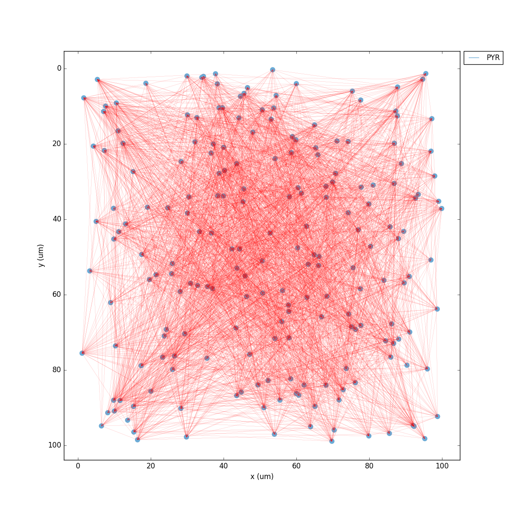

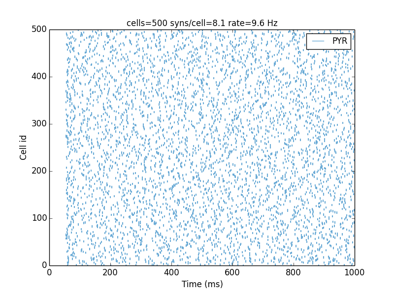

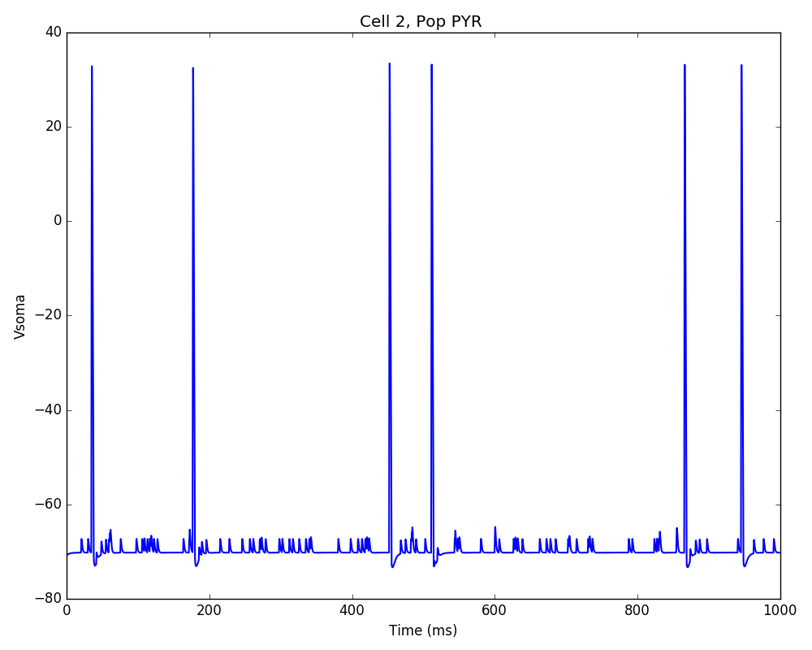

Congratulations! You have created and simulated a biological neuronal network in NEURON! 

.. note:: In some systems the figures that appear may be empty. This can be fixed by adding this line to the end of your tut1.py: ``import pylab; pylab.show()`` . In any case, the raster plot and the voltage trace figures will be correctly saved to disk as ``HHTut_raster.png`` and ``HHTut_traces.png``.

In the remainder of this tutorial we will see how to easily specify your own parameters to create custom networks and simulations. For simplicity, the network parameters, simulation options and calls to functions (necessary to create the network, simulate it and plot the results) will all be included in a single file. For larger models it is recommended to keep model specification parameters and function calls in separate files (see `examples here <https://https://github.com/Neurosim-lab/netpyne/tree/master/examples>`_.)

We begin with an overview of the Python objects where you will define all your network parameters.

Tutorial 2: Network parameters
------------------------------

The ``netParams`` object includes all the information necessary to define your network. It is composed of the following 8 ordered dictionaries:

* ``cellParams`` - cell types and their associated parameters (e.g. cell geometry)

* ``popParams`` - populations in the network and their parameters

* ``synMechParams`` - synaptic mechanisms and their parameters

* ``connParams`` - network connectivity rules and their associated parameters. 

* ``subConnParams`` - network subcellular connectivity rules and their associated parameters. 

* ``stimSourceParams`` - stimulation sources parameters. 

* ``stimTargetParams`` - mapping between stimulation sources and target cells. 

* ``rxdParams`` - reaction-diffusion (RxD) components and their parameters. 

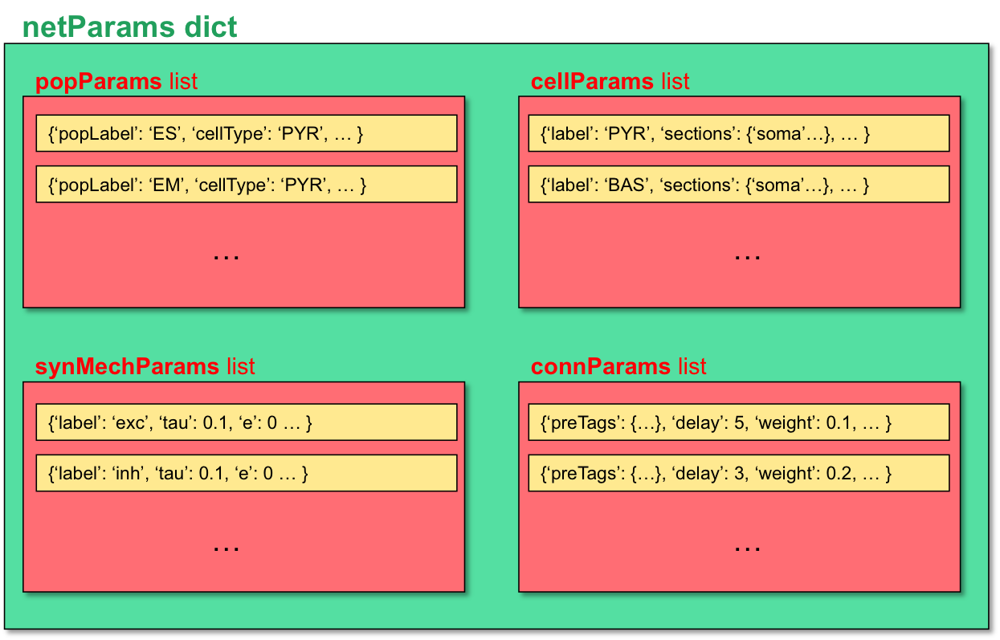

The ``netParams`` organization is consistent with the standard sequence of events that the package executes internally:

* creates a ``Network`` object and adds inside a set of ``Population`` and ``Cell`` objects based on ``popParams``

* sets the cell properties based on ``cellParams``  

* creates a set of connections based on ``connParams`` and ``subConnParams`` (checking which presynpatic and postsynaptic cells match the conn rule conditions), and using the synaptic parameters in ``synMechParams``.

* add stimulation to the cells based on ``stimSourceParams`` and ``stimTargetParams``.

The image below illustrates this process:

.. image:: figs/process.png
	:width: 50%
	:align: center

We will now create a new model file (call it ``tut2.py``) where we will specify from scratch all the network parameters. To create the structures that will hold the network parameters add the following code::

	from netpyne import specs, sim

	# Network parameters
	netParams = specs.NetParams()  # object of class NetParams to store the network parameters

Cell types
^^^^^^^^^^

First, we need to define the properties of each cell type, by adding items to the ``cellParams`` dictionary. Each ``cellParams`` item includes a key (the cell type) and a value consisting of a dictionary with the following field:

* ``secs`` - dictionary containing the properties of sections, e.g. geometry, mechanisms

In our example we create a cell type we'll call ``PYR``, which we will use in both our populations. We specify that we want them to have a section labeled ``soma`` with a certain geometry and a Hodgkin-Huxley mechanism (``hh``)::

	PYRcell = {'secs': {}}
	PYRcell['secs']['soma'] = {'geom': {}, 'mechs': {}} 
	PYRcell['secs']['soma']['geom'] = {'diam': 18.8, 'L': 18.8, 'Ra': 123.0}                           # soma geometry
	PYRcell['secs']['soma']['mechs']['hh'] = {'gnabar': 0.12, 'gkbar': 0.036, 'gl': 0.003, 'el': -70}  # soma hh mechanism
	netParams.cellParams['PYR'] = PYRcell

Take a moment to examine the nested dictionary structure used to define the cell type. Notice the use of empty dictionaries (``{}``) and intermediate dictionaries (e.g. ``PYRcell``) to facilitate filling in the parameters. There are other equivalent methods to add this rule, such as::

	netParams.cellParams['PYR'] = {	
		'secs': {'soma':
			{'geom': {'diam': 18.8, 'L': 18.8, 'Ra': 123.0}, 
			'mechs': {'hh': {'gnabar': 0.12, 'gkbar': 0.036, 'gl': 0.003, 'el': -70}}}}}) 

Populations
^^^^^^^^^^^

Now we need to create some populations for our network, by adding items to the ``popParams`` dictionary in ``netParams``. Each ``popParams`` item includes a key (population label) and a value consisting of a dictionary with the following population parameters (see :ref:`pop_params` for more details):

* ``cellType`` - an attribute/tag assigned to cells in this population, can later be used to set certain cell properties to cells with this tag.

* ``numCells`` - number of cells in this population (can also specify using cell density)

* ``cellModel`` - an attribute or tag that will be assigned to cells in this population, can later be used to set specific cell model implementation for cells with this tag. e.g. 'HH' (standard Hodkgin-Huxley type cell model) or 'Izhi2007b' (Izhikevich 2007 point neuron model). Cell models can be defined by the user or imported.

We will start by creating two populations labeled ``S`` (sensory) and ``M`` (motor), with 20 cells each, of type ``PYR`` (pyramidal), and using ``HH`` cell model (standard compartmental Hodgkin-Huxley type cell).

::

	## Population parameters
	netParams.popParams['S'] = {'cellType': 'PYR', 'numCells': 20}
	netParams.popParams['M'] = {'cellType': 'PYR', 'numCells': 20} 

During execution, this will tell NetPyNE to create 40 ``Cell`` objects, each of which will include the attributes or tags of its population, i.e. 'cellType': 'PYR', etc. These tags can later be used to define the properties of the cells, or connectivity rules.

To get a better intuition of the data structure, you can ``print(netParams.popParams)`` to see all the populations parameters, or print ``print(netParams.popParams['M'])`` to see the parameters of population 'M'.

Synaptic mechanisms parameters
^^^^^^^^^^^^^^^^^^^^^^^^^^^^^^

Next we need to define the parameters of at least one synaptic mechanism, by adding items to the ``synMechParams`` dictionary. Each ``synMechParams`` items includes a key (synMech label, used to reference it in the connectivity rules), and a value consisting of a dictionary with the following fields:

* ``mod`` - the NMODL mechanism (e.g. 'ExpSyn')

* mechanism parameters (e.g. ``tau`` or ``e``) - these will depend on the specific NMODL mechanism.

Synaptic mechanisms will be added to cells as required during the connection phase. Each connectivity rule will specify which synaptic mechanism parameters to use by referencing the appropiate label. In our network we will define the parameters of a simple excitatory synaptic mechanism labeled ``exc``, implemented using the ``Exp2Syn`` model, with rise time (``tau1``) of 0.1 ms, decay time (``tau2``) of 5 ms, and equilibrium potential (``e``) of 0 mV::

	## Synaptic mechanism parameters
	netParams.synMechParams['exc'] = {'mod': 'Exp2Syn', 'tau1': 0.1, 'tau2': 5.0, 'e': 0}  # excitatory synaptic mechanism

Stimulation
^^^^^^^^^^^

Let's now add a some background stimulation to the cells using ``NetStim`` (NEURON's artificial spike generator). We will create a source of stimulation labeled ``bkg`` and we will specify we want a firing rate of ``100`` Hz and with a noise level of ``0.5``::

	# Stimulation parameters
	netParams.stimSourceParams['bkg'] = {'type': 'NetStim', 'rate': 10, 'noise': 0.5}

Next we will specify what cells will be targeted by this stimulation. In this case we want all pyramidal cells so we set the conditions to ``{'cellType': 'PYR'}``. Finally we want the NetStims to be connected with a weight of 0.01, a delay of 5 ms, and to target the ``exc`` synaptic mechanism::

	netParams.stimTargetParams['bkg->PYR'] = {'source': 'bkg', 'conds': {'cellType': 'PYR'}, 'weight': 0.01, 'delay': 5, 'synMech': 'exc'}

 
Connectivity rules
^^^^^^^^^^^^^^^^^^

Finally, we need to specify how to connect the cells, by adding items (connectivity rules) to the ``connParams`` dictionary. Each ``connParams`` item includes a key (conn rule label), and a values  consisting of a dictionary with the following fields:

* ``preConds`` - specifies the conditions of the presynaptic cells

* ``postConds`` - specifies the conditions of the postsynaptic cells

* ``weight`` - synaptic strength of the connections

* ``delay`` - delay (in ms) for the presynaptic spike to reach the postsynaptic neuron

* ``synMech`` - synpatic mechanism parameters to use

* ``probability`` or ``convergence`` or ``divergence`` - optional parameter to specify the probability of connection (0 to 1), convergence (number of presyn cells per postsyn cell), or divergence (number of postsyn cells per presyn cell), respectively. If omitted, all-to-all connectivity is implemented.

We will add a rule to randomly connect the sensory to the motor population with a 50% probability::

	## Cell connectivity rules
	netParams.connParams['S->M'] = { #  S -> M label
		'preConds': {'pop': 'S'},   # conditions of presyn cells
		'postConds': {'pop': 'M'},  # conditions of postsyn cells
		'probability': 0.5,         # probability of connection
		'weight': 0.01,             # synaptic weight 
		'delay': 5,                 # transmission delay (ms) 
		'synMech': 'exc'}           # synaptic mechanism 

Simulation configuration options
^^^^^^^^^^^^^^^^^^^^^^^^^^^^^^^^

Above we defined all the parameters related to the network model. Here we will specify the parameters or configuration of the simulation itself (e.g. duration), which is independent of the network.

The ``simConfig`` object can be used to customize options related to the simulation duration, timestep, recording of cell variables, saving data to disk, graph plotting, and others. All options have defaults values so it is not mandatory to specify any of them.

Below we include the options required to run a simulation of 1 second, with integration step of 0.025 ms, record the soma voltage at 0.1 ms intervals, save data (params, network and simulation output) to a pickle file called ``model_output``, plot a network raster, plot the voltage trace of cell with gid ``1``, and plot a 2D representation of the network::

	# Simulation options
	simConfig = specs.SimConfig()       # object of class SimConfig to store simulation configuration

	simConfig.duration = 1*1e3          # Duration of the simulation, in ms
	simConfig.dt = 0.025                # Internal integration timestep to use
	simConfig.verbose = False           # Show detailed messages 
	simConfig.recordTraces = {'V_soma':{'sec':'soma','loc':0.5,'var':'v'}}  # Dict with traces to record
	simConfig.recordStep = 0.1          # Step size in ms to save data (e.g. V traces, LFP, etc)
	simConfig.filename = 'tut2'         # Set file output name
	simConfig.savePickle = False        # Save params, network and sim output to pickle file

	simConfig.analysis['plotRaster'] = {'saveFig': True}                  # Plot a raster
	simConfig.analysis['plotTraces'] = {'include': [1], 'saveFig': True}  # Plot recorded traces for this list of cells
	simConfig.analysis['plot2Dnet'] = {'saveFig': True}                   # plot 2D cell positions and connections

The complete list of simulation configuration options is available here: :ref:`sim_config`.

Network creation and simulation
^^^^^^^^^^^^^^^^^^^^^^^^^^^^^^^

Now that we have defined all the network parameters and simulation options, we are ready to actually create the network and run the simulation. To do this we use the ``createSimulateAnalyze`` function from the ``sim`` module, and pass as arguments the ``netParams`` and ``simConfig`` dicts we have just created::

	sim.createSimulateAnalyze(netParams, simConfig)    

Note that as before we need to make sure we have imported the ``sim`` module from the ``netpyne`` package. 

The full tutorial code for this example is available here: :download:`tut2.py <code/tut2.py>`

To run the model we can use any of the methods previously described in :ref:`simple_example`:

If mpi not installed::

	python tut2.py

If mpi working::

	mpiexec -n 4 nrniv -python -mpi tut2.py

If mpi working and have ``runsim`` shell script::

	./runsim 4 tut2.py

You should get the raster plot and voltage trace figures shown below. Notice how the ``M`` population firing rate is higher than that of the ``S`` population. This makes sense since they both receive the same background inputs, but ``S`` cells connect randomly to ``M`` cells thus increasing the ``M`` firing rate. 

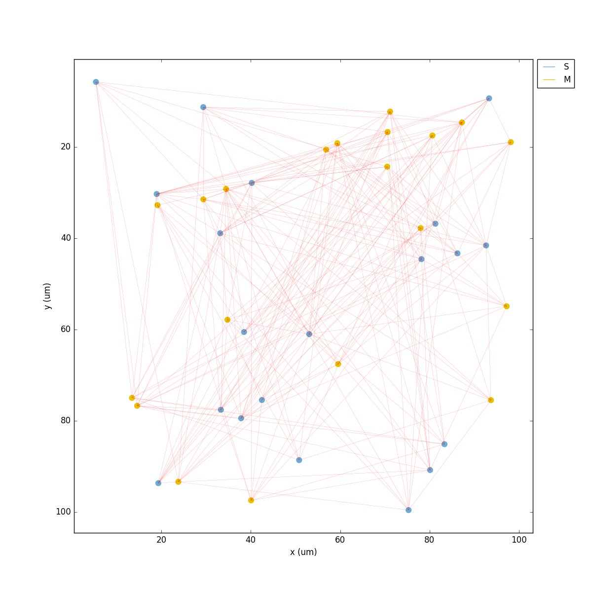

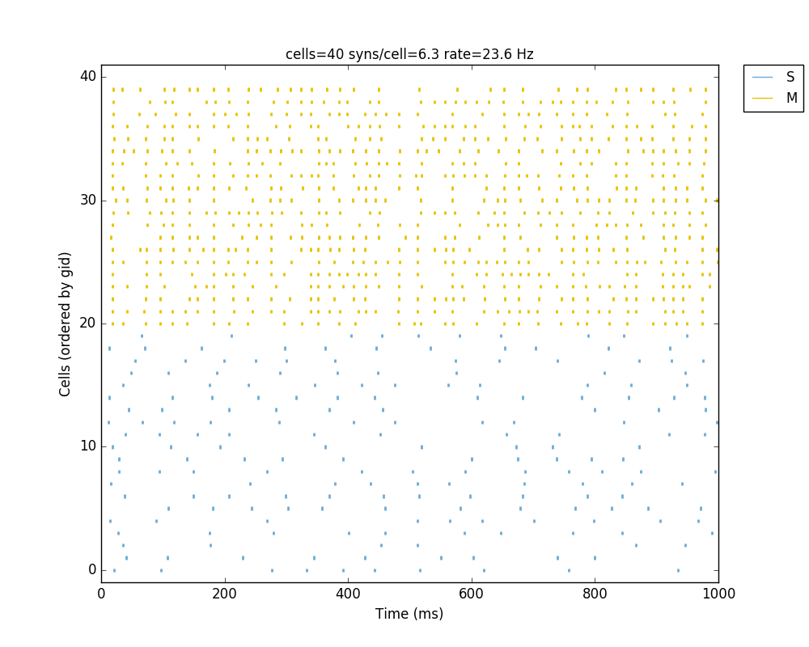

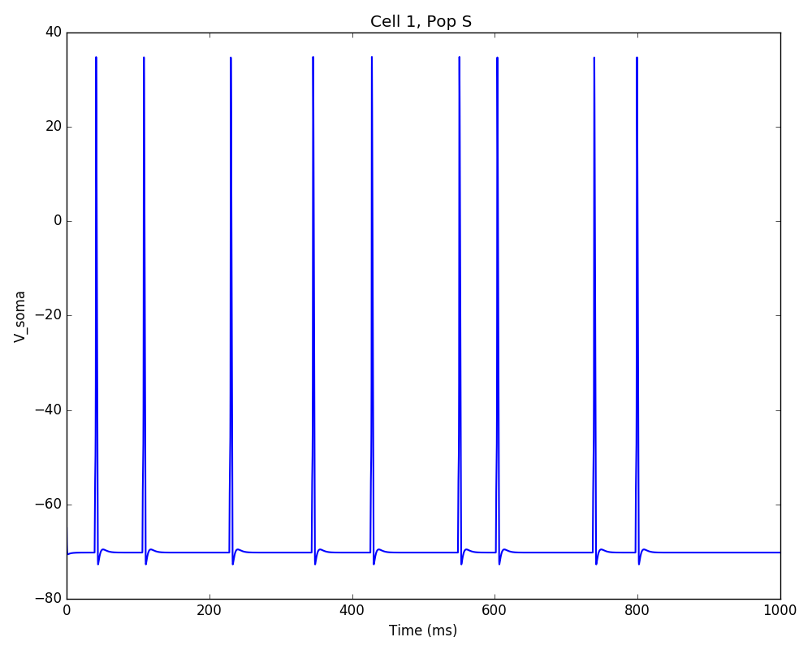

Feel free to explore the effect of changing any of the model parameters, e.g. number of cells, background or S->M weights, cell geometry or biophysical properties, etc.

Tutorial 3: Adding a compartment (dendrite) to cells
----------------------------------------------------

Here we extend the pyramidal cell type by adding a dendritic section with a passive mechanism. Note that for the ``dend`` section we included the ``topol`` dict defining how it connects to its parent ``soma`` section::

	## Cell types
	PYRcell = {'secs': {}}

	PYRcell['secs']['soma'] = {'geom': {}, 'mechs': {}}  
	PYRcell['secs']['soma']['geom'] = {'diam': 18.8, 'L': 18.8, 'Ra': 123.0}  
	PYRcell['secs']['soma']['mechs']['hh'] = {'gnabar': 0.12, 'gkbar': 0.036, 'gl': 0.003, 'el': -70} 

	PYRcell['secs']['dend'] = {'geom': {}, 'topol': {}, 'mechs': {}} 
	PYRcell['secs']['dend']['geom'] = {'diam': 5.0, 'L': 150.0, 'Ra': 150.0, 'cm': 1} 
	PYRcell['secs']['dend']['topol'] = {'parentSec': 'soma', 'parentX': 1.0, 'childX': 0} 
	PYRcell['secs']['dend']['mechs']['pas'] = {'g': 0.0000357, 'e': -70} 

	netParams.cellParams['PYR'] = PYRcell

We can also update the connectivity rule to specify that the ``S`` cells should connect to the dendrite of ``M`` cells, by adding the dict entry ``'sec': 'dend'`` as follows::

	netParams.connParams['S->M'] = {  #  S -> M
		'preConds': {'pop': 'S'},     # presynaptic conditions
		'postConds': {'pop': 'M'},    # postsynaptic conditions
		'probability': 0.5,           # probability of connection
		'weight': 0.01,               # synaptic weight 
		'delay': 5,                   # transmission delay (ms) 
		'sec': 'dend',                # section to connect to
		'loc': 1.0,                   # location of synapse
		'synMech': 'exc'}             # target synaptic mechanism

The full tutorial code for this example is available here: :download:`tut3.py <code/tut3.py>`.

If you run the network, you will observe the new dendritic compartment has the effect of reducing the firing rate.

Tutorial 4: Using a simplified cell model (Izhikevich)
------------------------------------------------------

When dealing with large simulations it is sometimes useful to use simpler cell models for some populations, in order to gain speed. Here we will replace the HH model with the simpler Izhikevich cell model only for cells in the sensory (``S``) population. 

The first step is to download the Izhikevich cell NEURON NMODL file which contains the Izhi2007b point process mechanism: :download:`izhi2007b.mod <code/mod/izhi2007b.mod>`

Next we need to compile this .mod file so its ready to use by NEURON.  Change to the directory where you downloaded the tutorial and mod file and execute the following command::

	nrnivmodl

Now we rename the HH cell type and create a new cell type for the Izhikevich cell::

	## Cell types
	PYR_HH = {'secs': {}}
	PYR_HH['secs']['soma'] = {'geom': {}, 'mechs': {}}                                                    # soma params dict
	PYR_HH['secs']['soma']['geom'] = {'diam': 18.8, 'L': 18.8, 'Ra': 123.0}                               # soma geometry
	PYR_HH['secs']['soma']['mechs']['hh'] = {'gnabar': 0.12, 'gkbar': 0.036, 'gl': 0.003, 'el': -70}      # soma hh mechanisms
	PYR_HH['secs']['dend'] = {'geom': {}, 'topol': {}, 'mechs': {}}                                       # dend params dict
	PYR_HH['secs']['dend']['geom'] = {'diam': 5.0, 'L': 150.0, 'Ra': 150.0, 'cm': 1}                      # dend geometry
	PYR_HH['secs']['dend']['topol'] = {'parentSec': 'soma', 'parentX': 1.0, 'childX': 0}                  # dend topology 
	PYR_HH['secs']['dend']['mechs']['pas'] = {'g': 0.0000357, 'e': -70}                                   # dend mechanisms
	netParams.cellParams['PYR_HH'] = PYR_HH                                                               # add dict to list of cell parameters

	PYR_Izhi = {'secs': {}}
	PYR_Izhi['secs']['soma'] = {'geom': {}, 'pointps': {}}                        # soma params dict
	PYR_Izhi['secs']['soma']['geom'] = {'diam': 10.0, 'L': 10.0, 'cm': 31.831}    # soma geometry
	PYR_Izhi['secs']['soma']['pointps']['Izhi'] = {                               # soma Izhikevich properties
		'mod':'Izhi2007b', 
		'C':1, 
		'k':0.7, 
		'vr':-60, 
		'vt':-40, 
		'vpeak':35, 
		'a':0.03, 
		'b':-2, 
		'c':-50, 
		'd':100, 
		'celltype':1} 
	netParams.cellParams['PYR_Izhi'] = PYR_Izhi                                   # add dict to list of cell parameters

Notice we have added a new field inside the ``soma`` called ``pointps``, which will include the point process mechanisms in the section. In this case we added the ``Izhi2007b`` point process and provided a dict with the Izhikevich cell parameters corresponding to the pyramidal regular spiking cell. Further details and other parameters for the Izhikevich cell model can be found `here. <https://senselab.med.yale.edu/modeldb/showModel.cshtml?model=39948>`_

Now we need to specify that we want to use the ``PYR_Izhi`` ``cellType`` for the ``S`` population::

	netParams.popParams['S'] = {'cellType': 'PYR_Izhi', 'numCells': 20} 
	netParams.popParams['M'] = {'cellType': 'PYR_HH', 'numCells': 20}

Congratulations, now you have a hybrid model composed of HH and Izhikevich cells! You can also easily change the cell model used by existing or new populations. 

The full tutorial code for this example is available here: :download:`tut4.py <code/tut4.py>`.

.. seealso:: NetPyNE also supports importing cells defined in other files (e.g. in hoc cell templates, or python classes). See :ref:`importing_cells` for details and examples.

Tutorial 5: Position- and distance-based connectivity
-----------------------------------------------------

The following example demonstrates how to spatially separate populations, add inhibitory populations, and implement weights, probabilities of connection, and delays that depend on cell positions or distances.

We will build a cortical-like network with six populations (three excitatory and three inhibitory) distributed in three layers: 2/3, 4 and 5. Create a new empty file called ``tut5.py`` and let's add the required code.   

Since we want to distribute the cells spatially, the first thing we need to do is define the volume dimensions where cells will be placed. By convention we take the X and Z to be the horizontal or lateral dimensions, and Y to be the vertical dimension (representing cortical depth in this case). To define a cuboid with volume of 100x1000x100 um (i.e. horizontal spread of 100x100 um and cortical depth of 1000um) we can use the ``sizeX``, ``sizeY`` and ``sizeZ`` network parameters as follows::

	# Network parameters
	netParams = specs.NetParams()     # object of class NetParams to store the network parameters

	netParams.sizeX = 100             # x-dimension (horizontal length) size in um
	netParams.sizeY = 1000            # y-dimension (vertical height or cortical depth) size in um
	netParams.sizeZ = 100             # z-dimension (horizontal length) size in um
	netParams.propVelocity = 100.0    # propagation velocity (um/ms)
	netParams.probLengthConst = 150.0 # length constant for conn probability (um)

Note that we also added two parameters (``propVelocity`` and ``probLengthConst``) which we'll use later for the connectivity rules.

Next we define the cell properties of each type of cell ('E' for excitatory and 'I' for inhibitory). We have made minor random modifications of some cell parameters just to illustrate that different cell types can have different properties::
	
	## Cell types
	secs = {} # sections dict
	secs['soma'] = {'geom': {}, 'mechs': {}}                                                # soma params dict
	secs['soma']['geom'] = {'diam': 15, 'L': 14, 'Ra': 120.0}                               # soma geometry
	secs['soma']['mechs']['hh'] = {'gnabar': 0.13, 'gkbar': 0.036, 'gl': 0.003, 'el': -70}  # soma hh mechanism
	netParams.cellParams['E'] = {'secs': secs}                                              # add dict to list of cell params

	secs = {} # sections dict
	secs['soma'] = {'geom': {}, 'mechs': {}}                                                # soma params dict
	secs['soma']['geom'] = {'diam': 10.0, 'L': 9.0, 'Ra': 110.0}                            # soma geometry
	secs['soma']['mechs']['hh'] = {'gnabar': 0.11, 'gkbar': 0.036, 'gl': 0.003, 'el': -70}  # soma hh mechanism
	netParams.cellParams['I'] = {'secs': secs}                                              # add dict to list of cell params

Next we can create our background input population and the six cortical populations labeled according to the cell type and layer e.g. 'E2' for excitatory cells in layer 2. We can define the cortical depth range of each population by using the ``yRange`` parameter, e.g. to place layer 2 cells between 100 and 300 um depth: ``'yRange': [100,300]``. This range can also be specified using normalized values, e.g. ``'yRange': [0.1,0.3]``. In the code below we provide examples of both methods for illustration::

	## Population parameters
	netParams.popParams['E2'] = {'cellType': 'E', 'numCells': 50, 'yRange': [100,300]}
	netParams.popParams['I2'] = {'cellType': 'I', 'numCells': 50, 'yRange': [100,300]}
	netParams.popParams['E4'] = {'cellType': 'E', 'numCells': 50, 'yRange': [300,600]}
	netParams.popParams['I4'] = {'cellType': 'I', 'numCells': 50, 'yRange': [300,600]}
	netParams.popParams['E5'] = {'cellType': 'E', 'numCells': 50, 'ynormRange': [0.6,1.0]}
	netParams.popParams['I5'] = {'cellType': 'I', 'numCells': 50, 'ynormRange': [0.6,1.0]}

As in previous examples we also add the parameters of the excitatory and inhibitory synaptic mechanisms, which will be added to cells when the connections are created::

	## Synaptic mechanism parameters
	netParams.synMechParams['exc'] = {'mod': 'Exp2Syn', 'tau1': 0.8, 'tau2': 5.3, 'e': 0}  # NMDA synaptic mechanism
	netParams.synMechParams['inh'] = {'mod': 'Exp2Syn', 'tau1': 0.6, 'tau2': 8.5, 'e': -75}  # GABA synaptic mechanism

In terms of stimulation, we'll add background inputs to all cell in the network. The weight will be fixed to 0.01, but we'll make the delay come from a gaussian distribution with mean 5 ms and standard deviation 2, and have a minimum value of 1 ms. We can do this using string-based functions: ``'max(1, normal(5,2)'``. As detailed in section :ref:`function_string`, string-based functions allow you to define connectivity parameters using many Python mathematical operators and functions. The full code to add background stimulation looks like this::

	# Stimulation parameters
	netParams.stimSourceParams['bkg'] = {'type': 'NetStim', 'rate': 20, 'noise': 0.3}
	netParams.stimTargetParams['bkg->all'] = {'source': 'bkg', 'conds': {'cellType': ['E','I']}, 'weight': 0.01, 'delay': 'max(1, normal(5,2))', 'synMech': 'exc'}

We can now add the standard simulation configuration options and the code to create and run the network. Notice that we have chosen to record and plot voltage traces of one cell in each of the excitatory populations (``{'include': [('E2',0), ('E4', 0), ('E5', 5)]})``), plot the raster ordered based on cell cortical depth (``{'orderBy': 'y', 'orderInverse': True})``), show a 2D visualization of cell positions and connections, and plot the connectivity matrix::

	# Simulation options
	simConfig = specs.SimConfig()        # object of class SimConfig to store simulation configuration

	simConfig.duration = 1*1e3           # Duration of the simulation, in ms
	simConfig.dt = 0.05                  # Internal integration timestep to use
	simConfig.verbose = False            # Show detailed messages 
	simConfig.recordTraces = {'V_soma':{'sec':'soma','loc':0.5,'var':'v'}}  # Dict with traces to record
	simConfig.recordStep = 1             # Step size in ms to save data (e.g. V traces, LFP, etc)
	simConfig.filename = 'tut5'          # Set file output name
	simConfig.savePickle = False         # Save params, network and sim output to pickle file

	simConfig.analysis['plotRaster'] = {'orderBy': 'y', 'orderInverse': True, 'saveFig': True}         # Plot a raster
	simConfig.analysis['plotTraces'] = {'include': [('E2',0), ('E4', 0), ('E5', 5)], 'saveFig': True}  # Plot recorded traces for this list of cells
	simConfig.analysis['plot2Dnet'] = {'saveFig': True}                                                # plot 2D cell positions and connections
	simConfig.analysis['plotConn'] = {'saveFig': True}                                                 # plot connectivity matrix

	# Create network and run simulation
	sim.createSimulateAnalyze(netParams = netParams, simConfig = simConfig)    
	   
If we run the model at this point we will see the cells are distributed into three layers as specified, and they all spike randomly with an average rate of 20 Hz driven by background input:

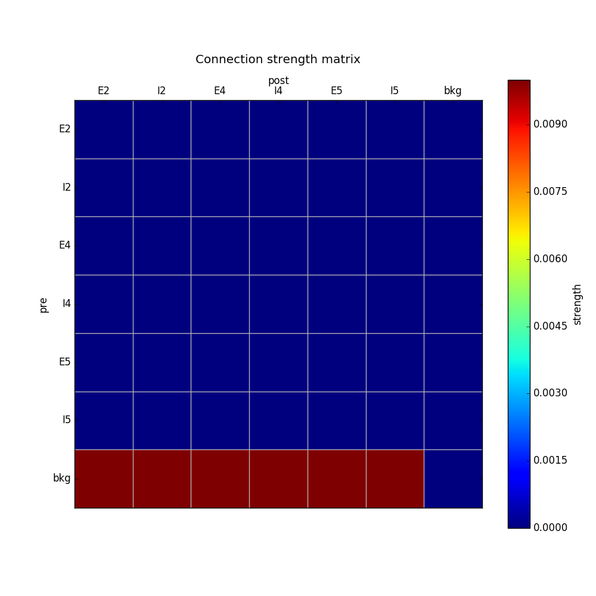

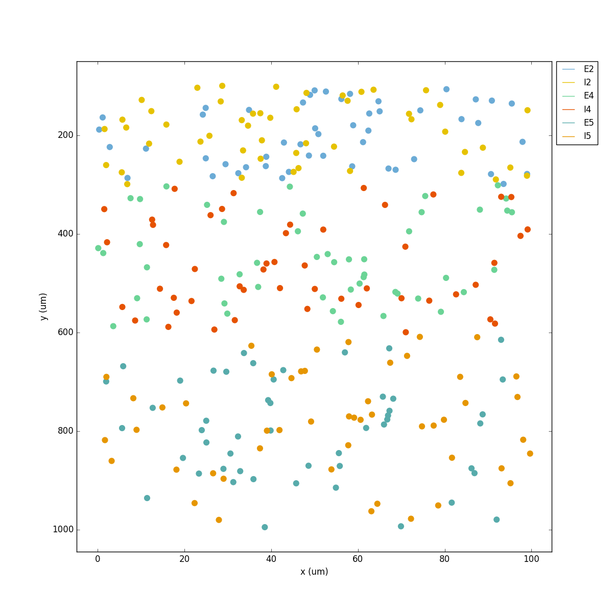

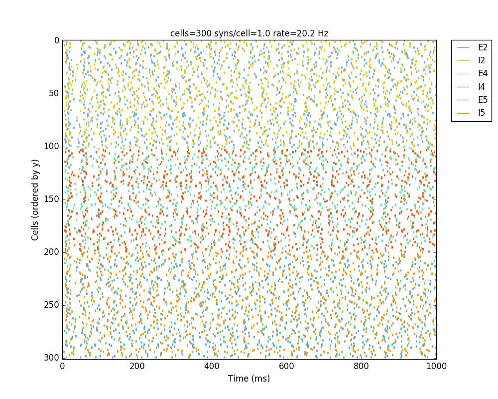

.. image:: figs/tut5_traces_1.png
	:width: 30%

Let's now add excitatory connections with some spatially-dependent properties to illustrate NetPyNE's capabilities. First, let's  specify that we want excitatory cells to target all cells within a cortical depth of 100 and 1000 um, with the following code: ``'postConds': {'y': [100,1000]}``. 

Second, let's make the the connection weight be proportional to the cortical depth of the cell, i.e. postsynaptic cells in deeper layers will receive stronger connections than those in superficial layers. To do this we make use of the distance-related variables that NetPyNE makes available to use in string-based functions; in this case ``post_ynorm``, which represents the normalized y location of the postsynaptic cell. For a complete list of available variables see: :ref:`function_string`.

Finally, we can specify the delay based on the distance between the cells (``dist_3D``) and the propagation velocity (given as a parameter at the beginning of the code), as follows: ``'delay': 'dist_3D/propVelocity'``. The full code for this connectivity rules is::

	netParams.connParams['E->all'] = {
	  'preConds': {'cellType': 'E'}, 'postConds': {'y': [100,1000]},  #  E -> all (100-1000 um)
	  'probability': 0.1 ,                  # probability of connection
	  'weight': '0.005*post_ynorm',         # synaptic weight 
	  'delay': 'dist_3D/propVelocity',      # transmission delay (ms) 
	  'synMech': 'exc'}                     # synaptic mechanism 

Running the model now shows excitatory connections in red, and how cells in the deeper layers (higher y values) exhibit lower rates and higher synchronization, due to increased weights leading to depolarization blockade. This difference is also visible in the voltage traces of layer 2 vs layer 5 cells:

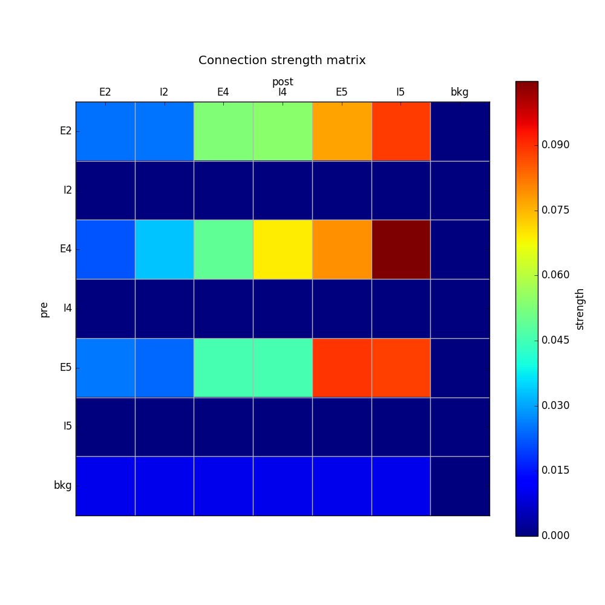

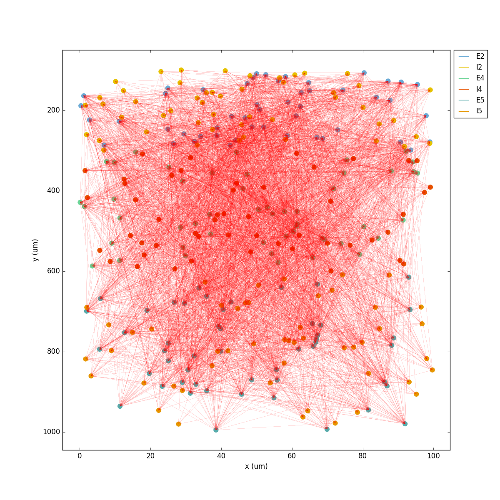

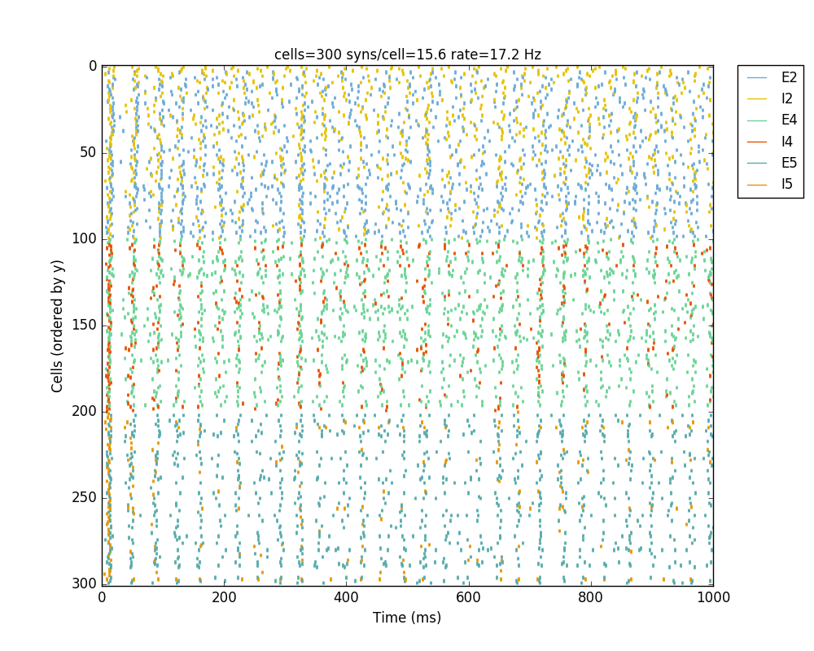

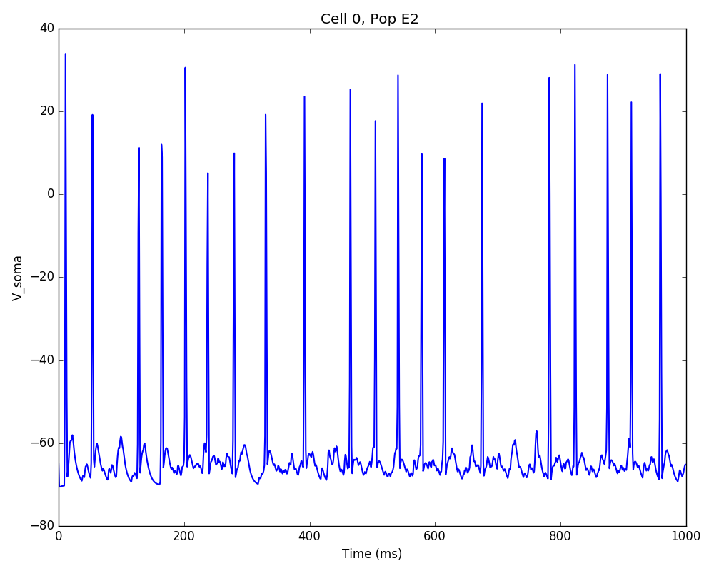

Finally, we add inhibitory connections which will project only onto excitatory cells, specified here using the ``pop`` attribute, for illustrative purposes (an equivalent rule would be: ``'postConds': {'cellType': 'E'}``). 

To make the probability of connection decay exponentially as a function of distance with a given length constant (``probLengthConst``), we can use the following distance-based expression: ``'probability': '0.4*exp(-dist_3D/probLengthConst)'``. The code for the inhibitory connectivity rule is therefore::

	netParams.connParams['I->E'] = {                          # I -> E
		'preConds': {'cellType': 'I'},                        # presynaptic conditions
		'postConds': {'pop': ['E2','E4','E5']},               # postsynaptic conditions
		'probability': '0.4*exp(-dist_3D/probLengthConst)',   # probability of connection
		'weight': 0.001,                                      # synaptic weight 
		'delay': 'dist_3D/propVelocity',                      # transmission delay (ms) 
		'synMech': 'inh'}                                     # synaptic mechanism 

Notice that the 2D network diagram now shows inhibitory connections in blue, and these are mostly local/lateral within layers, due to the distance-related probability restriction. These local inhibitory connections reduce the overall synchrony, introducing some richness into the temporal firing patterns of the network.

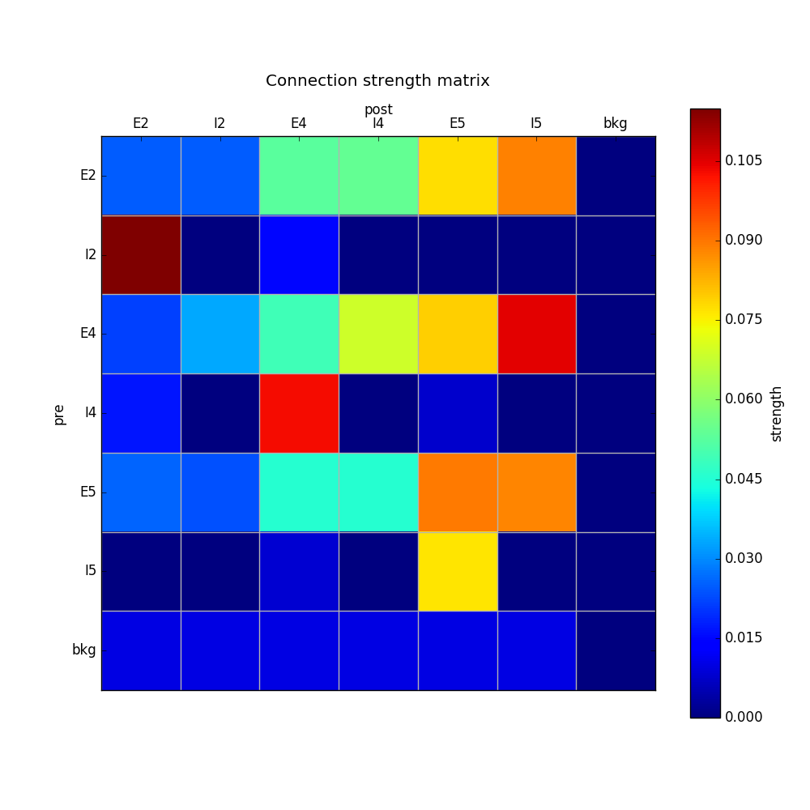

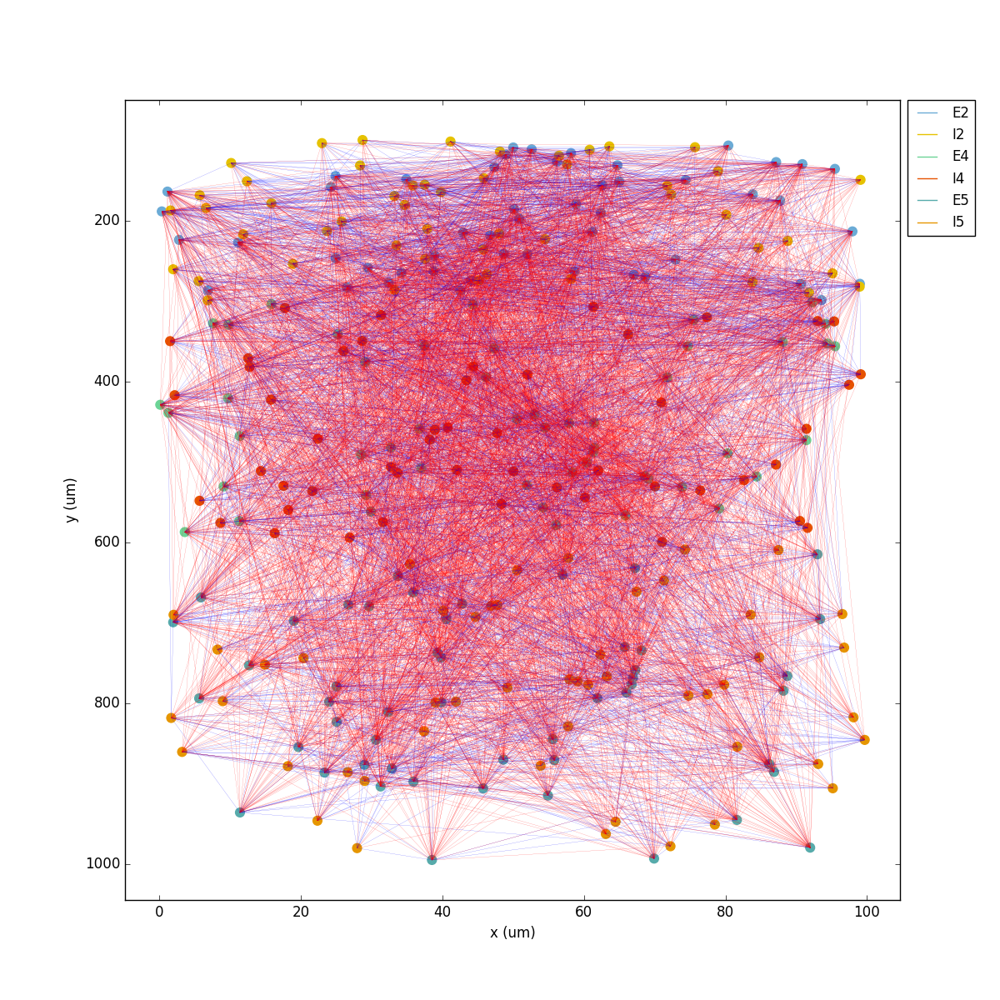

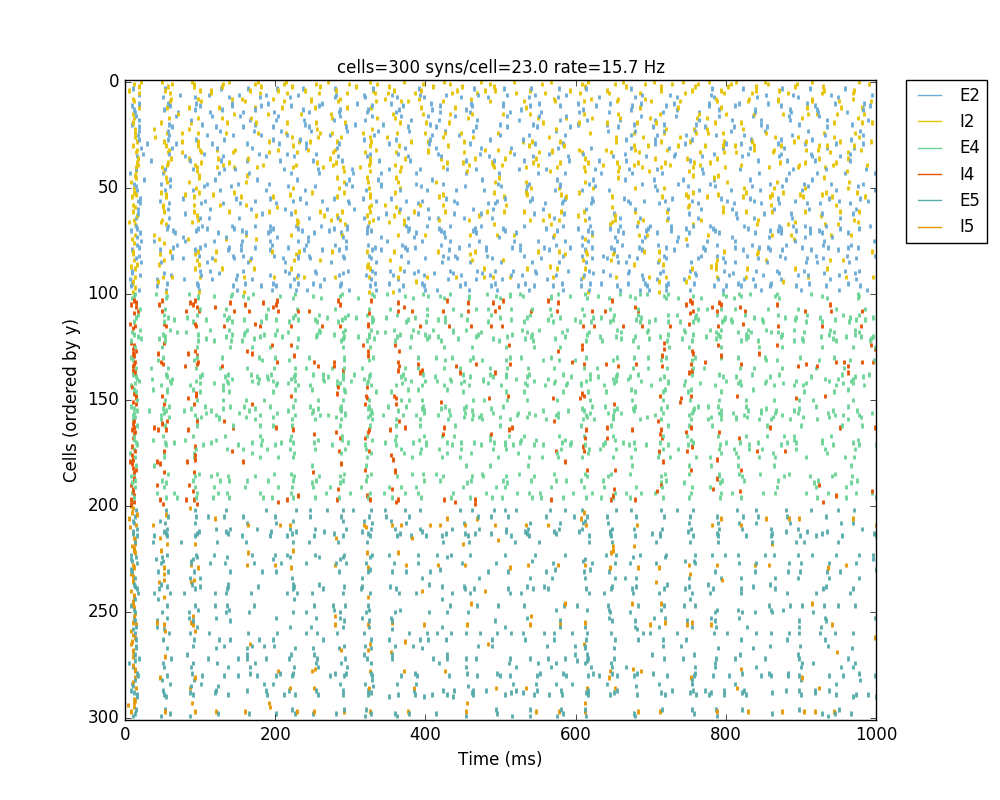

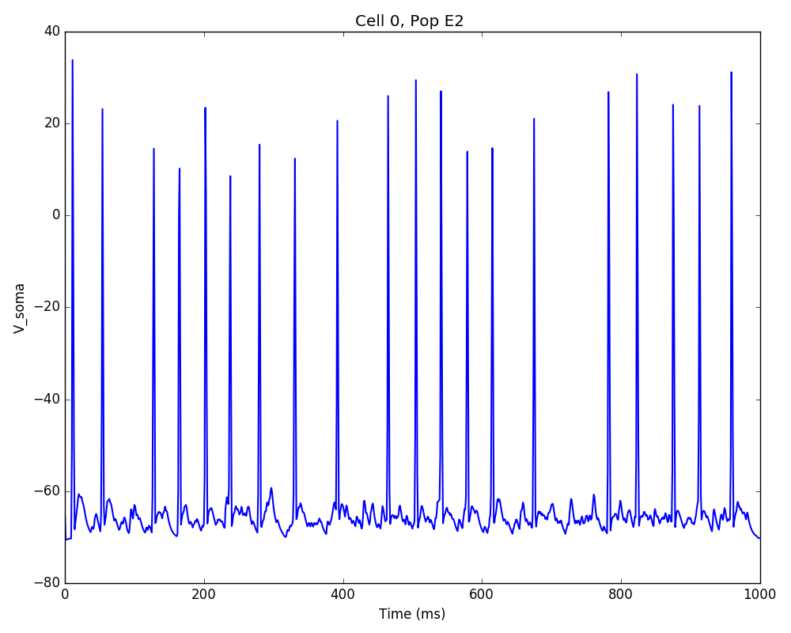

The full tutorial code for this example is available here: :download:`tut5.py <code/tut5.py>`.

Tutorial 6: Adding stimulation to the network
---------------------------------------------

Two dictionary structures are used to specify cell stimulation parameters: ``stimSourceParams`` to define the parameters of the sources of stimulation; and ``stimTargetParams`` to specify what cells will be applied what source of stimulation (mapping of sources to cells). See :ref:`stimulation` for details.

In this example, we will take as a starting point the simple network in :download:`tut2.py <code/tut2.py>`, remove all connection parameters, and add external stimulation instead.

Below we add four typical NEURON sources of stimulation, each of a different type: IClamp, VClamp, AlphaSynapse, NetStim. Note that parameter values can also include string-based functions (:ref:`function_string`), for example to set a uniform distribution of onset values (``'onset': 'uniform(600,800)'``), or maximum conductance dependent on the target cell normalized depth (``'gmax': 'post_ynorm'``)::

	netParams.stimSourceParams['Input_1'] = {'type': 'IClamp', 'del': 300, 'dur': 100, 'amp': 'uniform(0.4,0.5)'}
	netParams.stimSourceParams['Input_2'] = {'type': 'VClamp', 'dur': [0,50,200], 'amp': [-60,-30,40], 'gain': 1e5, 'rstim': 1, 'tau1': 0.1, 'tau2': 0}
	netParams.stimSourceParams['Input_3'] = {'type': 'AlphaSynapse', 'onset': 'uniform(300,600)', 'tau': 5, 'gmax': 'post_ynorm', 'e': 0}
	netParams.stimSourceParams['Input_4'] = {'type': 'NetStim', 'interval': 'uniform(20,100)', 'number': 1000, 'start': 600, 'noise': 0.1}

Now we can map or apply any of the above stimulation sources to any subset of cells in the network by adding items to the ``stimTargetParams`` dict. Note that we can use any of the cell tags (e.g. 'pop', 'cellType' or 'ynorm') to select which cells will be stimulated. Additionally, using the 'cellList' option, we can target a specific list of cells (using relative cell ids) within the subset of cells selected (e.g. first 15 cells of the 'S' population)::

	netParams.stimTargetParams['Input_1->S'] = {'source': 'Input_1', 'sec':'soma', 'loc': 0.8, 'conds': {'pop':'S', 'cellList': range(15)}}
	netParams.stimTargetParams['Input_2->S'] = {'source': 'Input_2', 'sec':'soma', 'loc': 0.5, 'conds': {'pop':'S', 'ynorm': [0,0.5]}}
	netParams.stimTargetParams['Input_3->M1'] = {'source': 'Input_3', 'sec':'soma', 'loc': 0.2, 'conds': {'pop':'M', 'cellList': [2,4,5,8,10,15,19]}}
	netParams.stimTargetParams['Input_4->PYR'] = {'source': 'Input_4', 'sec':'soma', 'loc': 0.5, 'weight': '0.1+normal(0.2,0.05)','delay': 1, 'conds': {'cellType':'PYR', 'ynorm': [0.6,1.0]}}

.. note:: The stimTargetParams of NetStims require connection parameters (e.g. weight and delay), since a new connection will be created to map/apply the NetStim to each target cell. 

.. note:: NetStims can be added both using the above method (as stims), or by creating a population with ``'cellModel': 'NetStim'`` and adding the appropriate connections.

Running the above network with different types of stimulation should produce the following raster:

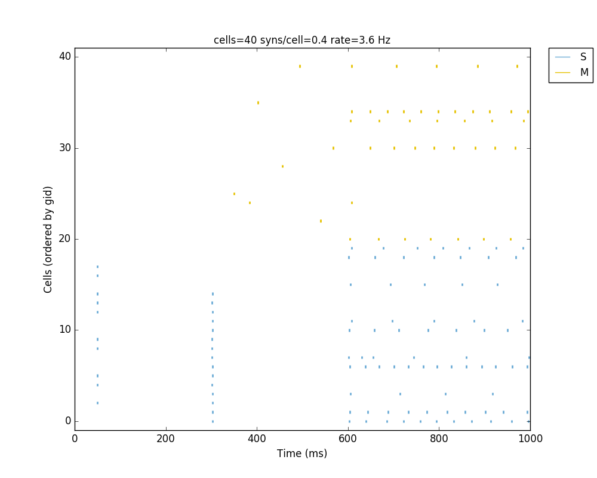

The full tutorial code for this example is available here: :download:`tut6.py <code/tut6.py>`.

Tutorial 7: Modifying the instantiated network interactively
------------------------------------------------------------

This example is directed at the more experienced users who might want to interact directly with the NetPyNE generated structure containing the network model and NEURON objects. We will model a Hopfield-Brody network where cells are connected all-to-all and firing synchronize due to mutual inhibition (inhibition from other cells provides a reset, locking them together). The level of synchronization depends on the connection weights, which we will modify interactively.

We begin by creating a new file (``tut7.py``) describing a simple network with one population (``hop``) of 50 cells and background input of 50 Hz (similar to the previous simple tutorial example ``tut2.py``). We create all-to-all inhibitory connections within the ``hop`` population, but set the weights to 0 initially:: 

	from netpyne import specs

	###############################################################################
	# NETWORK PARAMETERS
	###############################################################################

	netParams = specs.NetParams()  # object of class NetParams to store the network parameters

	# Cell parameters
	## PYR cell properties
	secs = {}
	secs['soma'] = {'geom': {}, 'topol': {}, 'mechs': {}}
	secs['soma']['geom'] = {'diam': 18.8, 'L': 18.8}
	secs['soma']['mechs']['hh'] = {'gnabar': 0.12, 'gkbar': 0.036, 'gl': 0.003, 'el': -70} 
	netParams.cellParams['PYR'] = {'secs': secs}  # add dict to list of cell properties

	# Population parameters
	netParams.popParams['hop'] = {'cellType': 'PYR', 'cellModel': 'HH', 'numCells': 50}      # add dict with params for this pop 
	#netParams.popParams['background'] = {'cellModel': 'NetStim', 'rate': 50, 'noise': 0.5}  # background inputs

	# Synaptic mechanism parameters
	netParams.synMechParams['exc'] = {'mod': 'Exp2Syn', 'tau1': 0.1, 'tau2': 1.0, 'e': 0}
	netParams.synMechParams['inh'] = {'mod': 'Exp2Syn', 'tau1': 0.1, 'tau2': 1.0, 'e': -80}

	# Stimulation parameters
	netParams.stimSourceParams['bkg'] = {'type': 'NetStim', 'rate': 50, 'noise': 0.5}
	netParams.stimTargetParams['bkg->all'] = {'source': 'bkg', 'conds': {'pop': 'hop'}, 'weight': 0.1, 'delay': 1, 'synMech': 'exc'}

	# Connectivity parameters
	netParams.connParams['hop->hop'] = {
		'preConds': {'pop': 'hop'},         # presynaptic conditions
		'postConds': {'pop': 'hop'},        # postsynaptic conditions
		'weight': 0.0,                      # weight of each connection
		'synMech': 'inh',                   # target inh synapse
		'delay': 5}                         # delay 

We now add the standard simulation configuration options, and include the ``syncLines`` option so that raster plots show vertical lines at each spike as an indication of synchrony::

	###############################################################################
	# SIMULATION PARAMETERS
	###############################################################################
	simConfig = specs.SimConfig()  # object of class SimConfig to store simulation configuration

	# Simulation options
	simConfig.duration = 0.5*1e3        # Duration of the simulation, in ms
	simConfig.dt = 0.025                # Internal integration timestep to use
	simConfig.verbose = False           # Show detailed messages 
	simConfig.recordTraces = {'V_soma':{'sec':'soma','loc':0.5,'var':'v'}}  # Dict with traces to record
	simConfig.recordStep = 1            # Step size in ms to save data (eg. V traces, LFP, etc)
	simConfig.filename = 'model_output' # Set file output name
	simConfig.savePickle = False        # Save params, network and sim output to pickle file

	simConfig.analysis['plotRaster'] = {'syncLines': True, 'saveFig': True}      # Plot a raster
	simConfig.analysis['plotTraces'] = {'include': [1], 'saveFig': True}         # Plot recorded traces for this list of cells
	simConfig.analysis['plot2Dnet'] = {'saveFig': True}                          # plot 2D cell positions and connections

Finally, we add the code to create the network and run the simulation, but for illustration purposes, we use the individual function calls for each step of the process (instead of the all-encompassing ``sim.createAndSimulate()`` function used before)::

	###############################################################################
	# EXECUTION CODE (via netpyne)
	###############################################################################
	from netpyne import sim

	# Create network and run simulation
	sim.initialize(                     # create network object and set cfg and net params
		simConfig = simConfig,          # pass simulation config and network params as arguments
		netParams = netParams)   
	sim.net.createPops()                # instantiate network populations
	sim.net.createCells()               # instantiate network cells based on defined populations
	sim.net.connectCells()              # create connections between cells based on params
	sim.net.addStims()                  # add stimulation
	sim.setupRecording()                # setup variables to record for each cell (spikes, V traces, etc)
	sim.runSim()                        # run parallel Neuron simulation  
	sim.gatherData()                    # gather spiking data and cell info from each node
	sim.saveData()                      # save params, cell info and sim output to file (pickle,mat,txt,etc)
	sim.analysis.plotData()             # plot spike raster

If we run the above code, the resulting network 2D map shows the inhibitory connections in blue, although these don't yet have any effect since the weight is 0. The raster plot shows random firing driven by the 50 Hz background inputs, and a low sync measure of 0.26 (vertical red lines illustrate poor synchrony):

.. image:: figs/tut7_net_1.png
	:width: 30%

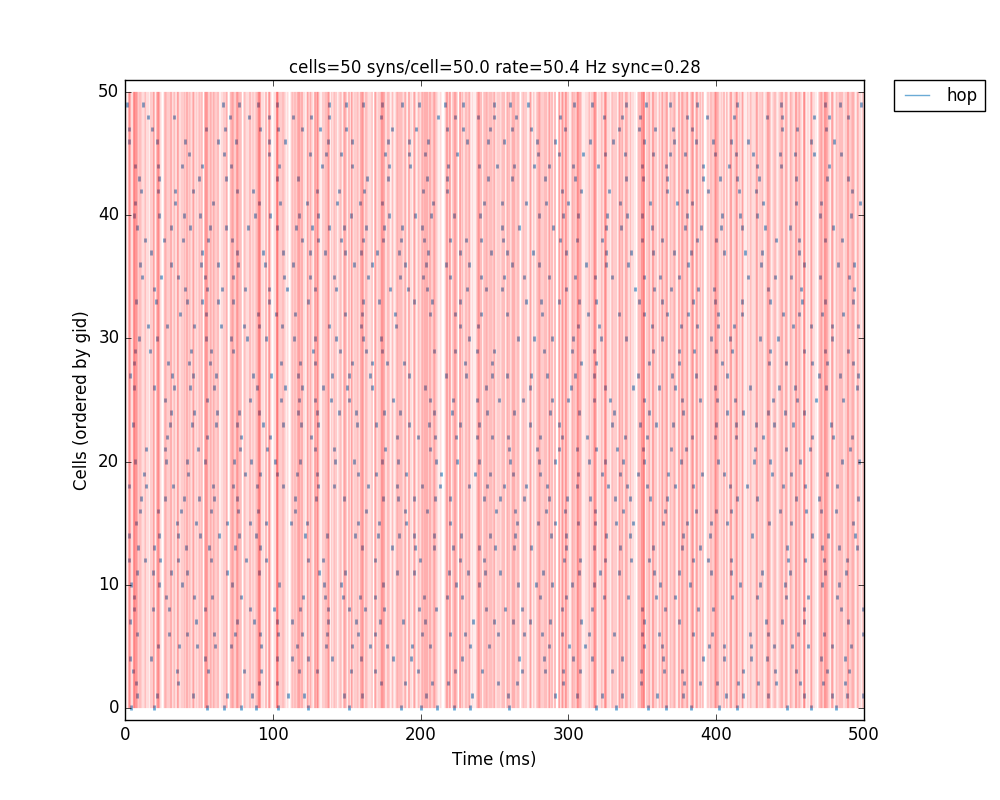

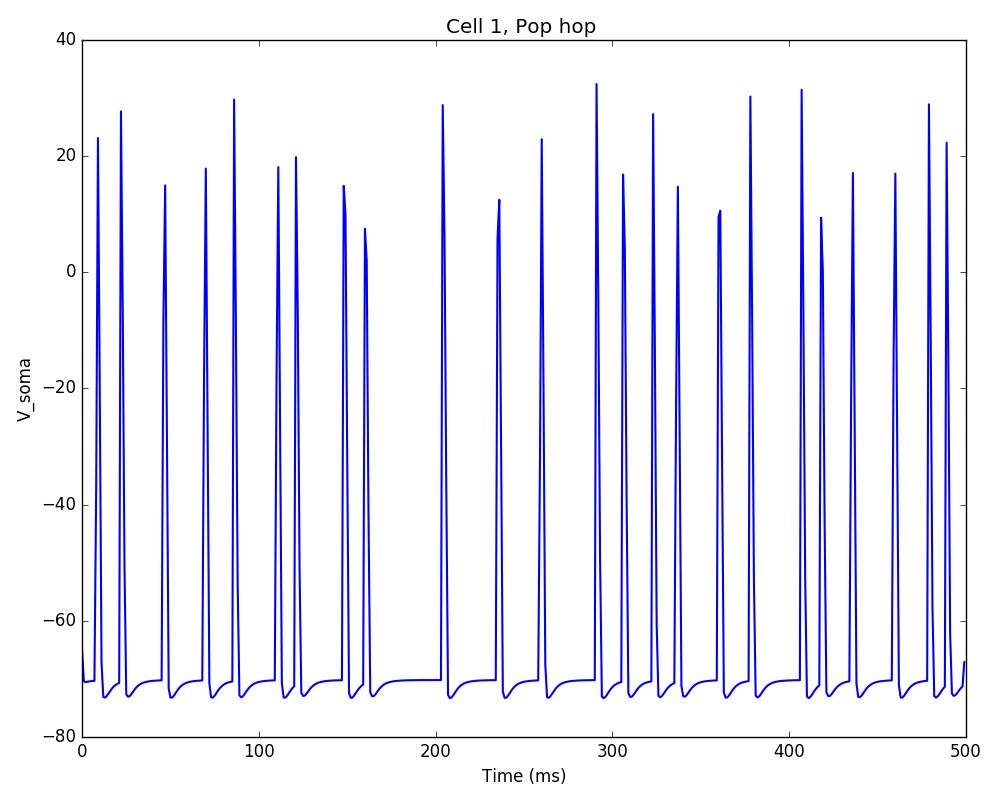

.. note:: We can now access the instantiated network with all the cell and connection metadata, as well as the associated NEURON objects (Sections, Netcons, etc.). The ``sim`` object contains a ``net`` object which, in turn, contains a list of Cell objects called ``cells``. Each Cell object contains a structure with its tags (``tags``), sections (``secs``), connections (``conns``), and external inputs (``stims``). NEURON objects are contained within this python hierarchical structure. See :ref:`data_model` for details.

.. note:: A list of population objects is available via ``sim.net.pops``; each object will contain a list ``cellGids`` with all gids of cells belonging to this populations, and a dictionary ``tags`` with population properties.

.. note:: Spiking data is available via ``sim.allSimData['spkt']`` and ``sim.allSimData['spkid']``. Voltage traces are available via e.g. ``sim.allSimData['V']['cell_25']`` (for cell with gid 25).

.. note:: All the simulation configuration options can be modified interactively via ``sim.cfg``. For example, to turn off plotting of 2D visualization, run: ``sim.cfg.analysis['plot2Dnet']=False``

A representation of the instantiated network structure generated by NetPyNE is shown below:

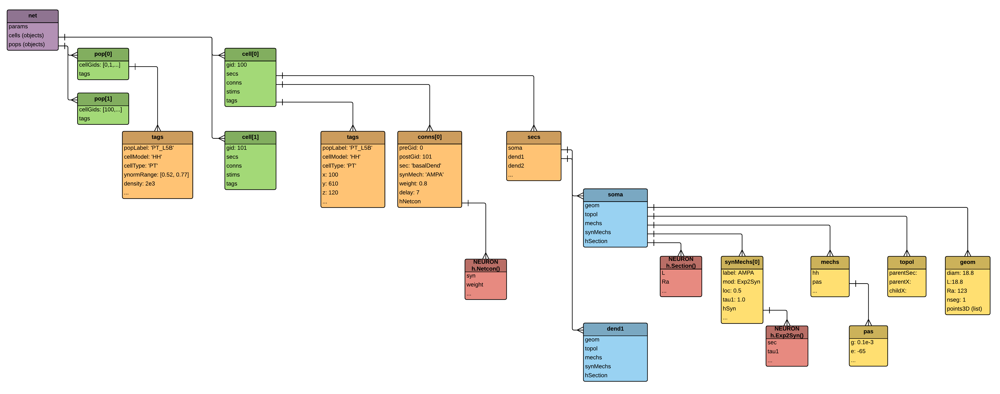

The Network object ``net`` also provides functions to easily modify its cell, connection and stimulation parameters: ``modifyCells(params)``, ``modifyConns(params)`` and ``modifyStims(params)``, respectively. The syntax for the ``params`` argument is similar to that used to initially set the network parameters, i.e. a dictionary including the conditions and parameters to set. For details see :ref:`network_methods`. 

We can therefore call the ``sim.net.modifyConns()`` function to increase all the weights of the inhibitory connections (e.g. to 0.5), and then rerun the simulation interactively::

	###############################################################################
	# INTERACTING WITH INSTANTIATED NETWORK
	###############################################################################

	# modify conn weights
	sim.net.modifyConns({'conds': {'label': 'hop->hop'}, 'weight': 0.5})

	sim.runSim()                          # run parallel Neuron simulation  
	sim.gatherData()                      # gather spiking data and cell info from each node
	sim.saveData()                        # save params, cell info and sim output to file (pickle,mat,txt,etc)
	sim.analysis.plotData()               # plot spike raster

.. note:: that for the condition we have used the `hop->hop` label, which makes reference to the set of recurrent connections previously created.

The resulting plots show that the increased mutual inhibition synchronizes the network activity, increasing the synchrony measure to 0.69:

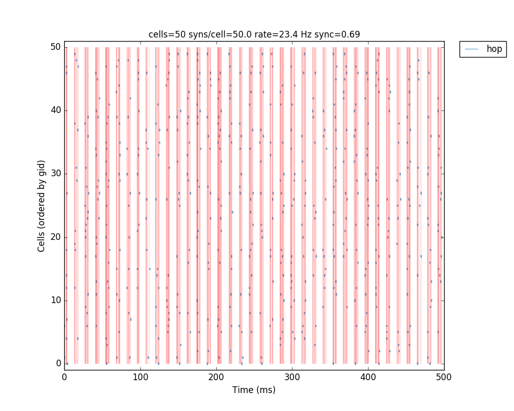

.. image:: figs/tut7_traces_2.png
	:width: 32%

Additionally, we could also modify some of the cell properties to observe how this affects synchrony. The code below modifies the soma length of all cells in the 'hop' population to 160 um::

	# modify cells geometry
	sim.net.modifyCells({'conds': {'pop': 'hop'}, 
	                    'secs': {'soma': {'geom': {'L': 160}}}})

	sim.simulate()
	sim.analysis.plotRaster(syncLines=True)
	sim.analysis.plotTraces(include = [1])

.. note:: For illustration purposes we make use of the ``sim.simulate()`` wrapper, which simply calls ``runSim()`` and ``gatherData()``. Additionally, we interactively call the ``sim.plotRaster()`` and ``sim.plotTraces()`` functions.

The resulting plot shows decreased firing rate and increased synchrony due to the new cell geometry:

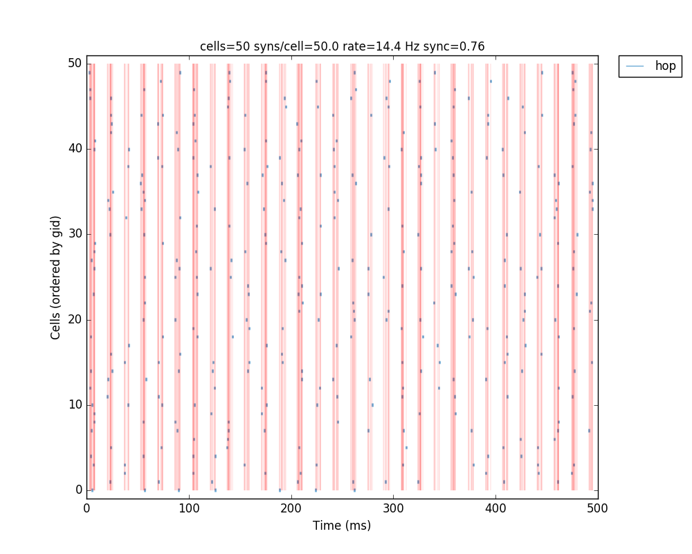

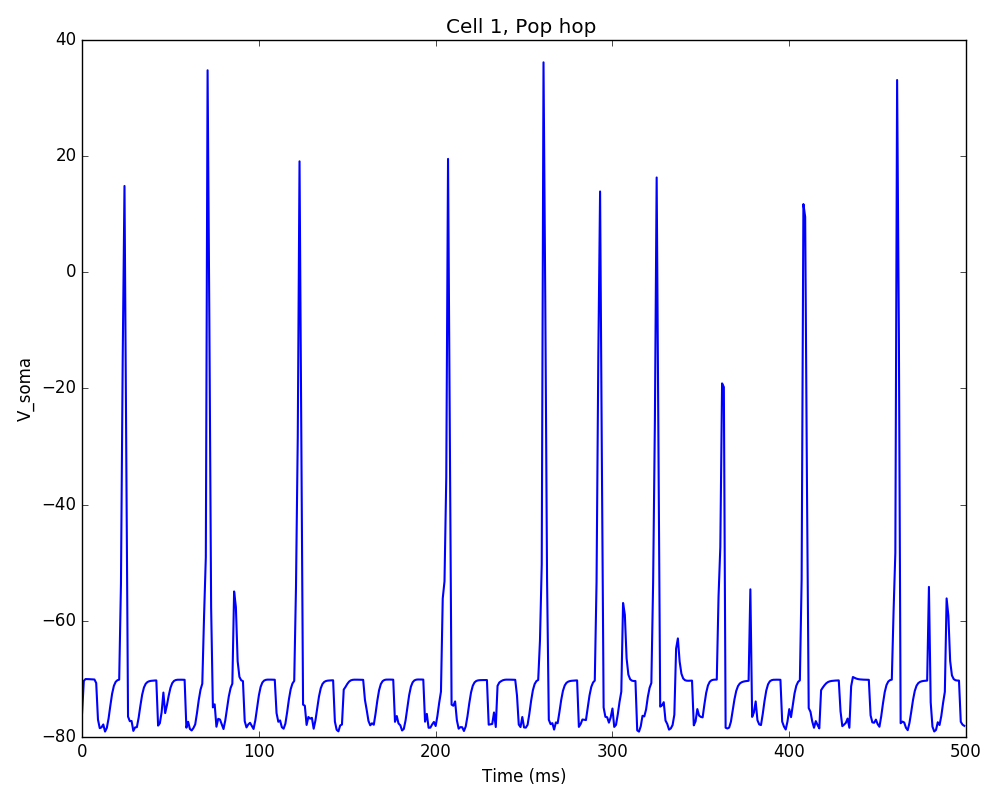

The full tutorial code for this example is available here: :download:`tut7.py <code/tut7.py>`.

Tutorial 8: Running batch simulations
-------------------------------------

Here we are going to illustrate how to run batch simulations using the simple network in Tutorial 2. By batch simulations we mean modifying some parameter values within a given range and automatically running simulations for all combinations of these parameter values (also known as grid parameter search).

The first thing we need to do is break up the tut2.py code into three different files -- although not needed for such small models, this will be very helpful for more larger, more complex models. The file organization should be as follows (click on filename to download):

* :download:`tut8_netParams.py <code/tut8_netParams.py>` : Defines the network model (netParams object). Includes "fixed" parameter values of cells, synapses, connections, stimulation, etc. Changes to this file should only be made for relatively stable improvements of the model. Parameter values that will be varied systematically to explore or tune the model should be included here by referencing the appropiate variable in the simulation configuration (cfg) module. Only a single netParams file is required for each batch of simulations.

* :download:`tut8_cfg.py <code/tut8_cfg.py>` : Simulation configuration (simConfig object). Includes parameter values for each simulation run such as duration, dt, recording parameters etc. Also includes the model parameters that are being varied to explore or tune the network. When running a batch, NetPyNE will automatically create one cfg file for each parameter configuration (using this one as a starting point).

* :download:`tut8_init.py <code/tut8_init.py>` : Sequence of commands to run a single simulation. Can be executed via 'python init.py'. When running a batch, NetPyNE will call init.py multiple times and pass a different cfg file for each of the parameter configurations explored. 

We will also need to add a new file to control the batch simulation:

* :download:`tut8_batch.py <code/tut8_batch.py>` : Defines the parameters and parameter values to be explored in a batch of simulations, the run configuration (e.g. whether to use MPI+Bulletin Board (for multicore machines) or SLURM/PBS Torque (for HPCs)), and the command to run the batch.

In summary, **netParams.py** for fixed (network) parameters, **cfg.py** for variable (simulation) parameters, **init.py** to run a simulation, and **batch.py** to run a batch of simulations exploring combinations of parameter values.

Lets say we want to explore how the connection weight and the synaptic decay time constant affect the firing rate of the motor population. The first step would be to modify ``tut8_netParams.py`` so these parameters are variable, i.e. different in each simulation. Therefore, we will change them from having fixed values (e.g. 5.0 and 0.01) to depending on a variable from simConfig: ``cfg.synMechTau2`` and ``cfg.connWeight`` (note that for simplicity we renamed ``simConfig`` to ``cfg``)::

	... 
	
	## Synaptic mechanism parameters
	netParams.synMechParams['exc'] = {'mod': 'Exp2Syn', 'tau1': 0.1, 'tau2': cfg.synMechTau2, 'e': 0}  # excitatory synaptic mechanism

	... 

	## Cell connectivity rules
	netParams.connParams['S->M'] = {    #  S -> M label
		'preConds': {'pop': 'S'},       # conditions of presyn cells
		'postConds': {'pop': 'M'},      # conditions of postsyn cells
		'probability': 0.5,             # probability of connection
		'weight': cfg.connWeight,       # synaptic weight
		'delay': 5,                     # transmission delay (ms)
		'synMech': 'exc'}               # synaptic mechanism

Therefore, this also requires changing  ``tut8_netParams.py`` to import the ``cfg`` module so that these two variables are available. The code will first attempt to load the ``cfg`` module from ``__main__``, which refers to the parent module which was initially executed by the user, in this case, ``tut8_init.py``. As mentioned before, ``tut8_init.py`` is responsible for loading both ``netParams`` and ``cfg`` and running the simulation. If that fails, the code will load ``cfg`` directly from the ``tut8_cfg.py`` file. To implement this we will add the following lines at the beginning of ``tut8_netParams.py``::

	try:
		from __main__ import cfg  # import SimConfig object with params from parent module
	except:
		from tut8_cfg import cfg  # if no simConfig in parent module, import directly from tut8_cfg module

The next step is to add these two variables to the ``tut8_cfg.py`` so that they exist and can be used by netParams and modified in the batch simulation::

	# Variable parameters (used in netParams)
	cfg.synMechTau2 = 50
	cfg.connWeight = 0.01

Note we will also add to ``tut8_cfg.py`` the following line so that the average firing rates of each populations are printed in screen and saved to the output file::

	cfg.printPopAvgRates = True

The ``tut8_init.py`` will contain only three lines, and just one new line compared to ``tut2.py``. This new line calls the method ``readCmdLineArgs`` which takes care of reading arguments from the command line. This is required to run the batch simulations, since NetPyNE will create multiple cfg files with the different parameter combinations and run them using command line arguments of the form: ``python tut8_init.py simConfig=filepath netParams=filepath``. You do not need to worry about this, since this is done behind the scenes by NetPyNE. The ``tut8_init.py`` should look like this::

	from netpyne import sim

	# read cfg and netParams from command line arguments if available; otherwise use default
	simConfig, netParams = sim.readCmdLineArgs(simConfigDefault='tut8_cfg.py', netParamsDefault='tut8_netParams.py')			

	# Create network and run simulation
	sim.createSimulateAnalyze(netParams=netParams, simConfig=simConfig)

At this point you can run the simulation using e.g. ``python tut8_init.py`` and it should produce the same result as in Tutorial 2 (``tut2.py``).

Now we will add the ``tut8_batch.py`` which contains all the information related to the batch simulations. We have defined a function ``batchTauWeight`` to explore this specific combination of parameters. We could later define other similar functions to create other batches. 

The first thing we do is create an ordered dictionary ``params`` -- this will be of a special NetPyNE type (``specs.ODict``) but it essentially behaves like an ordered dictionary. Next we add the parameters to explore as keys of this dictionary -- ``synMechTau2`` and ``connWeight`` -- and add the list of parameter values to try in the batch simulation as the dictionary keys -- ``[3.0, 5.0, 7.0]`` and ``[0.005, 0.01, 0.15]``. Note that parameter names should coincide with the variables defined in ``cfg``.

We then create an object ``b`` of the NetPyNE class ``Batch`` and pass as arguments the parameters to explore, and the files containing the netParams and simConfig modules. Finally, we customize some attributes of the ``Batch`` object, including the the batch label (``'tauWeight'``), used to create the output file; the folder where to save the data (``'tut8_data'``), the method used to explore parameters (``'grid'``), meaning all combinations of the parameter values; and the run configuration indicating we want to use ``'mpi'`` (this uses MPI and NEURON's Bulletin Board; other options are available for supercomputers), the ``'tut8_init.py'`` to run each sims, and to ``'skip'`` runs if the output files already exist. 

At the end we just need to add the command to launch the batch simulation: ``b.run()``.

The ``tut8_batch.py`` should look like this::
 

	from netpyne import specs
	from netpyne.batch import Batch 

	def batchTauWeight():
		# Create variable of type ordered dictionary (NetPyNE's customized version) 
		params = specs.ODict()   

		# fill in with parameters to explore and range of values (key has to coincide with a variable in simConfig) 
		params['synMechTau2'] = [3.0, 5.0, 7.0]   
		params['connWeight'] = [0.005, 0.01, 0.15]

		# create Batch object with parameters to modify, and specifying files to use
		b = Batch(params=params, cfgFile='tut8_cfg.py', netParamsFile='tut8_netParams.py',)
		
		# Set output folder, grid method (all param combinations), and run configuration
		b.batchLabel = 'tauWeight'
		b.saveFolder = 'tut8_data'
		b.method = 'grid'
		b.runCfg = {'type': 'mpi', 
					'script': 'tut8_init.py', 
					'skip': True}

		# Run batch simulations
		b.run()

	# Main code
	if __name__ == '__main__':
		batchTauWeight() 

To run the batch simulations you will need to have MPI properly installed and NEURON configured to use MPI. Run the following command: ``mpiexec -np [num_cores] nrniv -python -mpi tut8_batch.py`` , where ``[num_cores]`` should be replaced with the number of processors you want to use. The minimum required is ``2``, since one will be used to schedule the jobs (master node); e.g. if you select 4 processors, one will be used to schedule jobs, and the other 3 will run NEURON simulations with different parameter combinations. 

Once the simulations are complete you should have a new folder ``tut8_data`` with the following files:

* **tauWeight_netParams.py**: a copy of the original netParams file used (``tut8_netParams.py``)

* **tauWeight_batchScript.py**:  a copy of the original batch file used (``tut8_batch.py``)

* **tauWeight_batch.json**: a JSON file with the batch parameters and run option used.

* For each combination of parameters (with x, y representing the indices of the parameter values):
	
	* **tauWeight_x_y_cfg.json**: JSON file with all the ``cfg`` variables copied from ``tut8_cfg.py`` but with the values of ``synMechTau2`` and ``connWeight`` for this specific combination of batch parameters.  

	* **tauWeight_x_y.json**: JSON file with the output data for this combination of batch parameters; output data will contain by default the ``netParams``, ``net``, ``simConfig`` and ``simData``.

	* **tauWeight_x_y_raster.png** and **tauWeight_x_y_traces.png**: output figures for this combination of parameters.

To analyze the output data you can download :download:`tut8_analysis.py <code/tut8_analysis.py>`. This file has functions to read and plot a matrix showing the results from the batch simulations. This file requires the `Pandas <http://pandas.pydata.org/>`_ and `Seaborn <https://seaborn.pydata.org/>`_ packages. 

.. note:: The analysis functions in (``tut8_analysis.py``) will be soon integrated into NetPyNE, and so we won't go into the details of the code.

Running ``python tut8_analysis.py`` should produce a color plot showing the relation between the two parameters explored and the firing rate of the ``M`` populations:

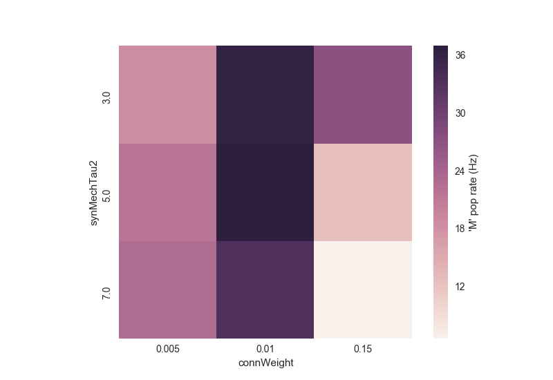

Notice how the rate initially increases as a function of connection weight, but then decreases due to depolarization blockade; and how the effect of the synaptic time decay constant (synMechTau2) depends on whether the cell is spiking normally or in blockade. Batch simulations and analyses facilitate exploration and understanding of these complex interactions.   

.. note:: For the more advanced users, this is what NetPyNE does under the hood when you run a batch:

	1) Copy netParams.py (or whatever file is specified) to batch data folder
	
	2) Load cfg (SimConfig object) from cfg.py (or whatever file is specified)
	
	3) Iterate parameter combinations:
 	
 		3a) Modify cfg (SimConfig object) with the parameter values
 	
 		3b) Save cfg to .json file
 	
 		3c) Run simulation by passing netParams.py and cfg.json files as arguments; this means the code in netParams.py is executed each time but cfg is just a set of fixed saved values.

.. seealso:: The full description of options available in the Batch class will be available soon in the :ref:`package_reference`.

Tutorial 9: Recording and plotting LFPs
---------------------------------------

Examples of how to record and analyze local field potentials (LFP) in single cells and networks are included in the \examples folder: `LFP recording example <https://github.com/Neurosim-lab/netpyne/tree/development/examples/LFPrecording>`_ . LFP recording also works with parallel simulations.

To record LFP just set the list of 3D locations of the LFP electrodes in the `simConfig` attribute `recordLFP` e.g. ``simConfig.recordLFP = e.g. [[50, 100, 50], [50, 200, 50]]`` (note the y coordinate represents depth, so will be represented as a negative value when plotted). The LFP signal in each electrode is obtained by summing the extracellular potential contributed by each segment of each neuron. Extracellular potentials are calculated using the "line source approximation" and assuming an Ohmic medium with conductivity sigma = 0.3 mS/mm. For more information on modeling LFPs see `Scholarpedia <http://www.scholarpedia.org/article/Local_field_potential>`_ or `this article <https://doi.org/10.3389/fncom.2016.00065>`_ .

The recorded LFP signal will be stored in ``sim.allSimData['LFP']`` as a 2D list of size timeSteps * numElectrodes e.g. `sim.allSimData['LFP'][10][2]`` corresponds to the LFP value of electrode 2 at time step 10. It is possible to record the LFP signal generated by each individual cell by setting ``simConfig.saveLFPCells = True`` -- this will be stored in ``sim.allSimData['LFPCells']`` as a 3D list with size cells * timeSteps * numElectrodes. 

To plot the LFP use the ``sim.analysis.plotLFP()`` method. This allows to plot for each electrode: 1) the time-resolved LFP signal ('timeSeries'), 2) the power spectral density ('PSD'), 3) the spectrogram / time-frequency profile ('spectrogram'), 4) and the 3D locations of the electrodes overlaid over the model neurons ('locations'). See :ref:`analysis_functions` for the full list of ``plotLFP()`` arguments.

The first example ( :download:`cell_lfp.py <../../examples/LFPrecording/cell_lfp.py>`) shows LFP recording for a single cell -- M1 corticospinal neuron --  with 700+ compartments (segments) and multiple somatic and dendritic ionic channels. The cell parameters are loaded from a .json file. The cell receives NetStim input to its soma via an excitatory synapse. Ten LFP electrodes are placed at both sides of the neuron at 5 different cortical depths. The soma voltage, LFP time-resolved signal and the 3D locations of the electrodes are plotted:

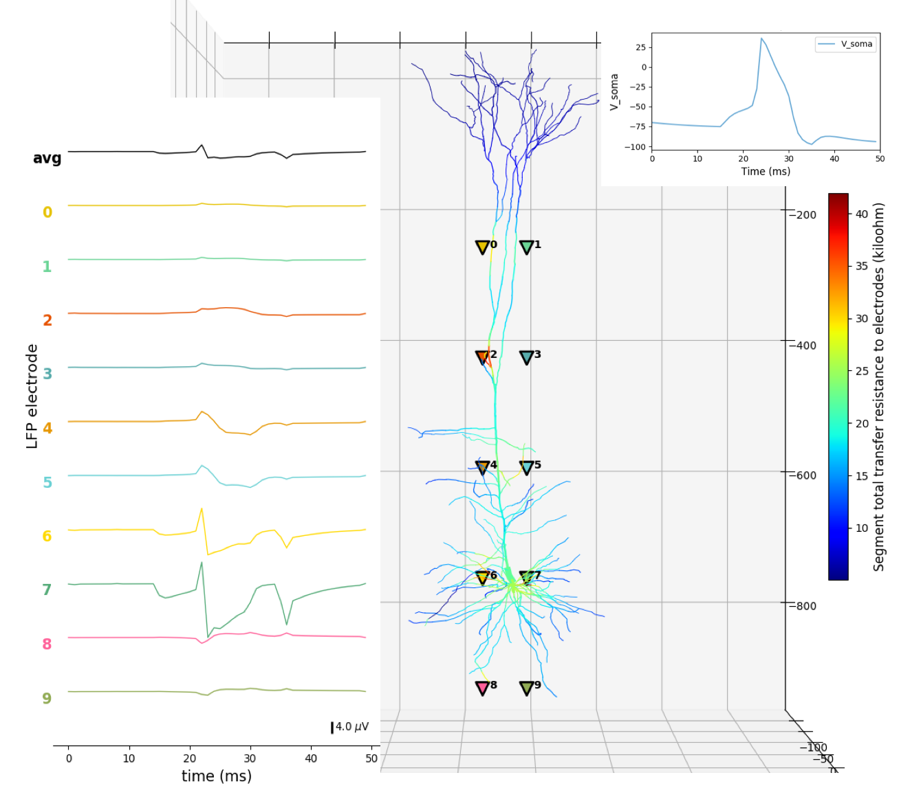

The second example ( :download:`net_lfp.py <../../examples/LFPrecording/net_lfp.py>`) shows LFP recording for a network very similar to that shown in Tutorial 5. However, in this case, the cells have been replaced with a more realistic model: a 6-compartment M1 corticostriatal neuron with multiple ionic channels. The cell parameters are loaded from a .json file. Cell receive NetStim inputs and include excitatory and inhibitory connections. Four LFP electrodes are placed at different cortical depths. The raster plot and LFP time-resolved signal, PSD, spectrogram and 3D locations of the electrodes are plotted:

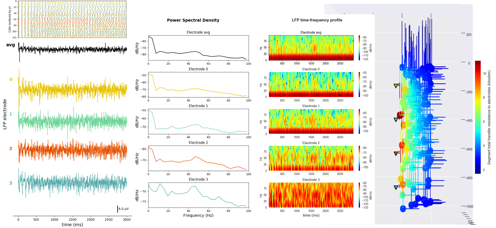

Tutorial 10: Network with Reaction-Diffusion (RxD)
--------------------------------------------------

NetPyNE's high-level specifications also supports `NEURON's reaction-diffusion (RxD) <https://www.neuron.yale.edu/neuron/static/docs/rxd/index.html>`_  components. RxD enables to specify the diffusion of molecules (\eg\ calcium, potassium or IP3) intracellularly, subcellularly (by including organelles such as endoplasmic reticulum and mitochondria), and extracellularly is the context of signaling and enzymatic processing -- \eg\ metabolism, phosphorylation, buffering, second messenger cascades.
This helps to couple molecular-level chemophysiology to the classical electrophysiology at subcellular, cellular and network scales. 

The ``netParams.rxdParams`` dictionary can be used to define the different RxD components: ``regions``, ``species``, ``states``, ``reactions``, ``multicompartmentReactions`` and ``rates``. Example models that include RxD components in single cells and networks are included in the \examples folder: `RxD buffering example <https://github.com/Neurosim-lab/netpyne/tree/development/examples/rxd_buffering>`_ and `RxD network example <https://github.com/Neurosim-lab/netpyne/tree/development/examples/rxd_network>`_. RxD also works with parallel simulations.

.. seealso:: For a comprehensive description of all the features available in NetPyNE see :ref:`package_reference`.
