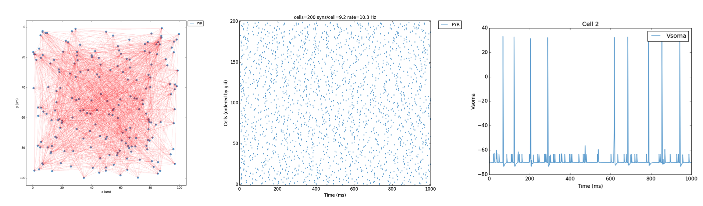
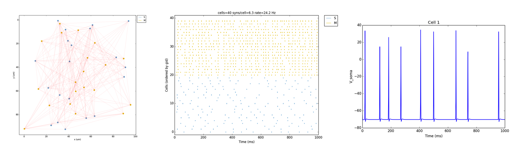
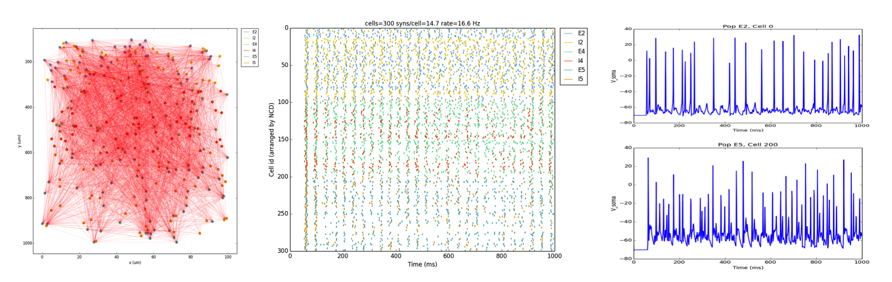
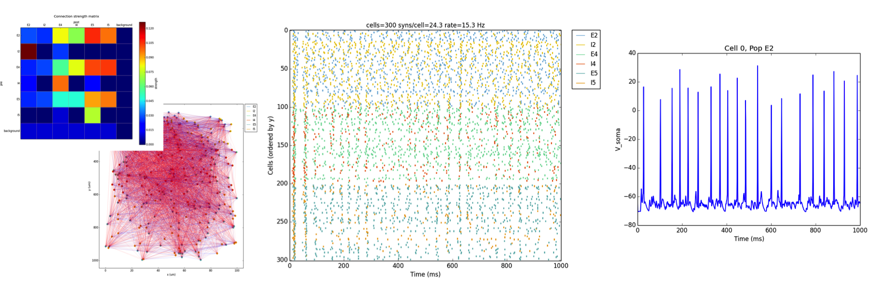
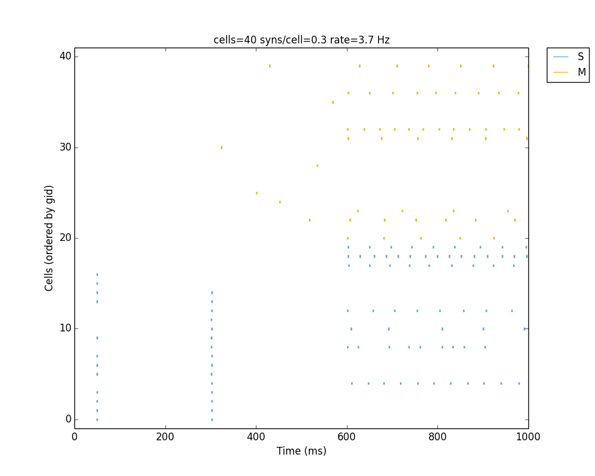
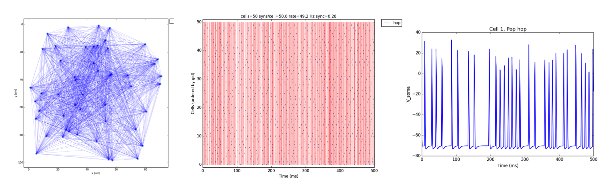
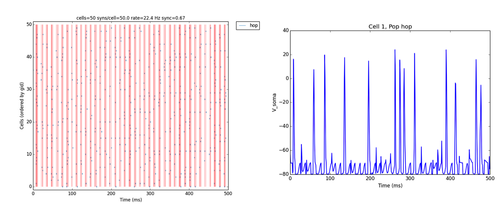
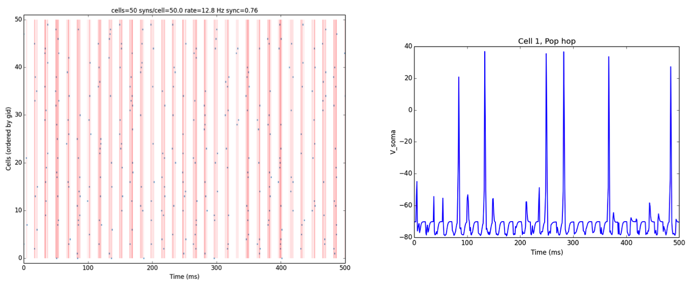

.. _tutorial:

Tutorial
=======================================

This tutorial provides an overview of how to use the NetPyNE python package to create a simple network. 

Downloading and installation instructions here: :ref:`install`

A good understading of python nested dictionaries and lists is recommended, since they are are used to specify the parameters. There are many good online Python courses available, eg. http://www.codecademy.com/en/tracks/python or https://developers.google.com/edu/python/.

.. seealso:: For a comprehensive description of all the features available in NetPyNE see :ref:`package_reference`.

.. _simple_example:

Very simple and quick example
-------------------------------
To start in an encouraging way, we will implement the simplest example possible consisting of just 3 lines! This will create a simple network (200 randomly connected cells), run a 1-second simulation, and plot the network raster plot and the voltage trace of a cell. 

You will need to **download** the ``HHTut.py`` example parameter file (`download here <https://raw.githubusercontent.com/Neurosim-lab/netpyne/master/examples/HHTut/HHTut.py>`_ - right click and "Save as" to same folder you are working on)

The code looks like this (available here :download:`tut1.py <code/tut1.py>`)::

	import HHTut
	from netpyne import sim
	sim.createSimulateAnalyze(netParams = HHTut.netParams, simConfig = HHTut.simConfig)    

The first line imports the ``HHTut`` module with the network and simulation parameters. 

The second line imports the ``sim`` module from the ``netpyne`` package. The `sim`` module provides functions to easily create and simulate networks based on these parameters.

The third line calls the ``createSimulateAnalyze`` function, which runs a standard sequence of commands to create, simulate and the network, and save and plot data. It requires the following 2 arguments:

* ``netParams`` - an object of class NetParams to store network parameters (eg. cell properties, populations, connectivtiy)

* ``simConfig`` - an object of class SimConfig to store simulation options (eg. duration, dt, recording and plotting options, etc)

In this case we are using a set of predefined parameters specified in the ``HHTut`` module (Hodgkin-Huxley network example). The ``HHTut`` module contains the 2 required objects: ``netParams`` and ``simConfig``. 

To run the model just execute the `tut1.py` script. One way to do this is to run this shell command::

	nrniv -python tut1.py

If you successfully installed MPI (eg. OpenMPI) and NEURON with MPI support, you can simulate the model in parallel using multiple cores/processsors by typing:: 

	mpiexec -n 4 nrniv -python -mpi tut1.py

, where you would replace the `4` with the number of cores you want to use.

If you want to avoid typing that long line every time, you can download this simple Unix shell script (:download:`runsim <code/runsim>`) and just type::

	./runsim 4 tut1.py

.. note:: To use the script make sure you change its permissions so its executable (eg. ``chmod +x runsim``) 

Whatever method you use, you should a 2D representation of the cells and connections in the network, a raster plot (spikes as cell vs time) and the voltage trace of a single cell: 

Congratulations! You have created and simulated a biological neuronal network in NEURON! 

.. note:: In some systems the figures that pop up may be empty. This can be fixed by adding this line to the end of your tut1.py: ``import pylab; pylab.show()`` . In any case, the raster plot and the voltage trace figures will be correctly saved to disk as ``raster.png`` and ``traces.png``.

In the remaining of this tutorial we will see how to easily specify your own parameters to create custom networks and simulations. For simplicity, in the rest of the tutorial, the network parameters, simulation options and calls to functions (necessary to create the network, simulate it and plot the results) will all be included in a single file. For larger models it is recommended to keep model specification parameters and function calls in separate files (see `examples here <https://https://github.com/Neurosim-lab/netpyne/tree/master/examples>`_.)

We begin with an overview of the Python objects where you will define all your network parameters.

Network parameters
----------------------

The ``netParams`` object includes all the information necessary to define your network. It is compoased of the following 6 ordered dictionaries:

* ``popParams`` - populations in the network and their parameters

* ``cellParams`` - cell property rules and their associated parameters (eg. cell geometry)

* ``synMechParams`` - synaptic mechanisms and their parameters

* ``connParams`` - network connectivity rules and their associated parameters. 

* ``subConnParams`` - network subcellular connectivity rules and their associated parameters. 

* ``stimSourceParams`` - stimulation sources parameters. 

* ``stimTargetParams`` - mapping between stimulation sources and target cells . 

.. image:: figs/netparams.png
	:width: 40%
	:align: center

The ``netParams`` organization is consistent with the standard sequence of events that the package executes internally:

* creates a ``Network`` object and adds inside a set of ``Population`` and ``Cell`` objects based on ``popParams``

* sets the cell properties based on ``cellParams`` (checking which cells match the conditions of each rule) 

* creates a set of connections based on ``connParams`` and ``subConnParams`` (checking which presynpatic and postsynaptic cells match the conn rule conditions), and using the synaptic parameters in ``synMechParams``.

* add stimulation to the cells based on ``stimSourceParams`` and ``stimTargetParams``.

The image below illustrates this process:

.. image:: figs/process.png
	:width: 50%
	:align: center

We will now create a new model file (call it ``tut2.py``) where we will specify from scratch all the network parameters. To create the structures that will hold the network parameters add the following code:

	from netpyne import specs, sim

	# Network parameters
	netParams = specs.NetParams()  # object of class NetParams to store the network parameters

Populations
^^^^^^^^^^^^^^^^^^^^^^

First, we need to create some populations for our network, by adding items to the ``popParams`` dictionary in ``netParams``. The ``netParams`` object provides a method ``addPopParams(label, params)`` to easily do this, where ``label`` is an arbitrary label for the population (can be used as reference later), and ``params`` is a dictionary with the following population parameters (see :ref:`pop_params` for more details):

* ``cellType`` - an attribute/tag assigned to cells in this population, can later be used to set certain cell properties to cells with this tag.

* ``numCells`` - number of cells in this population (can also specify using cell density)

* ``cellModel`` - an attribute or tag that will be assigned to cells in this population, can later be used to set specific cell model implementation for cells with this tag. Eg. 'HH' (standard Hodkgin-Huxley type cell model) or 'Izhi2007b' (Izhikevich 2007 point neuron model). Cell models can be defined by the user or imported.

We will start by creating 2 populations labeled ``S`` (sensory) and ``M`` (motor), with ``20`` cells each, of type ``PYR`` (pyramidal), and using ``HH`` cell model (standard compartmental Hodgkin-Huxley type cell). 

	## Population parameters
	netParams.addPopParams('S', {'cellType': 'PYR', 'numCells': 20, 'cellModel': 'HH'}) 
	netParams.addPopParams('M', {'cellType': 'PYR', 'numCells': 20, 'cellModel': 'HH'}) 

During execution, this will tell NetPyNE to create 40 ``Cell`` objects, each of which will include the attributes or tags of its population, i.e. 'cellType': 'PYR', etc. These tags can later be used to define the properties of the cells, or connectivity rules.

Lets now add a special type of population used to provide background driving inputs to the cells, labeled ``background``. In this case the cell model will be ``NetStim`` (NEURON's artificial spike generator), and we will specify we want a firing rate of ``100`` Hz and with a noise level of ``0.5``::

	netParams.addPopParams('background', {'rate': 10, 'noise': 0.5, 'cellModel': 'NetStim'})

To get a better intuition of the data structure, you can ``print netParams.popParams`` to see all the populations parameters, or print ``print netParams.popParams['M']`` to see the parameters of population 'M'.

Cell property rules
^^^^^^^^^^^^^^^^^^^^^^^^^^

Now we need to define the properties of each cell type, by adding items to the ``cellParams`` dictionary. We can use the ``netParams`` method ``addCellParams(label, params)``, where ``label`` is an arbitrary label for this rule (doesn't need to be same as cell type), and ``params`` is a dictionary with the following two fields:

* ``conds`` - these arbitrary conditions need to be met by cells in order to apply them these cell properties. Usually defined specifying an attribute/tag of the cell and the required value e.g. 'cellType': 'PYR'

* ``secs`` - dictionary containing the properties of sections, eg. geometry, mechanisms

The idea of conditional cell properties is that you can apply cell properties to subsets of neurons - eg. only those neurons of a given cell type, and/or of a given population, and/or within a certain range of locations. 

In our example we create a cell property rule that applies to all cells where the ``cellType`` = ``PYR``, therefore applying to our two populations (``S`` and ``P``) currently composed of pyramidal cells. We specify that we want them to have a section labeled ``soma`` with a certain geometry, a Hodgkin-Huxley mechanism (``hh``)::

	cellRule = {'conds': {'cellType': 'PYR'},  'secs': {}} 	# cell rule dict
	cellRule['secs']['soma'] = {'geom': {}, 'mechs': {}}  													# soma params dict
	cellRule['secs']['soma']['geom'] = {'diam': 18.8, 'L': 18.8, 'Ra': 123.0}  								# soma geometry
	cellRule['secs']['soma']['mechs']['hh'] = {'gnabar': 0.12, 'gkbar': 0.036, 'gl': 0.003, 'el': -70}  	# soma hh mechanism
	netParams.addCellParams('PYRrule', cellRule)  

Take a moment to examine the nested dictionary structure used to define the cell property rule. Notice the use of empty dictionaries (``{}``) and intermediate dictionaries (eg. ``cellRule``) to facilitate filling in the parameters. There are other equivalent methods to add this rule, such as::

	netParams.addCellParams('PYRrule',		# cell rule label
		{'conds': {'cellType': 'PYR'},  	# properties will be applied to cells that match these conditions	
		'secs': {'soma':					# sections 
					{'geom': {'diam': 18.8, 'L': 18.8, 'Ra': 123.0},		# geometry 
					'mechs': {'hh': {'gnabar': 0.12, 'gkbar': 0.036, 'gl': 0.003, 'el': -70}}}}}) 	# mechanisms

All methods are equally valid as long as the resulting structure looks like this (order of elements doesn't matter in dictionaries)::

	>>> netParams.cellParams['PYRrule']
	{'conds': {'cellType': 'PYR'},
 	'secs': {'soma': {'geom': {'L': 18.8, 'Ra': 123.0, 'diam': 18.8},
    'mechs': {'hh': {'el': -70, 'gkbar': 0.036, 'gl': 0.003, 'gnabar': 0.12}}}}}

Synaptic mechanisms parameters
^^^^^^^^^^^^^^^^^^^^^^^^^^^^^^

Next we need to define the parameters of at least one synaptic mechanism, by adding items to the ``synMechParams`` dictionary via ``addSynMechParams(label, params)`` method; where ``label`` is an arbitrary label for this mechanism (used to reference it in the connectivity rules); and ``params`` is a dictionary with the following fields:

* ``mod`` - the NMODL mechanism (eg. 'ExpSyn')

* mechanism parameters (eg. ``tau`` or ``e``) - these will depend on the specific NMODL mechanism.

Synaptic mechanisms will be added to cells as required during the connection phase. Each connectivity rule will specify which synaptic mechanism parameters to use by referencing the appropiate label. In our network we will define the parameters of a simple excitatory synaptic mechanism labeled ``exc``, implemented using the ``Exp2Syn`` model, with rise time (``tau1``) of 0.1 ms, decay time (``tau2``) of 5 ms, and equilibrium potential (``e``) of 0 mV::

	## Synaptic mechanism parameters
	netParams.addSynMechParams('exc', {'mod': 'Exp2Syn', 'tau1': 0.1, 'tau2': 5.0, 'e': 0})  # excitatory synaptic mechanism

 
Connectivity rules
^^^^^^^^^^^^^^^^^^^^^^^^^^^^^^

Finally, we need to specify how to connect the cells, by adding items (connectivity rules) to the ``connParams`` dictionary, using the ``addConnParams(label, params)`` method. The ``label`` is an arbitrary name for this conenction, and ``params``  consists of a dictionary with the following fields:

* ``preConds`` - specifies the conditions of the presynaptic cells

* ``postConds`` - specifies the conditions of the postsynaptic cells

* ``weight`` - synaptic strength of the connections

* ``delay`` - delay (in ms) for the presynaptic spike to reach the postsynaptic neuron

* ``synMech`` - synpatic mechanism parameters to use

* ``probability`` or ``convergence`` or ``divergence`` - optional parameter to specify the probability of connection (0 to 1), convergence (number of presyn cells per postsyn cell), or divergence (number of postsyn cells per presyn cell), respectively. If omitted, all-to-all connectivity is implemented.

We will first add a rule to randomly connect the sensory to the motor population with a 50% probability::

	## Cell connectivity rules
	netParams.addConnParams('S->M', #  S -> M label
		{'preConds': {'popLabel': 'S'}, # conditions of presyn cells
		'postConds': {'popLabel': 'M'}, # conditions of postsyn cells
		'probability': 0.5, 		# probability of connection
		'weight': 0.01, 			# synaptic weight 
		'delay': 5,					# transmission delay (ms) 
		'synMech': 'exc'})   		# synaptic mechanism 

Next we will connect background inputs (NetStims) to all cells of both populations::

	netParams.addConnParams('bg->PYR', # background -> PYR label
		{'preConds': {'popLabel': 'background'}, 
		'postConds': {'cellType': 'PYR'}, 
		'weight': 0.01, 				# synaptic weight 
		'delay': 5, 				# transmission delay (ms) 
		'synMech': 'exc'})  		# synaptic mechanism 

Simulation configuration options
---------------------------------

Above we defined all the parameters related to the network model. Here we will specifiy the parameters or configuration of the simulation itself (e.g. duration), which is independent of the network.

The ``simConfig`` object can be used to customize options related to the simulation duration, timestep, recording of cell variables, saving data to disk, graph plotting, and others. All options have defaults values so it is not mandatory to specify any of them.

Below we include the options required to run a simulation of 1 second, with intgration step of 0.025 ms, record the soma voltage at 0.1 ms intervals, save data (params, network and simulation output) to a pickle file called ``model_output``, plot a network raster, plot the voltage trace of cell with gid ``1``, and plot a 2D representation of the network::

	# Simulation options
	simConfig = specs.SimConfig()		# object of class SimConfig to store simulation configuration

	simConfig.duration = 1*1e3 			# Duration of the simulation, in ms
	simConfig.dt = 0.025 				# Internal integration timestep to use
	simConfig.verbose = False  			# Show detailed messages 
	simConfig.recordTraces = {'V_soma':{'sec':'soma','loc':0.5,'var':'v'}}  # Dict with traces to record
	simConfig.recordStep = 0.1 			# Step size in ms to save data (eg. V traces, LFP, etc)
	simConfig.filename = 'model_output'  # Set file output name
	simConfig.savePickle = False 		# Save params, network and sim output to pickle file

	simConfig.addAnalysis('plotRaster', True) 			# Plot a raster
	simConfig.addAnalysis('plotTraces', {'include': [1]}) 			# Plot recorded traces for this list of cells
	simConfig.addAnalysis('plot2Dnet', True)           # plot 2D visualization of cell positions and connections

The complete list of simulation configuration options is available here: :ref:`sim_config`.

Network creation and simulation
-----------------------------------------------

Now that we have defined all the network parameters and simulation options, we are ready to actually create the network and run the simulation. To do this we use the ``createSimulateAnalyze`` function from the ``sim`` module, and pass as arguments the ``netParams`` and ``simConfig`` dicts we have just created::

	sim.createSimulateAnalyze(netParams, simConfig)    

Note that as before we need to make sure we have imported the ``sim`` module from the ``netpyne`` package. 

The full tutorial code for this example is available here: :download:`tut2.py <code/tut2.py>`

To run the model we can use any of the methods previously described in :ref:`simple_example`:

If mpi not installed::

	nrniv -python tut2.py

If mpi working::

	mpiexec -n 4 nrniv -python -mpi tut2.py

If mpi working and have ``runsim`` shell script::

	./runsim 4 tut2.py

You should get the raster plot and voltage trace figures shown below. Notice how the ``M`` population firing rate is higher than that of the ``S`` population. This makes sense since they both receive the same background inputs, but ``S`` cells connect randomly to ``M`` cells thus increasing the ``M`` firing rate. 

Feel free to explore the effect of changing any of the model parameters, eg. number of cells, background or S->M weights, cell geometry or biophysical properties, etc.

Adding a compartment (dendrite) to cells
-------------------------------------------

Here we extend the pyramidal cell type by adding a dendritic section with a passive mechanism. Note that for the ``dend`` section we included the ``topol`` dict defining how it connects to its parent ``soma`` section::

	## Cell property rules
	cellRule = {'conds': {'cellType': 'PYR'},  'secs': {}} 	# cell rule dict
	cellRule['secs']['soma'] = {'geom': {}, 'mechs': {}}  											# soma params dict
	cellRule['secs']['soma']['geom'] = {'diam': 18.8, 'L': 18.8, 'Ra': 123.0}  									# soma geometry
	cellRule['secs']['soma']['mechs']['hh'] = {'gnabar': 0.12, 'gkbar': 0.036, 'gl': 0.003, 'el': -70}  		# soma hh mechanisms
	cellRule['secs']['dend'] = {'geom': {}, 'topol': {}, 'mechs': {}}  								# dend params dict
	cellRule['secs']['dend']['geom'] = {'diam': 5.0, 'L': 150.0, 'Ra': 150.0, 'cm': 1}							# dend geometry
	cellRule['secs']['dend']['topol'] = {'parentSec': 'soma', 'parentX': 1.0, 'childX': 0}						# dend topology 
	cellRule['secs']['dend']['mechs']['pas'] = {'g': 0.0000357, 'e': -70} 										# dend mechanisms
	netParams.addCellParams('PYRrule', cellRule)  												# add dict to list of cell parameters

We can also update the connectivity rule to specify that the ``S`` cells should connect to the dendrite of ``M`` cells, by adding the dict entry ``'sec': 'dend'`` as follows::

	netParams.addConnParams('S->M', {'preConds': {'popLabel': 'S'}, 'postConds': {'popLabel': 'M'},  #  S -> M
		'probability': 0.5, 		# probability of connection
		'weight': 0.01, 			# synaptic weight 
		'delay': 5,					# transmission delay (ms) 
		'sec': 'dend',				# section to connect to
		'loc': 1.0,				# location of synapse
		'synMech': 'exc'})   		# target synaptic mechanism

The full tutorial code for this example is available here: :download:`tut3.py <code/tut3.py>`.

If you run the network, you will observe the new dendritic compartment has the effect of reducing the firing rate.

Using a simplified cell model (Izhikevich) 
--------------------------------------------------------------------

When dealing with large simulations it is sometimes useful to use simpler cell models for some populations, in order to gain speed. Here we will replace the HH model with the simpler Izhikevich cell model only for cells in the sensory (``S``) population. 

The first step is to download the Izhikevich cell NEURON NMODL file which containes the Izhi2007b point process mechanism: :download:`izhi2007b.mod <code/mod/izhi2007b.mod>`

Next we need to compile this .mod file so its ready to use by NEURON::

	nrnivmodl

Now we need to specify that we want to use the ``Izhi2007b`` ``cellModel`` for the ``S`` population::

	netParams.addPopParams('S', {'cellType': 'PYR', 'numCells': 20, 'cellModel': 'Izhi2007b'}) 

And we need to create a new cell rule for the Izhikevich cell. But first we need to specify that the existing rule needs to apply only to 'HH' cell models::

	cellRule = {'label': 'PYR_HH_rule', 'conds': {'cellType': 'PYR', 'cellModel': 'HH'},  'secs': {}} 	# cell rule dict

Finally we can create the new rule for the Izhikevich cell model::

	cellRule = {'conds': {'cellType': 'PYR', 'cellModel': 'Izhi2007b'},  'secs': {}} 	# cell rule dict
	cellRule['secs']['soma'] = {'geom': {}, 'pointps': {}}  											# soma params dict
	cellRule['secs']['soma']['geom'] = {'diam': 10.0, 'L': 10.0, 'cm': 31.831}  									# soma geometry
	cellRule['secs']['soma']['pointps']['Izhi'] = {'mod':'Izhi2007b', 'C':1, 'k':0.7, 
		'vr':-60, 'vt':-40, 'vpeak':35, 'a':0.03, 'b':-2, 'c':-50, 'd':100, 'celltype':1}  		# soma hh mechanisms
	netParams.addCellParams('PYR_Izhi_rule', cellRule)  												# add dict to list of cell parameters

Notice we have added a new field inside the ``soma`` called ``pointps``, which will include the point process mechanisms in the section. In this case we added the ``Izhi2007b`` point process and provided a dict with the Izhikevich cell parameters corresponding to the pyramidal regular spiking cell. Further details and other parameters for the Izhikevich cell model can be found here: https://senselab.med.yale.edu/modeldb/showModel.cshtml?model=39948 

Congratulatios, now you have a hybrid model composed of HH and Izhikevich cells! You can also easily change the cell model used by existing or new populations. 

The full tutorial code for this example is available here: :download:`tut4.py <code/tut4.py>`.

.. seealso:: NetPyNE also supports importing cells defined in other files (eg. in hoc cell templates, or python classes). See :ref:`importing_cells` for details and examples.

Position and distance based connectivity
------------------------------------------

The following example demonstrates how to spatially separate populations, add inhbitory populations, and implement weights, probabilities of connection and delays that depend on cell positions or distances.

We will build a cortical-like network with 6 populations (3 excitatory and 3 inhibitory) distributed in 3 layers: 2/3, 4 and 5. Create a new empty file called ``tut5.py`` and lets add the required code.   

Since we want to distribute the cells spatially, the first thing we need to do is define the volume dimensions where cells will be placed. By convention we take the X and Z to be the horizontal or lateral dimensions, and Y to be the vertical dimension (representing cortical depth in this case.) To define a cuboid with volume of 100x1000x100 um (ie. horizontal spread of 100x100 um and cortical depth of 1000um) we can use the ``sizeX``, ``sizeY`` and ``sizeZ`` network parameters as follows::

	# Network parameters
	netParams = specs.NetParams()  # object of class NetParams to store the network parameters

	netParams.sizeX = 100 # x-dimension (horizontal length) size in um
	netParams.sizeY = 1000 # y-dimension (vertical height or cortical depth) size in um
	netParams.sizeZ = 100 # z-dimension (horizontal length) size in um
	netParams.propVelocity = 100.0 # propagation velocity (um/ms)
	netParams.probLengthConst = 150.0 # length constant for conn probability (um)

Note that we also added two parameters (``propVelocity`` and ``probLengthConst``) which we'll use later for the connectivity rules.

Next we can create our background input popualtion and the 6 cortical populations labeled according to the cell type and layer eg. 'E2' for excitatory cells in layer 2. We can define the cortical depth range of each population by using the ``yRange`` parameter, eg. to place layer 2 cells between 100 and 300 um depth: ``'yRange': [100,300]``. This range can also be specified using normalized values, eg. ``'yRange': [0.1,0.3]``. In the code below we provide examples of both methods for illustration::

	## Population parameters
	netParams.addPopParams('E2', {'cellType': 'E', 'numCells': 50, 'yRange': [100,300], 'cellModel': 'HH'}) 
	netParams.addPopParams('I2', {'cellType': 'I', 'numCells': 50, 'yRange': [100,300], 'cellModel': 'HH'}) 
	netParams.addPopParams('E4', {'cellType': 'E', 'numCells': 50, 'yRange': [300,600], 'cellModel': 'HH'}) 
	netParams.addPopParams('I4', {'cellType': 'I', 'numCells': 50, 'yRange': [300,600], 'cellModel': 'HH'}) 
	netParams.addPopParams('E5', {'cellType': 'E', 'numCells': 50, 'ynormRange': [0.6,1.0], 'cellModel': 'HH'}) 
	netParams.addPopParams('I5', {'cellType': 'I', 'numCells': 50, 'ynormRange': [0.6,1.0], 'cellModel': 'HH'}) 
	netParams.addPopParams('background', {'rate': 20, 'noise': 0.3, 'cellModel': 'NetStim'})

Next we define the cell properties of each type of cell ('E' for excitatory and 'I' for inhibitory). We have made minor random modifications of some cell parameters just to illustrate that different cell types can have different properties::
	
	## Cell property rules
	cellRule = {'conds': {'cellType': 'E'},  'secs': {}}  # cell rule dict
	cellRule['secs']['soma'] = {'geom': {}, 'mechs': {}}                              # soma params dict
	cellRule['secs']['soma']['geom'] = {'diam': 15, 'L': 14, 'Ra': 120.0}                   # soma geometry
	cellRule['secs']['soma']['mechs']['hh'] = {'gnabar': 0.13, 'gkbar': 0.036, 'gl': 0.003, 'el': -70}      # soma hh mechanism
	netParams.addCellParams('Erule', cellRule)                          # add dict to list of cell params

	cellRule = {'conds': {'cellType': 'I'},  'secs': {}}  # cell rule dict
	cellRule['secs']['soma'] = {'geom': {}, 'mechs': {}}                              # soma params dict
	cellRule['secs']['soma']['geom'] = {'diam': 10.0, 'L': 9.0, 'Ra': 110.0}                  # soma geometry
	cellRule['secs']['soma']['mechs']['hh'] = {'gnabar': 0.11, 'gkbar': 0.036, 'gl': 0.003, 'el': -70}      # soma hh mechanism
	netParams.addCellParams('Irule', cellRule)                          # add dict to list of cell params

As in previous examples we also add the parameters of the excitatory and inhibitory synaptic mechanisms, which will be added to cells when the connections are created::

	## Synaptic mechanism parameters
	netParams.addSynMechParams('exc', {'mod': 'Exp2Syn', 'tau1': 0.8, 'tau2': 5.3, 'e': 0})  # NMDA synaptic mechanism
	netParams.addSynMechParams('inh', {'mod': 'Exp2Syn', 'tau1': 0.6, 'tau2': 8.5, 'e': -75})  # GABA synaptic mechanism

In terms of connectivity, we'll start by adding background inputs to all cell in the network. The weight will be fixed to 0.01, but we'll make the delay come from a gaussian distribution with mean 5 ms and standard deviation 2, and have a minimum value of 1 ms. We can do this using string-based functions: ``'max(1, gauss(5,2)'``. As detailed in section :ref:`function_string`, string-based functions allow you to define connectivity params using many Python mathematical operators and functions. The full code to add background inputs looks like this::

	## Cell connectivity rules
	netParams.addConnParams('bg->all',
	{'preConds': {'popLabel': 'background'}, 'postConds': {'cellType': ['E', 'I']}, # background -> all
	  'weight': 0.01,                     # synaptic weight 
	  'delay': 'max(1, gauss(5,2))',      # transmission delay (ms) 
	  'synMech': 'exc'})                  # synaptic mechanism 

We can now add the standard simulation configuration options and the code to create and run the network. Notice that we have chosen to record and plot voltage traces of one cell in each of the excitatory populations (``{'include': [('E2',0), ('E4', 0), ('E5', 5)]})``), plot the raster ordered based on cell cortical depth (``{'orderBy': 'y', 'orderInverse': True})``), show a 2D visualization of cell positions and connections, and plot the connectivity matrix::

	# Simulation options
	simConfig = specs.SimConfig()        # object of class SimConfig to store simulation configuration

	simConfig.duration = 1*1e3           # Duration of the simulation, in ms
	simConfig.dt = 0.05                 # Internal integration timestep to use
	simConfig.verbose = False            # Show detailed messages 
	simConfig.recordTraces = {'V_soma':{'sec':'soma','loc':0.5,'var':'v'}}  # Dict with traces to record
	simConfig.recordStep = 1             # Step size in ms to save data (eg. V traces, LFP, etc)
	simConfig.filename = 'model_output'  # Set file output name
	simConfig.savePickle = False         # Save params, network and sim output to pickle file

	simConfig.addAnalysis('plotRaster', {'orderBy': 'y', 'orderInverse': True})      # Plot a raster
	simConfig.addAnalysis('plotTraces', {'include': [('E2',0), ('E4', 0), ('E5', 5)]})      # Plot recorded traces for this list of cells
	simConfig.addAnalysis('plot2Dnet', True)           # plot 2D visualization of cell positions and connections
	simConfig.addAnalysis('plotConn', True)           # plot connectivity matrix

	# Create network and run simulation
	sim.createSimulateAnalyze(netParams = netParams, simConfig = simConfig)    
	   
If we run the model at this point we will see the cells are distributed into three layers as specified, and they all spike randomly with an average rate of 20Hz driven by background input:

.. image:: figs/tut5_1.png
	:width: 95%
	:align: center

Lets now add excitatory connections with some spatial-dependent properties to illustrate NetPyNE capabilities. First,lets  specify that we want excitatory cells to target all cells within a cortical depth of 100 and 1000 um, with the following code: ``'postConds': {'y': [100,1000]}``. 

Second, lets make the the connection weight be proportional to the cortical depth of the cell, ie. postsynaptic cells in deeper layers will receive stronger connections than those in superficial layers. To do this we make use of the distance-related variables that NetPyNE makes available to use in string-based functions; in this case ``post_ynorm``, which represents the normalized y location of the postsynaptic cell. For a complete list of available variables see: :ref:`function_string`.

Finally, we can specify the delay based on the distance between the cells (``dist_3D``) and the propagation velocity (given as a parameter at the beginning of the code), as follows: ``'delay': 'dist_3D/propVelocity'``. The full code for this connectivity rules is::

	netParams.addConnParams('E->all',
	{'preConds': {'cellType': 'E'}, 'postConds': {'y': [100,1000]},  #  E -> all (100-1000 um)
	  'probability': 0.1 ,                  # probability of connection
	  'weight': '0.005*post_ynorm',         # synaptic weight 
	  'delay': 'dist_3D/propVelocity',      # transmission delay (ms) 
	  'synMech': 'exc'})                    # synaptic mechanism 

Running the model now shows excitatory connections in red, and how cells in the deeper layers (higher y values) exhibit lower rates and higher synchronization, due to increased weights leading to depolarization blockade. This difference is also visible in the voltage traces of layer 2 vs layer 5 cells:

Finally, we add inhibitory connections which will project only onto excitatory cells, specified here using the ``popLabel`` attribute, for illustrative purposes (an equivalent rule would be: ``'postConds': {'cellType': 'E'}``). 

To make the probability of connection decay exponentiall as a function of distance with a given length constant (``probLengthConst``), we can use the following distance-based expression: ``'probability': '0.4*exp(-dist_3D/probLengthConst)'``. The code for the inhibitory connectivity rule is therefore::

	netParams.addConnParams('I->E',
	{'preConds': {'cellType': 'I'}, 'postConds': {'popLabel': ['E2','E4','E5']},       #  I -> E
	  'probability': '0.4*exp(-dist_3D/probLengthConst)',   # probability of connection
	  'weight': 0.001,                                     # synaptic weight 
	  'delay': 'dist_3D/propVelocity',                    # transmission delay (ms) 
	  'synMech': 'inh'})                                  # synaptic mechanism 

Notice that the 2D network diagram now shows inhibitory connections in blue, and these are mostly local/lateral within layers, due to the distance-related probability restriction. These local inhibitory connections reduce the overall synchrony, introducing some richness into the temporal firing patterns of the network.

The full tutorial code for this example is available here: :download:`tut5.py <code/tut5.py>`.

Adding stimulation to  the network 
----------------------------------

Two data structures are used to specify cell stimulation parameters: ``stimSourceParams`` to define the parameters of the sources of stimulation; and ``stimTargetParams`` to specify what cells will be applied what source of stimulation (mapping of sources to cells). See See :ref:`stimulation` for details.

In this example, we will take as a starting point the simple network in :download:`tut2.py <code/tut2.py>`, remove all connection parameters, and add external stimulation instead.

Below we use the ``netParams.addStimSourceParams()`` method to easily add four typical NEURON sources of stimulation, each of a different type: IClamp, VClamp, AlphaSynapse, NetStim. Note that parameters values can also include string-based functions (:ref:`function_string`), for example to set a uniform distribution of onset values (``'onset': 'uniform(600,800)'``), or maximum conductance dependent on the target cell normalized depth (``'gmax': 'post_ynorm'``)::

	netParams.addStimSourceParams('Input_1', {'type': 'IClamp', 'delay': 300, 'dur': 100, 'amp': 'uniform(0.4,0.5)'})
	netParams.addStimSourceParams('Input_2', {'type': 'VClamp', 'dur': [0,50,200], 'amp': [-60,-30,40], 'gain': 1e5, 'rstim': 1, 'tau1': 0.1, 'tau2': 0})
	netParams.addStimSourceParams('Input_3', {'type': 'AlphaSynapse', 'onset': 'uniform(300,600)', 'tau': 5, 'gmax': 'post_ynorm', 'e': 0})
	netParams.addStimSourceParams('Input_4', {'type': 'NetStim', 'interval': 'uniform(20,100)', 'number': 1000, 'start': 600, 'noise': 0.1})

Now we can map or apply any of the above stimulation sources to any subset of cells in the network, using the ``netParams.addStimTargetParams()``. Note that we can use any of the cell tags (e.g. 'popLabel', 'cellType' or 'ynorm') to select what cells will be stimulated. Additionally, using the 'cellList' option, we can target a specific list of cells (using relative cell ids) within the subset of cells selected (e.g. first 15 cells of the 'S' population)::

	netParams.addStimTargetParams('Input_1->S', {'source': 'Input_1', 'sec':'soma', 'loc': 0.8, 'conds': {'popLabel':'S', 'cellList': range(15)}})
	netParams.addStimTargetParams('Input_2->S', {'source': 'Input_2', 'sec':'soma', 'loc': 0.5, 'conds': {'popLabel':'S', 'ynorm': [0,0.5]}})
	netParams.addStimTargetParams('Input_3->M1', {'source': 'Input_3', 'sec':'soma', 'loc': 0.2, 'conds': {'popLabel':'M', 'cellList': [2,4,5,8,10,15,19]}})
	netParams.addStimTargetParams('Input_4->PYR', {'source': 'Input_4', 'sec':'soma', 'loc': 0.5, 'weight': '0.1+gauss(0.2,0.05)','delay': 1, 'conds': {'cellType':'PYR', 'ynorm': [0.6,1.0]}})

.. note:: The stimTargetParams of NetStims require connection parameters (e.g. weight and delay), since a new connection will be created to map/apply the NetStim to each target cell. 

.. note:: NetStims can be added both using the above method (as stims), or by creating a special type of population with ``'cellModel': 'NetStim'`` and adding the appropriate connections.

Running the above network with different types of stimulation should produce the following raster::

The full tutorial code for this example is available here: :download:`tut6.py <code/tut6.py>`.

Modifying the instantiated network interactively
-------------------------------------------------

This example is directed at the more experienced users who might want to interact directly with the NetPyNE generated structure containing the network model and NEURON objects. We will model a Hopfield-Brody network where cells are connected all-to-all and fires synchronize due to mutual inhibition (inhibition from other cells provides a reset, locking them together). The level of synchronization depends on the connection weights, which wel will modify interactively.

We begin by creating a new file (``net6.py``) describing a simple network with one population (``hop``) of 50 cells and background input of 50 Hz (similar to the previous simple tutorial example ``tut2.py``). We create all-to-all inhibitory connections within the ``hop`` population, but set the weights to 0 initially:: 

	from netpyne import specs

	###############################################################################
	# NETWORK PARAMETERS
	###############################################################################

	netParams = specs.NetParams()  # object of class NetParams to store the network parameters

	# Population parameters
	netParams.addPopParams('hop', {'cellType': 'PYR', 'cellModel': 'HH', 'numCells': 50}) # add dict with params for this pop 
	netParams.addPopParams('background', {'cellModel': 'NetStim', 'rate': 50, 'noise': 0.5})  # background inputs

	# Cell parameters

	## PYR cell properties
	cellRule = {'conds': {'cellType': 'PYR'},  'secs': {}}
	cellRule['secs']['soma'] = {'geom': {}, 'topol': {}, 'mechs': {}}  # soma properties
	cellRule['secs']['soma']['geom'] = {'diam': 18.8, 'L': 18.8}
	cellRule['secs']['soma']['mechs']['hh'] = {'gnabar': 0.12, 'gkbar': 0.036, 'gl': 0.003, 'el': -70} 
	netParams.addCellParams('PYR', cellRule)  # add dict to list of cell properties

	# Synaptic mechanism parameters
	netParams.addSynMechParams('exc', {'mod': 'Exp2Syn', 'tau1': 0.1, 'tau2': 1.0, 'e': 0})
	netParams.addSynMechParams('inh', {'mod': 'Exp2Syn', 'tau1': 0.1, 'tau2': 1.0, 'e': -80})

	 
	# Connectivity parameters
	netParams.addConnParams('bg->hop',
	    {'preConds': {'popLabel': 'background'}, 'postConds': {'popLabel': 'hop'}, # background -> PYR
	    'weight': 0.1,                    # fixed weight of 0.1
	    'synMech': 'exc',                 # target exc synapse
	    'delay': 1})                      # uniformly distributed delays between 1-5ms

	netParams.addConnParams('hop->hop',
	    {'preConds': {'popLabel': 'hop'}, 'postConds': {'popLabel': 'hop'},
	    'weight': 0.0,                      # weight of each connection
	    'synMech': 'inh',                   # target inh synapse
	    'delay': 5})       				    # delay 

We now add the standard simulation configuration options, and include the ``syncLines`` option so that raster plots shown vertical lines at for each spike as an indication of synchrony::

	###############################################################################
	# SIMULATION PARAMETERS
	###############################################################################
	simConfig = specs.SimConfig()  # object of class SimConfig to store simulation configuration

	# Simulation options
	simConfig.duration = 0.5*1e3 		# Duration of the simulation, in ms
	simConfig.dt = 0.025 				# Internal integration timestep to use
	simConfig.verbose = False  			# Show detailed messages 
	simConfig.recordTraces = {'V_soma':{'sec':'soma','loc':0.5,'var':'v'}}  # Dict with traces to record
	simConfig.recordStep = 1 			# Step size in ms to save data (eg. V traces, LFP, etc)
	simConfig.filename = 'model_output'  # Set file output name
	simConfig.savePickle = False 		# Save params, network and sim output to pickle file

	simConfig.addAnalysis('plotRaster', {'syncLines': True})      # Plot a raster
	simConfig.addAnalysis('plotTraces', {'include': [1]})      # Plot recorded traces for this list of cells
	simConfig.addAnalysis('plot2Dnet', True)           # plot 2D visualization of cell positions and connections

Finally, we add the code to create the network and run the simulation, but for illustration purposes, we use the individual function calls for each step of the process (instead of the all-encompassing ``sim.createAndSimulate()`` function used before)::

	###############################################################################
	# EXECUTION CODE (via netpyne)
	###############################################################################
	from netpyne import sim

	# Create network and run simulation
	sim.initialize(                       # create network object and set cfg and net params
	    simConfig = simConfig,   # pass simulation config and network params as arguments
	    netParams = netParams)   
	sim.net.createPops()                      # instantiate network populations
	sim.net.createCells()                     # instantiate network cells based on defined populations
	sim.net.connectCells()                    # create connections between cells based on params
	sim.setupRecording()                  # setup variables to record for each cell (spikes, V traces, etc)
	sim.runSim()                          # run parallel Neuron simulation  
	sim.gatherData()                      # gather spiking data and cell info from each node
	sim.saveData()                        # save params, cell info and sim output to file (pickle,mat,txt,etc)
	sim.analysis.plotData()                   # plot spike raster

If we run the above code, the resulting network 2D map shows the inhibitory connections in blue, although these don't yet have any effect since the weight is 0. The raster plot shows random firing driven by the 50 Hz background inputs, and a low sync measure of 0.28 (vertical red lines illustrate poor synchrony):

.. note:: We can now access the instantiated network with all the cell and connection metadata, as well as the associated NEURON objects (Sections, Netcons, etc.). The ``sim`` object contains a ``net`` object which, in turn, contains a list of Cell objects called ``cells``. Each Cell object contains a structure with its tags (``tags``), sections (``secs``), connections (``conns``), and external inputs (``stims``). NEURON objects are contained within this python hierarchical structure.

.. note:: A list of population objects is available via ``sim.net.pops``; each object will contain a list ``cellGids`` with all gids of cells belonging to this populations, and a dictionary ``tags`` with population properties.

.. note:: Spiking data is available via ``sim.allSimData['spkt']`` and ``sim.allSimData['spkid']``. Voltage traces are available via eg. ``sim.allSimData['V']['cell_25']`` (for cell with gid 25).

.. note:: All the simulation configuration options can be modified interactively via ``sim.cfg``. For example, to turn off plotting of 2D visualization run: ``sim.cfg.analysis['plot2Dnet']=False``

A representation of the instantiated network structure generated by NetPyNE is shown below:

.. image:: figs/netstruct.png
	:width: 80%
	:align: center

The Network object ``net`` also provides functions to easily modify its cell, connection and stimulation parameters: ``modifyCells(params)``, ``modifyConns(params)`` and ``modifyStims(params)``, respectively. The syntax for the ``params`` argument is similar to that used to initially set the network parameters, i.e. a dictionary including the conditions and parameters to set. For details see :ref:`net_modify_methods`. 

We can therefore call the ``sim.net.modifyConns()`` function to increase all the weights of the inhibitory connections (eg. to 0.5), and then rerun the simulation interactively::

	###############################################################################
	# INTERACTING WITH INSTANTIATED NETWORK
	###############################################################################

	# modify conn weights
	sim.net.modifyConns({'conds': {'label': 'hop->hop'}, 'weight': 0.5})

	sim.runSim()                          # run parallel Neuron simulation  
	sim.gatherData()                      # gather spiking data and cell info from each node
	sim.saveData()                        # save params, cell info and sim output to file (pickle,mat,txt,etc)
	sim.analysis.plotData()                   # plot spike raster

.. note:: that for the condition we have used the `hop->hop` label, which makes reference to the set of recurrent connections previously created.

The resulting plots show that the increased mutual inhibitions synchronizes the network activity, increasing the synchrony measure to 0.70:

Additionally, we could also modify some of the cell properties to observe how this affects synchrony. The code below modifies the soma length of all cells in the 'hop' population to 160 um::

	# modify cells geometry
	sim.net.modifyCells({'conds': {'popLabel': 'hop'}, 
	                    'secs': {'soma': {'geom': {'L': 160}}}})

	sim.simulate()
	sim.analysis.plotRaster(syncLines=True)
	sim.analysis.plotTraces(include = [1])

.. note:: For illustration purposes we make use of the ``sim.simulate()`` wrapper, which simply calls ``runSim()`` and ``gatherData()``. Additionally, we interactively call the ``sim.plotRaster()`` and ``sim.plotTraces()`` functions.

The resulting plot shows decreased firing rate and increased synchrony due to the new cell geometry:

The full tutorial code for this example is available here: :download:`tut7.py <code/tut7.py>`.

An alternative version of the code is available here: :download:`hopbrodnetpyne.py <code/hopbrodnetpyne.py>`.

.. seealso:: For a comprehensive description of all the features available in NetPyNE see :ref:`package_reference`.