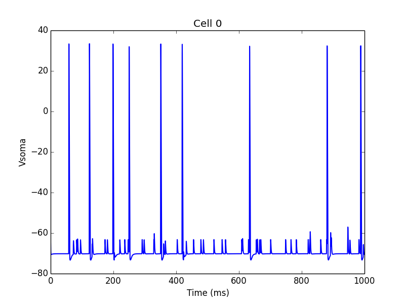
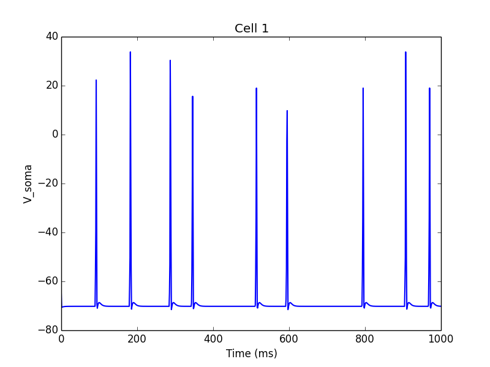

.. _tutorial:

Tutorial
=======================================

This tutorial provides an overview of how to use the NetPyNE python package to create a simple network. 

Downloading and installation instructions here: :ref:`install`

A good understading of python nested dictionaries and lists is recommended, since they are are used to specify the parameters. There are many good online Python courses available, eg: http://www.practicepython.org , http://www.codecademy.com/en/tracks/python or https://developers.google.com/edu/python/ .

.. _simple_example:

Very simple and quick example
-------------------------------
To start in an encouraging way, we will implement the simplest example possible consisting of just 3 lines! This will create a simple network (500 randomly connected cells), run a 1-second simulation, and plot the network raster plot and the voltage trace of a cell. The code looks like this (available here :download:`tut1.py <code/tut1.py>`)::

	import HHTut
	from netpyne import init
	init.createAndSimulate(netParams = HHTut.netParams, simConfig = HHTut.simConfig)    

The first line imports the ``HHTut`` module with the network and simulation parameters. You will need to download the ``HHTut.py`` example parameter file (`download here <https://raw.githubusercontent.com/Neurosim-lab/netpyne/master/examples/HHTut.py>`_.) 

The second line imports the ``init`` module from the ``netpyne`` package. The `init`` module provides functions to easily create and simulate networks based on these parameters.

The third line calls the ``createAndSimulate`` function, which runs a standard sequence of commands to create and simulate the network, and save and plot data. It requires the following 2 arguments:

* ``netParams`` - a dictionary to store network parameters (eg. cell properties, populations, connectivtiy)

* ``simConfig`` - a dictionary to store simulation options (eg. duration, dt, recording and plotting options, etc)

In this case we are using a set of predefined parameters defined in the ``HHTut`` module (Hodgkin-Huxley network example). The ``HHTut`` module contains the 2 required dictionaries: ``netParams`` and ``simConfig``. 

To run the model just execute the `tut1.py` script. One way to do this is to run this shell command::

	nrniv -python tut1.py

If you successfully installed MPI (eg. OpenMPI) and NEURON with MPI support, you can simulate the model in parallel using multiple cores/processsors by typing:: 

	mpiexec -n 4 nrniv -python -mpi tut1.py

, where you would replace the `4` with the number of cores you want to use.

If you want to avoid typing that long line every time, you can download this simple Unix shell script (:download:`runsim <code/runsim>`) and just type::

	./runsim 4 tut1.py

.. note:: To use the script make sure you change its permissions so its executable (eg. ``chmod +x runsim``) 

Whatever method you use, you should get a raster plot (spikes as cell vs time) and the voltage trace of a single cell: 

.. image:: figs/tut1_raster.png
	:width: 35%
	:align: center

Congratulations! You have created and simulated a biological neuronal network in NEURON! 

.. note:: In some systems the figures that pop up may be empty. This can be fixed by adding this line to the end of your tut1.py: ``import pylab; pylab.show()`` . In any case, the raster plot and the voltage trace figures will be correctly saved to disk as ``raster.png`` and ``traces.png``.

In the remaining of this tutorial we will see how to easily specify your own parameters to create custom networks and simulations. For simplicity, in the rest of the tutorial, the network parameters, simulation options and calls to functions (necessary to create the network, simulate it and plot the results) will all be included in a single file. For larger models it is recommended to keep model specification parameters and function calls in separate files (see `examples here <https://https://github.com/Neurosim-lab/netpyne/tree/master/examples>`_.)

We begin with an overview of the Python dictionary structure where you will define all your network parameters.

Network parameters
----------------------

The ``netParams`` dictionary includes all the information necessary to define your network. It is compoased of the following 4 lists:

* ``popParams`` - list of populations in the network and their parameters

* ``cellParams`` - list of cell property rules and their associated parameters (eg. cell geometry)

* ``synMechParams`` - list of synaptic mechanisms and their parameters

* ``connParams`` - list of network connectivity rules and their associated parameters. 

The ``netParams`` organization is consistent with the standard sequence of events that the framework executes internally:

* creates a ``Network`` object and adding inside a set of ``Population`` and ``Cell`` objects based on ``popParams``

* sets the cell properties based on ``cellParams`` (checking which cells match the conditions of each rule)

* creates a set of connections based on ``connParams`` (checking which presynpatic and postsynaptic cells match the conn rule conditions), and using the synaptic parameters in ``synMechParams``.

The image below illustrates this process:

.. image:: figs/process.png
	:width: 50%
	:align: center

We will now create a new model file (call it ``tut2.py``) where we will specify from scratch all the network parameters.

Populations
^^^^^^^^^^^^^^^^^^^^^^

First, we need to create some populations for our network, by adding items to the ``popParams`` list. Each ``popParams`` item consists of a dictionary with at least 4 fields (see :ref:`pop_params` for more details):

* ``popLabel`` - an arbitrary label for this population (can be used to define connectivtiy later)

* ``cellType`` - an attribute/tag assigned to cells in this population, can later be used to set certain cell properties to cells with this tag.

* ``numCells`` - number of cells in this population (can also specify using cell density)

* ``cellModel`` - an attribute or tag that will be assigned to cells in this population, can later be used to set specific cell model implementation for cells with this tag. Eg. 'HH' (standard Hodkgin-Huxley type cell model) or 'Izhi2007b' (Izhikevich 2007 point neuron model). Cell models can be defined by the user or imported.

We will start by creating 2 populations labeled ``S`` (sensory) and ``M`` (motor), with ``20`` cells each, of type ``PYR`` (pyramidal), and using ``HH`` cell model (standard compartmental Hodgkin-Huxley type cell)::

	# Network parameters
	netParams = {}  # dictionary to store sets of network parameters

	## Population parameters
	netParams['popParams'] = []  # list of populations - each item will contain dict with pop params
	netParams['popParams'].append({'popLabel': 'S',  'cellType': 'PYR', 'numCells': 20, 'cellModel': 'HH'}) 
	netParams['popParams'].append({'popLabel': 'M',  'cellType': 'PYR', 'numCells': 20, 'cellModel': 'HH'}) 

During execution, this will tell the framework to create 40 ``Cell`` objects, each of which will include the attributes or tags of its population, i.e. 'cellType': 'PYR', etc. These tags can later be used to define the properties of the cells, or connectivity rules.

Lets now add a special type of population used to provide background driving inputs to the cells, labeled ``background``. In this case the cell model will be ``NetStim`` (NEURON's artificial spike generator), and we will specify we want a firing rate of ``100`` Hz and with a noise level of ``0.5``::

	netParams['popParams'].append({'popLabel': 'background', 'rate': 100, 'noise': 0.5, 'cellModel': 'NetStim'})

Cell property rules
^^^^^^^^^^^^^^^^^^^^^^^^^^

Now we need to define the properties of each cell type, by adding items to the ``cellParams`` list. Each ``cellParams`` item consists of a dictionary with the following fields:

* ``label`` - arbitrary name which identifies this rule; doesn't need to be same as cell type

* ``conditions`` - these arbitrary conditions need to be met by cells in order to apply them these cell properties. Usually defined specifying an attribute/tag of the cell and the required value e.g. 'cellType': 'PYR'

* ``sections`` - dictionary containing the properties of sections, eg. geometry, mechanisms

The idea of conditional cell properties is that you can apply cell properties to subsets of neurons - eg. only those neurons of a given cell type, and/or of a given population, and/or within a certain range of locations. 

In our example we create a cell property rule that applies to all cells where the ``cellType`` = ``PYR``, therefore applying to our two populations (``S`` and ``P``) currently composed of pyramidal cells. We specify that we want them to have a section labeled ``soma`` with a certain geometry, a Hodgkin-Huxley mechanism (``hh``)::

	## Cell property rules
	netParams['cellParams'] = [] # list of cell property rules - each item will contain dict with cell properties
	cellRule = {'label': 'PYRrule', 'conditions': {'cellType': 'PYR'},  'sections': {}}      # cell rule dict
	soma = {'geom': {}, 'mechs': {}} 			                                            # soma params dict
	soma['geom'] = {'diam': 18.8, 'L': 18.8, 'Ra': 123.0}                                    # soma geometry
	soma['mechs']['hh'] = {'gnabar': 0.12, 'gkbar': 0.036, 'gl': 0.003, 'el': -70}           # soma hh mechanism
	cellRule['sections'] = {'soma': soma}                                                    # add soma section to dict
	netParams['cellParams'].append(cellRule)  	

Take a moment to examine the nested dictionary structure used to define the cell property rule. Notice the use of empty dictionaries (``{}``) and intermediate dictionaries (eg. ``soma``) to facilitate filling in the parameters. There are other ways to fill it in, all equally valid as long as the resulting structure looks like this (order of elements doesn't matter since its a dict)::

	>>> netParams['cellParams']
	['label': 'PYRrule', conditions': {'cellType': 'PYR'}, {'sections': 
		{'soma': {'geom': {'diam': 18.8, 'L': 18.8, 'Ra': 123.0}, 
			  'mechs': {'hh': {'gnabar': 0.12, 'gkbar': 0.036, 'gl': 0.003,  'el': -70}}}}}]

Synaptic mechanisms parameters
^^^^^^^^^^^^^^^^^^^^^^^^^^^^^^

Next we need to define the parameteres of at least one synaptic mechanism, by adding items to the ``synMechParams`` list.  Each ``synMechParams`` item consists of a dictionary with the following fields:

* ``label`` - an arbitrary label for this mechanism, which will be used to reference in in the connectivity rules

* ``mod`` - the NMODL mechanism (eg. 'ExpSyn')

* mechanism parameters (eg. ``tau`` or ``e``) - these will depend on the specific NMODL mechanism.

Synaptic mechanisms will be added to cells as required during the connection phase. Each connectivity rule will specify which synaptic mechanism parameters to use by referencing the appropiate label. In our network we will define the parameters of a simple excitatory synaptic mechanism labeled ``NMDA``, implemented using the ``Exp2Syn`` model, with rise time (``tau1``) of 0.1 ms, decay time (``tau2``) of 5 ms, and equilibrium potential (``e``) of 0 mV::

	## Synaptic mechanism parameters
	netParams['synMechParams'] = []
	netParams['synMechParams'].append({'label': 'NMDA', 'mod': 'Exp2Syn', 'tau1': 0.1, 'tau2': 5.0, 'e': 0})  # NMDA synaptic mechanism
 

Connectivity rules
^^^^^^^^^^^^^^^^^^^^^^^^^^^^^^

Finally, we need to specify how to connect the cells, by adding items to the ``connParams`` list. Each ``connParams`` item (connectivity rule) consists of a dictionary with the following fields:

* ``preTags`` - specifies the conditions of the presynaptic cells

* ``postTags`` - specifies the conditions of the postsynaptic cells

* ``weight`` - synaptic strength of the connections

* ``delay`` - delay (in ms) for the presynaptic spike to reach the postsynaptic neuron

* ``synMech`` - synpatic mechanism parameters to use

* ``probability`` or ``convergence`` or ``divergence`` - optional parameter to specify the probability of connection (0 to 1), convergence (number of presyn cells per postsyn cell), or divergence (number of postsyn cells per presyn cell), respectively. If omitted, all-to-all connectivity is implemented.

We will first add a rule to randomly connect the sensory to the motor population with a 50% probability::

	## Cell connectivity rules
	netParams['connParams'] = []  
	netParams['connParams'].append({'preTags': {'popLabel': 'S'}, 'postTags': {'popLabel': 'M'},  #  S -> M
		'probability': 0.5, 		# probability of connection
		'weight': 0.01, 		# synaptic weight 
		'delay': 5,			# transmission delay (ms) 
		'synMech': 'NMDA'})   	# synaptic mechanism 

Next we will connect background inputs (NetStims) to all cells of both populations::

	netParams['connParams'].append({'preTags': {'popLabel': 'background'}, 'postTags': {'cellType': 'PYR'}, # background -> PYR
		'weight': 0.01, 		# synaptic weight 
		'delay': 5, 			# transmission delay (ms) 
		'synMech': 'NMDA'})  	# synaptic mechanism 

Simulation configuration options
---------------------------------

Above we defined all the parameters related to the network model. Here we will specifiy the parameters or configuration of the simulation itself (e.g. duration), which is independent of the network.

The ``simConfig`` dictionary can be used to customize options related to the simulation duration, timestep, recording of cell variables, saving data to disk, graph plotting, and others. All options have defaults values so it is not mandatory to specify any of them.

Below we include the options required to run a simulation of 1 second, with intgration step of 0.025 ms, record the soma voltage at 1 ms intervals, save data (params, network and simulation output) to a pickle file called ``model_output``, plot a network raster, and plot the voltage trace of cell with gid ``1``::

	# Simulation options
	simConfig = {}
	simConfig['duration'] = 1*1e3 			# Duration of the simulation, in ms
	simConfig['dt'] = 0.025 			# Internal integration timestep to use
	simConfig['verbose'] = False 			# Show detailed messages 
	simConfig['recordTraces'] = {'V_soma':{'sec':'soma','pos':0.5,'var':'v'}}  # Dict with traces to record
	simConfig['recordStep'] = 1 			# Step size in ms to save data (eg. V traces, LFP, etc)
	simConfig['filename'] = 'model_output'  	# Set file output name
	simConfig['savePickle'] = False 		# Save params, network and sim output to pickle file
	simConfig['plotRaster'] = True 			# Plot a raster
	simConfig['plotCells'] = [1] 		# Plot recorded traces for this list of cells

The complete list of simulation configuration options is available here: :ref:`sim_config`.

Network creation and simulation
-----------------------------------------------

Now that we have defined all the network parameters and simulation options, we are ready to actually create the network and run the simulation. To do this we use the ``createAndSimulate`` function from the ``init`` module, and pass as arguments the ``netParams`` and ``simConfig`` dicts we have just created::

	init.createAndSimulate(netParams, simConfig)    

Note that as before we need to import the ``init`` module from the ``netpyne`` package, but in this case we don't need to import the ``params`` subpackage, since we are defining our own. Thus, we can just add this line to the top of the file::

	from netpyne import init

The full tutorial code for this example is available here: :download:`tut2.py <code/tut2.py>`

To run the model we can use any of the methods previously described in :ref:`simple_example`:

If mpi not installed::

	nrniv -python tut2.py

If mpi working::

	mpiexec -n 4 nrniv -python -mpi tut2.py

If mpi working and have ``runsim`` shell script::

	./runsim 4 tut2.py

You should get the raster plot and voltage trace figures shown below. Notice how the ``M`` population firing rate is higher than that of the ``S`` population. This makes sense since they both receive the same background inputs, but ``S`` cells connect randomly to ``M`` cells thus increasing the ``M`` firing rate. 

.. image:: figs/tut2_raster.png
	:width: 35%
	:align: center

Feel free to explore the effect of changing any of the model parameters, eg. number of cells, background or S->M weights, cell geometry or biophysical properties, etc.

Adding a compartment (dendrite) to cells
-------------------------------------------

Here we extend the pyramidal cell type by adding a dendritic section with a passive mechanism. Note that for the ``dend`` section we included the ``topol`` dict defining how it connects to its parent ``soma`` section::

	## Cell property rules
	netParams['cellParams'] = [] # list of cell property rules - each item will contain dict with cell properties
	cellRule = {'label': 'PYRrule', 'conditions': {'cellType': 'PYR'},  'sections': {}}       # cell rule dict
	soma = {'geom': {}, 'mechs': {}}        		                                      # soma params dict
	soma['geom'] = {'diam': 18.8, 'L': 18.8, 'Ra': 123.0}                                     # soma geometry
	soma['mechs']['hh'] = {'gnabar': 0.12, 'gkbar': 0.036, 'gl': 0.003, 'el': -70}            # soma hh mechanisms
	dend = {'geom': {}, 'topol': {}, 'mechs': {}}                   		              # dend params dict
	dend['geom'] = {'diam': 5.0, 'L': 150.0, 'Ra': 150.0, 'cm': 1}                            # dend geometry
	dend['topol'] = {'parentSec': 'soma', 'parentX': 1.0, 'childX': 0}                        # dend topology 
	dend['mechs']['pas'] = {'g': 0.0000357, 'e': -70}                                         # dend mechanisms
	cellRule['sections'] = {'soma': soma, 'dend': dend}                                       # add soma section to dict
	netParams['cellParams'].append(cellRule)                                                  # add dict to list of cell parameters

We can also update the connectivity rule to specify that the ``S`` cells should connect to the dendrite of ``M`` cells, by adding the dict entry ``'sec': 'dend'`` as follows::

	netParams['connParams'].append({'preTags': {'popLabel': 'S'}, 'postTags': {'popLabel': 'M'},  #  S -> M
		'connFunc': 'randConn',     # connectivity function (random)
		'maxConns': 10,             # max number of incoming conns to cell
		'weight': 0.01,             # synaptic weight 
		'delay': 5,                 # transmission delay (ms) 
		'sec': 'dend',              # section to connect to
		'synMech': 'NMDA'})     # target synaptic mechanism 

The full tutorial code for this example is available here: :download:`tut3.py <code/tut3.py>`.

If you run the network, you will observe the new dendritic compartment has the effect of reducing the firing rate.

Using a simplified cell model (Izhikevich) 
--------------------------------------------------------------------

When dealing with large simulations it is sometimes useful to use simpler cell models for some populations, in order to gain speed. Here we will replace the HH model with the simpler Izhikevich cell model only for cells in the sensory (``S``) population. 

The first step is to download the Izhikevich cell NEURON NMODL file which containes the Izhi2007b point process mechanism: :download:`izhi2007b.mod <code/mod/izhi2007b.mod>`

Next we need to compile this .mod file so its ready to use by NEURON::

	nrnivmodl

Now we need to specify that we want to use the ``Izhi2007b`` ``cellModel`` for the ``S`` population::

	netParams['popParams'].append({'popLabel': 'S', 'cellType': 'PYR', 'numCells': 20, 'cellModel': 'Izhi2007b'}) 

And we need to create a new cell rule for the Izhikevich cell. But first we need to specify that the existing rule needs to apply only to 'HH' cell models::

	cellRule = {'label': 'PYR_HH_rule', 'conditions': {'cellType': 'PYR', 'cellModel': 'HH'},  'sections': {}} 	# cell rule dict

Finally we can create the new rule for the Izhikevich cell model::

	cellRule = {'label': 'PYR_Izhi_rule', 'conditions': {'cellType': 'PYR', 'cellModel':'Izhi2007b'},  'sections': {}} 		# cell rule dict
	soma = {'geom': {}, 'pointps': {}}  											# soma params dict
	soma['geom'] = {'diam': 18.8, 'L': 18.8, 'Ra': 123.0}  										# soma geometry
	soma['pointps']['Izhi2007b'] = {'C':100, 'k':0.7, 'vr':-60, 'vt':-40, 'vpeak':35, 'a':0.03, 'b':-2, 'c':-50, 'd':100, 'celltype':1}	# soma poinpt process
	cellRule['sections'] = {'soma': soma}  											# add soma section to dict
	netParams['cellParams'].append(cellRule)  

Notice we have added a new field inside the ``soma`` called ``pointps``, which will include the point process mechanisms in the section. In this case we added the ``Izhi2007b`` point process and provided a dict with the Izhikevich cell parameters corresponding to the pyramidal regular spiking cell. Further details and other parameters for the Izhikevich cell model can be found here: https://senselab.med.yale.edu/modeldb/showModel.cshtml?model=39948 

Congratulatios, now you have a hybrid model composed of HH and Izhikevich cells! You can also easily change the cell model used by existing or new populations. 

The full tutorial code for this example is available here: :download:`tut4.py <code/tut4.py>`.

.. seealso:: NetPyNE also supports importing cells defined in other files (eg. in hoc cell templates, or python classes). See :ref:`importing_cells` for details and examples.

.. seealso:: For a comprehensive description of all the features available in NetPyNE see :ref:`package_reference`.