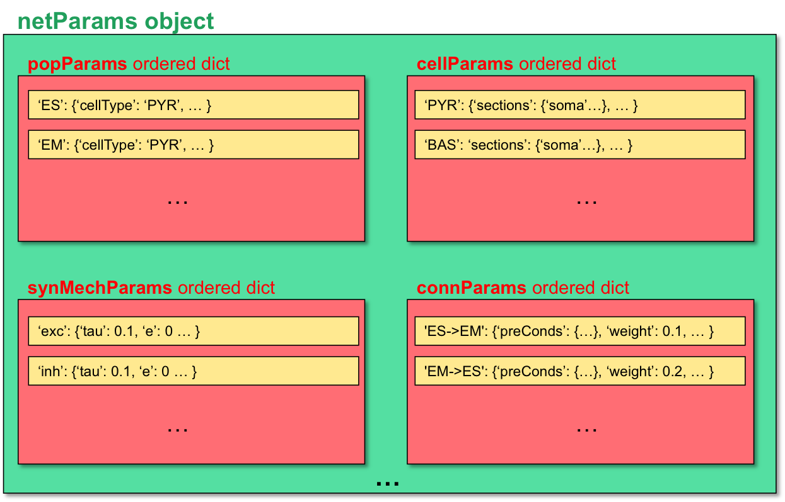

.. _package_reference:

User Documentation
=======================================

Model components and structure
-------------------------------

Creating a network model requires:

* An object ``netParams`` of class ``specs.NetParams`` with the network parameters.

* An object ``simConfig`` of class ``specs.SimConfig`` with the simulation configuration options.

* A call to the method(s) to create and run the network model, passing as arguments the above dictionaries, e.g. ``createSimulateAnalyze(netParams, simConfig)``.

These components can be included in a single or multiple Python files. This section comprehensively describes how to define the network parameters and simulation configuration options, as well as the methods available to create and run the network model.

Network parameters
-------------------------

The ``netParams`` object of class ``NetParams`` includes all the information necessary to define your network. It is composed of the following ordered dictionaries:

* ``cellParams`` - cell types and their associated parameters (e.g. cell geometry)

* ``popParams`` - populations in the network and their parameters

* ``synMechParams`` - synaptic mechanisms and their parameters

* ``connParams`` - network connectivity rules and their associated parameters. 

* ``subConnParams`` - network subcellular connectivity rules and their associated parameters. 

* ``stimSourceParams`` - stimulation sources parameters. 

* ``stimTargetParams`` - mapping between stimulation sources and target cells. 

* ``rxdParams`` - reaction-diffusion (RxD) components and their parameters. 

Each of these ordered dicts can be filled in directly or using the NetParams object methods. Both ways are equivalent, but the object methods provide checks on the syntax of the parameters being added. Below are two equivalent ways of adding an item to the popParams ordered dictionary::

	from netpyne import specs
	netParams = specs.NetParams()

	# Method 1: direct
	netParams.popParams['Pop1'] = {'cellType': 'PYR', 'numCells': 20}

	# Method 2: using object method
	netParams.addPopParams(label='Pop1', params={'cellType': 'PYR', 'numCells': 20})

The organization of ``netParams`` is consistent with the standard sequence of events that the framework executes internally:

* sets the cell properties according to type based on ``cellParams``

* creates a ``Network`` object and adds inside it a set of ``Cell`` and ``Population`` objects based on ``popParams``

* creates a set of connections based on ``connParams`` and ``subConnParams`` (checking which presynpatic and postsynaptic cells match the connection rule conditions), and using the synaptic parameters in ``synMechParams``

* adds stimulation to the cells based on ``stimSourceParams`` and ``stimTargetParams``

Additionally, ``netParams`` contains the following customizable single-valued attributes (e.g. ``netParams.sizeX = 100``):

* **scale**: Scale factor multiplier for number of cells (default: 1)

* **shape**: Shape of network: 'cuboid', 'cylinder' or 'ellipsoid' (default: 'cuboid')

* **sizeX**: x-dimension (horizontal length) network size in um (default: 100)

* **sizeY**: y-dimension (vertical height or cortical depth) network size in um (default: 100)

* **sizeZ**: z-dimension (horizontal depth) network size in um (default: 100)

* **rotateCellsRandomly**: Random rotation of cells around y-axis [min,max] radians, e.g. [0, 3.0] (default: False)

* **defaultWeight**: Default connection weight (default: 1)

* **defaultDelay**: Default connection delay, in ms (default: 1)

* **propVelocity**: Conduction velocity in um/ms (e.g. 500 um/ms = 0.5 m/s) (default: 500)

* **scaleConnWeight**: Connection weight scale factor (excludes NetStims) (default: 1)

* **scaleConnWeightNetStims**: Connection weight scale factor for NetStims (default: 1)

* **scaleConnWeightModels**: Connection weight scale factor for each cell model, e.g. {'HH': 0.1, 'Izhi': 0.2} (default: {})

* **popTagsCopiedToCells**: List of tags that will be copied from the population to the cells (default: ['pop', 'cellModel', 'cellType'])

Other arbitrary entries to the ``netParams`` dict can be added and used in custom-defined functions for connectivity parameters (see :ref:`function_string`). 

.. _cell_types:

Cell types
^^^^^^^^^^^^^^^^^^^^^^^^

Each item of the ``cellParams`` ordered dictionary consists of a key and a value. The key is a label to identify this cell type. The value consists of a dictionary that defines the cell properties, containing the following fields:

* **secs** - Dictionary containing the sections of the cell, each in turn containing the following fields (can omit those that are empty):

	* **geom**: Dictionary with geometry properties, such as ``diam``, ``L`` or ``Ra``. 
		Can optionally include a field ``pt3d`` with a list of 3D points, each defined as a tuple of the form ``(x,y,z,diam)``
		Values of ``diam``, ``L`` or ``Ra`` can be defined as functions (see :ref:`function_string`).

	* **topol**: Dictionary with topology properties.
		Includes ``parentSec`` (label of parent section), ``parentX`` (parent location where to make connection) and ``childX`` (current section --child-- location where to make connection).
	
	* **mechs**: Dictionary of density/distributed mechanisms.
		The key contains the name of the mechanism (e.g. 'hh' or 'pas')
		The value contains a dictionary with the properties of the mechanism (e.g. ``{'g': 0.003, 'e': -70}``).
		These properties can be defined as functions (see :ref:`function_string`).

	* **ions**: Dictionary of ions.
		The key contains the name of the ion (e.g. 'na' or 'k')
		The value contains a dictionary with the properties of the ion for the particular section (e.g. ``{'e': -70}``).
		Properties available are ``'e'``: reversal potential, ``'i'``: internal concentration of the ion at that section, and ``'o'``: the extracellular concentration of the ion at that section.
	
	* **pointps**: Dictionary of point processes (excluding synaptic mechanisms). 
		The key contains an arbitrary label (e.g. 'Izhi')
		The value contains a dictionary with the point process properties (e.g. ``{'mod':'Izhi2007a', 'a':0.03, 'b':-2, 'c':-50, 'd':100, 'celltype':1})``. 
		These properties can be defined as functions (see :ref:`function_string`).
		
		Apart from internal point process variables, the following properties can be specified for each point process:

		* ``mod``,the name of the NEURON mechanism, e.g. ``'Izhi2007a'``
		* ``loc``, section location where to place synaptic mechanism, e.g. ``1.0``, default=0.5
		* ``vref`` (optional), internal mechanism variable containing the cell membrane voltage, e.g. ``'V'``
		* ``synList`` (optional), list of internal mechanism synaptic mechanism labels, e.g. ['AMPA', 'NMDA', 'GABAB']

	* **vinit** - (optional) Initial membrane voltage (in mV) of the section (default: -65)
	e.g. ``cellRule['secs']['soma']['vinit'] = -72``

	* **spikeGenLoc** - (optional) Indicates that this section is responsible for spike generation (instead of the default 'soma'), and provides the location (segment) where spikes are generated.
	e.g. ``cellRule['secs']['axon']['spikeGenLoc'] = 1.0``

	* **threshold** - (optional) Threshold voltage (in mV) used to detect a spike originating in this section of the cell. If omitted, defaults to ``netParams.defaultThreshold = 10.0``
	e.g. ``cellRule['secs']['soma']['threshold'] = 5.0``

* **secLists** - (optional) Dictionary of sections lists (e.g. {'all': ['soma', 'dend']})

* **vars** - (optional) Dictionary of user-defined variables that can be referenced in properties of any section of this cell type.
	Example of usage::

		cellRule['secs']['dend1']['mechs']['pas'] = {'g': 'g_default + 1e-6'}  # cell variable 'g_default' referenced
		cellRule['secs']['dend2']['mechs']['pas'] = {'g': 'g_default + 1.5e-6'}  # cell variable 'g_default' referenced
		cellRule['vars'] = {'g_default': 0.0000357} # cell variable 'g_default' defined

	Values of cell variables themselves can also be defined as functions (see :ref:`function_string`), e.g. ``cellRule['vars'] = {'g_default': 'normal(3.57e-5, 1e-7)}``

Example of adding two different cell types::

	## PYR_HH cell properties
	soma = {'geom': {}, 'mechs': {}}  # soma properties
	soma['geom'] = {'diam': 18.8, 'L': 18.8, 'Ra': 123.0, 'pt3d': []}
	soma['geom']['pt3d'].append((0, 0, 0, 20))
	soma['geom']['pt3d'].append((0, 0, 20, 20))
	soma['mechs']['hh'] = {'gnabar': 0.12, 'gkbar': 0.036, 'gl': 0.003, 'el': -70} 

	dend = {'geom': {}, 'topol': {}, 'mechs': {}}  # dend properties
	dend['geom'] = {'diam': 5.0, 'L': 150.0, 'Ra': 150.0, 'cm': 1}
	dend['topol'] = {'parentSec': 'soma', 'parentX': 1.0, 'childX': 0}
	dend['mechs']['pas'] = {'g': 0.0000357, 'e': -70} 

	PYR_HH_dict = {'secs': {'soma': soma, 'dend': dend}}
	netParams.cellParams['PYR_HH'] = PYR_HH_dict  # add rule dict to list of cell property rules

	## PYR_Izhi cell properties
	Izhi_dict = {'secs': {'soma': {} }}
	Izhi_dict['secs']['soma'] = {'geom': {}, 'pointps':{}}  # soma properties
	Izhi_dict['secs']['soma']['geom'] = {'diam': 18.8, 'L': 18.8, 'Ra': 123.0}
	Izhi_dict['secs']['soma']['pointps']['Izhi'] = {'mod':'Izhi2007a', 'vref':'V', 'a':0.03, 'b':-2, 'c':-50, 'd':100, 'celltype':1}

	netParams.cellParams['PYR_Izhi'] = Izhi_dict  # add rule to list of cell property rules

.. note:: As in the examples above, you can use temporary variables/structures (e.g. ``soma`` or ``Izhi_dict``) to facilitate the creation of the final dictionary ``netParams.cellParams``.

.. note:: You can directly create or modify the cell parameters via ``netParams.cellParams``, e.g. ``netParams.cellParams['PYR_HH']['secs']['soma']['geom']['L']=16``. 

.. seealso:: Cell properties can be imported from an external file. See :ref:`importing_cells` for details and examples.

.. _pop_params:

Population parameters 
^^^^^^^^^^^^^^^^^^^^^^^^^^

Each item of the ``popParams`` ordered dictionary consists of a key and value. The key is an arbitrary label for the population, which will be assigned to all cells as the tag ``pop``, and can be used as condition to apply specific connectivtiy rules.

The value consists of a dictionary with the parameters of the population, and includes the following fields:

* **cellType** - Cell type used for all cells in this population.
	e.g. 'Pyr' (for pyramidal neurons) or 'FS' (for fast-spiking interneurons)

* **numCells**, **density** or **gridSpacing** - The total number of cells in this population, the density in neurons/mm3, or the fixed grid spacing (only one of the three is required). 
	The volume occupied by each population can be customized (see ``xRange``, ``yRange`` and ``zRange``); otherwise the full network volume will be used (defined in ``netParams``: ``sizeX``, ``sizeY``, ``sizeZ``).
	
	``density`` can be expressed as a function of normalized location (``xnorm``, ``ynorm`` or ``znorm``), by providing a string with the variable and any common Python mathematical operators/functions. e.g. ``'1e5 * exp(-ynorm/2)'``.

	``gridSpacing`` is the spacing between cells (in um). The total number of cells will be determined based on spacing and ``sizeX``, ``sizeY``, ``sizeZ``. e.g. ``10``.

* **xRange** or **xnormRange** - Range of neuron positions in x-axis (horizontal length), specified two-element list [min, max]. 
	``xRange`` for absolute value in um (e.g. [100,200]), or ``xnormRange`` for normalized value between 0 and 1 as fraction of ``sizeX`` (e.g. [0.1,0.2]).

* **yRange** or **ynormRange** - Range of neuron positions in y-axis (vertical height=cortical depth), specified two-element list [min, max]. 
	``yRange`` for absolute value in um (e.g. [100,200]), or ``ynormRange`` for normalized value between 0 and 1 as fraction of ``sizeY`` (e.g. [0.1,0.2]). Note: The NEURON object's 3d points (pt3d) ``y`` coordinates will have opposite sign to the NetPyNE/Python ``tags.y`` value, in order to correctly employ and represent the y-axis as a depth coordinate, e.g. if ``cell.tags.y = 500`` then ``cell.secs.soma.geom.pt3d[0][1] = -500`` ([0] refers to the 1st pt3d, and [1] refers to the y coordinate)
 
* **zRange** or **znormRange** - Range of neuron positions in z-axis (horizontal depth), specified two-element list [min, max]. 
	``zRange`` for absolute value in um (e.g. [100,200]), or ``znormRange`` for normalized value between 0 and 1 as fraction of ``sizeZ`` (e.g. [0.1,0.2]).

Examples of creating a population::

	netParams.popParams['Sensory'] = {'cellType': 'PYR', 'ynormRange':[0.2, 0.5], 'density': 50000}

The ``addPopParams(label, params)`` method of the class ``netParams`` can be used to add an item to ``popParams``. If working interactively, this has the advantage of checking the syntax of the parameters added::
 
	netParams.addPopParams('Sensory', {'cellType': 'PYR', 'ynormRange':[0.2, 0.5], 'density': 50000})

It is also possible to create populations of artificial cells, i.e. point processes, that generate spike events but don't have sections (e.g. NEURON objects: ``NetStim``, ``VecStim``, or ``IntFire2``). In this case, a ``cellModel`` field will specify the name of the point process mechanism, and the properties of the mechanism will be specified as additional fields. Note, since artificial cells are simpler they don't require defining separate cell parameters in the ``netParams.cellParams`` structure. For example, below are the fields required to create a population of NetStims (NEURON's artificial spike generator):

* **pop** - An arbitrary label for this population assigned to all cells (e.g. 'background'); can be used as a condition to apply specific connectivity rules. 

* **cellModel** - Name of the point process artificical cell (e.g ``IntFire2``, ``NetStim`` or ``VecStim``).

* **numCells** - Number of cells

* **parameters of artificial cell** - Specific to each point process artificial cell (e.g. ``IntFire2`` includes 'taum', 'taus', 'ib')

When ``cellModel`` is 'NetStim' or 'VecStim' the following parameters are allowed:

* **interval** - Spike interval in ms

* **rate** - Firing rate in Hz (note this is the inverse of the NetStim interval property)

* **noise** - Fraction of noise in NetStim (0 = deterministic; 1 = completely random)

* **start** - Time of first spike in ms (default = 0)

* **number** - Max number of spikes generated (default = 1e12)

* **seed** - Seed for randomizer (optional; defaults to value set in ``simConfig.seeds['stim']``)

* **spkTimes** (only for 'VecStim') - List of spike times (e.g. [1, 10, 40, 50], range(1,500,10), or any variable containing a Python list) 

* **pulses** (only for 'VecStim') - List of spiking pulses; each item includes the ``start`` (ms), ``end`` (ms), ``rate`` (Hz), and ``noise`` (0 to 1) pulse parameters. See example below.

Example of point process artificial cell populations::

	netParams.popParams['artif1'] = {'cellModel': 'IntFire2', 'taum': 100, 'noise': 0.5, 'numCells': 100}  # Intfire2

	netParams.popParams['artif2'] = {'cellModel': 'NetStim', 'rate': 100, 'noise': 0.5, 'numCells': 100}  # NetsStim
	
	# create custom list of spike times
	spkTimes = range(0,1000,20) + [138, 155,270]  
	
	# create list of pulses (each item is a dict with pulse params) 
	pulses = [{'start': 10, 'end': 100, 'rate': 200, 'noise': 0.5},
		{'start': 400, 'end': 500, 'rate': 1, 'noise': 0.0})] 

	netParams.popParams['artif3'] = {'cellModel': 'VecStim', 'numCells': 100, 'spkTimes': spkTimes, 'pulses': pulses}  # VecStim with spike times

When ``cellModel`` is 'VecStim', a pattern generator may be used by creating a 'spikePattern' dictionary::

    netParams.popParams['artif1'] = {'cellModel': 'VecStim'
                                     ...
                                     'spikePattern': {'type': 'rhythmic', # can be 'rhythmic', 'evoked', 'poisson', 'gauss'
                                                      ...                 # see netpyne/cell/inputs.py for argument entries
                                                      }
                                     }

Currently, 'rhythmic', 'evoked', 'poisson' and 'gauss' spike pattern generators are available, their argument entries are:

* **rhythmic** - Creates the ongoing external inputs (rhythmic)

    * **start** - time of first spike. if -1, uniform distribution between startMin and startMax (ms)

    * **startMin** - minimum values of uniform distribution for start time (ms)

    * **startMax** - maximum values of uniform distribution for start time (ms)

    * **startStd** - standard deviation of normal distrinution for start time (ms); mean is set by start param. Only used if > 0.0

    * **freq** - oscillatory frequency of rhythmic pattern (Hz)

    * **freqStd** - standard deviation of oscillatory frequency (Hz)

    * **distribution** - distribution type fo oscillatory frequencies; either 'normal' or 'uniform'

    * **eventsPerCycle** - spikes/burst per cycle; should be either 1 or 2

    * **repeats** - number of times to repeat input pattern (equivalent to number of inputs)

    * **stop** - maximum time for last spike of pattern (ms)

* **evoked** - creates the ongoing external inputs (rhythmic)

    * **start** - time of first spike. if -1, uniform distribution between startMin and startMax (ms)

    * **inc** - increase in time of first spike; from cfg.inc_evinput (ms)

    * **startStd** - standard deviation of start (ms)

    * **numspikes** - total number of spikes to generate

* **poisson** - creates external Poisson inputs

    * **start** - time of first spike (ms)

    * **stop** - stop time; if -1 the full duration (ms)

    * **frequency** - standard deviation of start (ms)

* **gauss** - Creates Gaussian inputs

    * **mu** - Gaussian mean

    * **sigma** - Gaussian variance

Finally, it is possible to define a population composed of individually-defined cells by including the list of cells in the ``cellsList`` dictionary field. Each element of the list of cells will in turn be a dictionary containing any set of cell properties such as ``cellLabel`` or location (e.g. ``x`` or ``ynorm``). An example is shown below::

	cellsList.append({'cellLabel':'gs15', 'x': 1, 'ynorm': 0.4 , 'z': 2})
	cellsList.append({'cellLabel':'gs21', 'x': 2, 'ynorm': 0.5 , 'z': 3})
	netParams.popParams['IT_cells'] = {'cellType':'IT', 'cellsList': cellsList} #  IT individual cells

.. note:: To use VecStim you need to download and compile (nrnivmodl) the `vecevent.mod file <https://raw.githubusercontent.com/Neurosim-lab/netpyne/development/doc/source/code/mod/vecevent.mod>`_ .

Synaptic mechanisms parameters
^^^^^^^^^^^^^^^^^^^^^^^^^^^^^^

To define the parameters of a synaptic mechanism, add items to the ``synMechParams`` ordered dictionary. You can use the addSynMechParams(label,params) method. Each ``synMechParams`` item consists of a key and value. The key is a an arbitrary label for this mechanism, which will be used to reference it in the connectivity rules. The value is a dictionary of the synaptic mechanism parameters with the following fields:

* ``mod`` - the NMODL mechanism name (e.g. 'ExpSyn'); note this does not always coincide with the name of the mod file.

* mechanism parameters (e.g. ``tau`` or ``e``) - these will depend on the specific NMODL mechanism. Values of these parameters can be defined as a function (see :ref:`function_string`).

* ``selfNetCon`` (optional) - dictionary with the parameters of a NetCon between the cell voltage and the synapse, required by some synaptic mechanisms such as the homeostatic synapse (hsyn). e.g. ``'selfNetCon': {'sec': 'soma' , 'threshold': -15, 'weight': -1, 'delay': 0}`` (by default, the source section is set to the soma, e.g. ``'sec': 'soma'``)

Synaptic mechanisms will be added to cells as required during the connection phase. Each connectivity rule will specify which synaptic mechanism parameters to use by referencing the appropiate label. 

Here is an example of synaptic mechanism parameters for a simple excitatory synaptic mechanism labeled ``NMDA``, implemented using the ``Exp2Syn`` model, with rise time (``tau1``) of 0.1 ms, decay time (``tau2``) of 5 ms, and equilibrium potential (``e``) of 0 mV:

.. code-block:: python

	## Synaptic mechanism parameters
	netParams.synMechParams['NMDA'] = {'mod': 'Exp2Syn', 'tau1': 0.1, 'tau2': 5.0, 'e': 0}  # NMDA synaptic mechanism

Connectivity rules
^^^^^^^^^^^^^^^^^^^^^^^^

The rationale for using connectivity rules is that you can create connections between subsets of neurons that match certain criteria, e.g. only presynaptic neurons of a given cell type, and postsynaptic neurons of a given population, and/or within a certain range of locations. 

Each item of the ``connParams`` ordered dictionary consists of a key and value. The key is an arbitrary label used as reference for this connectivity rule. The value contains a dictionary that defines the connectivity rule parameters and includes the following fields:

* **preConds** - Set of conditions for the presynaptic cells
	Defined as a dictionary with the attributes/tags of the presynaptic cell and the required values, e.g. ``{'cellType': 'PYR'}``. 

	Values can be lists, e.g. ``{'pop': ['Exc1', 'Exc2']}``. For location properties, the list values correspond to the min and max values, e.g. ``{'ynorm': [0.1, 0.6]}``.

* **postConds** - Set of conditions for the postynaptic cells
	Same format as ``preConds`` (above).

* **sec** (optional) - Name of target section on the postsynaptic neuron (e.g. ``'soma'``) 
	If omitted, defaults to 'soma' if it exists, otherwise to the first section in the cell sections list.

	If ``synsPerConn`` > 1, and a list of sections or sectionList is specified, synapses will be distributed uniformly along the specified section(s), taking into account the length of each section.

	If ``synsPerConn`` == 1, and list of sections or sectionList is specified, synapses (one per presynaptic cell) will be placed in sections randomly selected from the list. To enforce using always the first section from the list set ``cfg.connRandomSecFromList = False``.

* **loc** (optional) - Location of target synaptic mechanism (e.g. ``0.3``)
	If omitted, defaults to 0.5.

	If you have a list of ``synMechs``, you can have a single loc for all, or a list of locs (one per synMech, e.g. for two synMechs: ``[0.4, 0.7]``).

	If you have ``synsPerConn`` > 1, you can have single loc for all, or a list of locs (one per synapse, e.g. if ``synsPerConn`` = 3: ``[0.4, 0.5, 0.7]``)

	If you have both a list of ``synMechs`` and ``synsPerConn`` > 1, you can have a 2D list for each synapse of each synMech (e.g. for two synMechs and ``synsPerConn`` = 3: ``[[0.2, 0.3, 0.5], [0.5, 0.6, 0.7]]``)

	If ``synsPerConn`` == 1, and a list of ``loc``s is specified, synapses (one per presynaptic cell) will be placed in locations randomly selected from the list (note that the random section and location will go hand in hand, i.e. the same random index is used for both). 

	.. The above only applies for a single target section, ``sec``. If a list of target sections is specified, the ``loc`` value has no effect, and synapses will be distributed uniformly along the specified section(s), taking into account the length of each section. To enforce using always the first location from the list set ``cfg.connRandomSecFromList = False``.

* **synMech** (optional) - Label (or list of labels) of target synaptic mechanism(s) on the postsynaptic neuron (e.g. ``'AMPA'`` or ``['AMPA', 'NMDA']``)

	If omitted, employs first synaptic mechanism in the cell's synaptic mechanisms list.

	If you have a list, a separate connection is created to each synMech; and a list of weights, delays and/or locs can be provided.  

* **synsPerConn** (optional) - Number of individual synaptic connections (*synapses*) per cell-to-cell connection (*connection*)

	Can be defined as a function (see :ref:`function_string`).

	If omitted, defaults to 1.

	The weights, delays and/or locs for each synapse can be specified as a list, or a single value can be used for all.

	When ``synsPerConn`` > 1 and a single section is specified, the locations of synapses can be specified as a list in ``loc``.

	When ``synsPerConn`` > 1, if ``loc`` is a single value or omitted, or if a list of target sections is specified, synapses will be distributed uniformly along the specified section(s), taking into account the length of each section.

	
* **weight** (optional) - Strength of synaptic connection (e.g. ``0.01``)
	Associated with a change in conductance, but has different meaning and scale depending on the synaptic mechanism and cell model.

	Can be defined as a function (see :ref:`function_string`).

	If omitted, defaults to ``netParams.defaultWeight = 1``.

	If you have list of ``synMechs``, you can have single weight for all, or a list of weights (one per synMech, e.g. for two synMechs: ``[0.1, 0.01]``).

	If you have ``synsPerConn`` > 1, you can have single weight for all, or list of weights (one per synapse, e.g. if ``synsPerConn`` = 3: ``[0.2, 0.3, 0.4]``)

	If you have both a list of ``synMechs`` and ``synsPerConn`` > 1, you can have a 2D list for each synapse of each synMech (e.g. for two synMechs and ``synsPerConn`` = 3: ``[[0.2, 0.3, 0.4], [0.02, 0.04, 0.03]]``)

* **delay** (optional) - Time (in ms) for the presynaptic spike to reach the postsynaptic neuron
	Can be defined as a function (see :ref:`function_string`)

	If omitted, defaults to ``netParams.defaultDelay = 1``.

	If you have list of ``synMechs``, you can have a single delay for all, or a list of delays (one per synMech, e.g. for two synMechs: ``[5, 7]``).

	If you have ``synsPerConn`` > 1, you can have a single weight for all, or a list of weights (one per synapse, e.g. if ``synsPerConn`` = 3: ``[4, 5, 6]``).

	If you have both a list of ``synMechs`` and ``synsPerConn`` > 1, you can have a 2D list for each synapse of each synMech (e.g. for two synMechs and ``synsPerConn`` = 3: ``[[4, 6, 5], [9, 10, 11]]``).

* **threshold** (deprecated, do not use)

	To set the source cell threshold (in mV) use the ``threshold`` parameter within a section of a cell rule in ``cellParams`` or set the default value (e.g. ``netParams.defaultThreshold = 10.0``).

* **probability** (optional) - Probability of connection between each pre- and post-synaptic cell (0 to 1)

	Can be defined as a function (see :ref:`function_string`).

	Sets ``connFunc`` to ``probConn`` (internal probabilistic connectivity function).

	Overrides the ``convergence``, ``divergence`` and ``fromList`` parameters.

* **convergence** (optional) - Number of pre-synaptic cells connected to each post-synaptic cell

	Can be defined as a function (see :ref:`function_string`).

	Sets ``connFunc`` to ``convConn`` (internal convergence connectivity function).

	Overrides the ``divergence`` and ``fromList`` parameters; has no effect if the ``probability`` parameter is included.

* **divergence** (optional) - Number of post-synaptic cells connected to each pre-synaptic cell

	Can be defined as a function (see :ref:`function_string`).
	
	Sets ``connFunc`` to ``divConn`` (internal divergence connectivity function).

	Overrides the ``fromList`` parameter; has no effect if the ``probability`` or ``convergence`` parameters are included.

* **connList** (optional) - Explicit list of connections between individual pre- and post-synaptic cells

	Each connection is indicated with relative ids of cells in pre and post populations, e.g. ``[[0,1],[3,1]]`` creates a connection between: pre cell 0 and post cell 1, pre cell 3 and post cell 1.

	Weights, delays and locs can also be specified as a list for each of the individual cell connections. These lists can be 2D or 3D if combined with multiple synMechs and synsPerConn > 1 (the outer dimension will correspond to the connList).

	Sets ``connFunc`` to ``fromList`` (explicit list connectivity function).

	Has no effect if the ``probability``, ``convergence`` or ``divergence`` parameters are included.

* **connFunc** (optional) - Internal connectivity function to use
	
	Is automatically set to ``probConn``, ``convConn``, ``divConn`` or ``fromList``, when the ``probability``, ``convergence``, ``divergence`` or ``connList`` parameters are included, respectively. Otherwise defaults to ``fullConn``, i.e. all-to-all connectivity.

	User-defined connectivity functions can be added.

* **shape** (optional) - Modifies the connection weight dynamically during the simulation based on the specified pattern
	
	Contains a dictionary with the following fields:

		``'switchOnOff'`` - times at which to switch on and off the weight 
	
		``'pulseType'`` - type of pulse to generate; either 'square' or 'gaussian'
	
		``'pulsePeriod'`` - period (in ms) of the pulse 
	
		``'pulseWidth'`` - width (in ms) of the pulse

	Can be used to generate complex stimulation patterns, with oscillations or turning on and off at specific times.

	e.g. ``'shape': {'switchOnOff': [200, 800], 'pulseType': 'square', 'pulsePeriod': 100, 'pulseWidth': 50}``

* **plasticity** (optional) - Plasticity mechanism to use for this connection
	
	Requires two fields: ``mech`` to specify the name of the plasticity mechanism, and ``params`` containing a dictionary with the parameters of the mechanism. 

	e.g. ``{'mech': 'STDP', 'params': {'hebbwt': 0.01, 'antiwt':-0.01, 'wmax': 50, 'RLon': 1 'tauhebb': 10}}``

Here is an example of connectivity rules:

.. code-block:: python

	## Cell connectivity rules
	netParams.connParams['S->M'] = {    #  S -> M
		'preConds': {'pop': 'S'}, 
		'postConds': {'pop': 'M'},      
		'sec': 'dend',                  # target postsyn section
		'synMech': 'AMPA',              # target synaptic mechanism
		'weight': 0.01,                 # synaptic weight 
		'delay': 5,                     # transmission delay (ms) 
		'probability': 0.5}             # probability of connection		

	netParams.connParams['bg->all'] = {      # background -> S,M in ynorm range
		'preConds': {'pop': 'background'}, 
		'postConds': {'cellType': ['S','M'], 
					  'ynorm': [0.1, 0.6]}, 
		'synReceptor': 'AMPA',               # target synaptic mechanism 
		'weight': 0.01,                      # synaptic weight 
		'delay': 5}                          # transmission delay (ms) 

	netParams.connParams['yrange->HH'] = {            # cells with y in range 100 to 600 -> HH cells
	    'preConds': {'y': [100, 600]}, 
	    'postConds': {'cellType': 'HH'}, 
	    'synMech': ['AMPA', 'NMDA'],                  # target synaptic mechanisms
	    'synsPerConn': 3,                             # number of synapses per cell connection (per synMech, ie. total syns = 2 x 3)
	    'weight': 0.02,                               # single weight for all synapses
	    'delay': [5, 10],                             # different delays for each of 3 synapses per synMech 
	    'loc': [[0.1, 0.5, 0.7], [0.3, 0.4, 0.5]]}    # different locations for each of the 6 synapses

.. _function_string:

Functions as strings
^^^^^^^^^^^^^^^^^^^^^^^

Some of parameters of cells, synapses and connectivity rules can be provided using a string that contains a function. The string will be interpreted internally by NetPyNE and converted to the appropriate `lambda function <https://docs.python.org/3/tutorial/controlflow.html#lambda-expressions>`_. This string may contain the following elements:

* Numerical values, e.g. '3.56'

* All Python mathematical operators: ``+``, ``-``, ``*``, ``/``, ``%``, ``**`` (exponent), etc.

* Python mathematical functions: ``sin``, ``cos``, ``tan``, ``exp``, ``sqrt``, ``mean``, ``inf`` (see https://docs.python.org/2/library/math.html for details)

* NEURON h.Random() methods: ``binomial``, ``discunif``, ``erlang``, ``geometric``, ``hypergeo``, ``lognormal``, ``negexp``, ``normal``, ``poisson``, ``uniform``, ``weibull`` (see https://www.neuron.yale.edu/neuron/static/py_doc/programming/math/random.html)

* Single-valued numerical network parameters defined in the ``netParams`` dictionary. Existing ones can be customized, and new arbitrary ones can be added. The following parameters are available by default:

	* ``sizeX``, ``sizeY``, ``sizeZ``: network size in um (default: 100)

	* ``defaultWeight``: Default connection weight (default: 1)

	* ``defaultDelay``: Default connection delay, in ms (default: 1)

	* ``propVelocity``: Conduction velocity in um/ms (default: 500)

* Contextual variables like cell location, segment position in cell, distance between connected cells etc. Such variables' names are pre-defined and specific to where the function is used (see below).

Functions as strings can be used as parameters in the entries of the following model components (in each case, there is a specific set of variables that can be contained in the function, in addition to elements listed above).

* ``weight``, ``delay``, ``probability``, ``convergence`` and ``divergence`` in connectivity rules. Available variables are:
	
	* ``pre_x``, ``pre_y``, ``pre_z``: pre-synaptic cell x, y or z location.

	* ``pre_ynorm``, ``pre_ynorm``, ``pre_znorm``: normalized pre-synaptic cell x, y or z location.
	
	* ``post_x``, ``post_y``, ``post_z``: post-synaptic cell x, y or z location.
	
	* ``post_xnorm``, ``post_ynorm``, ``post_znorm``: normalized post-synaptic cell x, y or z location.
	
	* ``dist_x``, ``dist_y``, ``dist_z``: absolute Euclidean distance between pre- and postsynaptic cell x, y or z locations.
	
	* ``dist_xnorm``, ``dist_ynorm``, ``dist_znorm``: absolute Euclidean distance between normalized pre- and postsynaptic cell x, y or z locations.
	
	* ``dist_2D``, ``dist_3D``: absolute Euclidean 2D (x and z) or 3D (x, y and z) distance between pre- and postsynaptic cells.

	* ``dist_norm2D``, ``dist_norm3D``: absolute Euclidean 2D (x and z) or 3D (x, y and z) distance between normalized pre- and postsynaptic cells.

* Properties of ``mechs`` and ``pointps``, section's ``geom`` parameters (except ``pt3d``) in ``cellParams`` dictionary. Available variables are:

	* ``x``, ``y``, ``z``: cell x, y or z location.
	
	* ``xnorm``, ``ynorm``, ``znorm``: normalized cell x, y or z location.

	* ``post_dist_euclidean``: euclidean distance from center of soma to the given segment (makes sense for ``CompartCell`` only)

	* ``post_dist_path``: distance from center of soma to the given segment, defined as sum of intermediary sections' lengths along the topological path (makes sense for ``CompartCell`` only)

	*  custom cell variables, that can defined by user in ``vars`` dictionary in ``cellParams``.

* Cell variables in ``cellParams`` dictionary (see :ref:`cell_types`). May in turn include variables ``x``, ``y``, ``z``, ``xnorm``, ``ynorm``, ``znorm`` with same meaning as above.

.. note::
	Each property in ``mechs``  or ``pointps`` in cell params, defined as function, gets evaluated per each section or segment. On the other hand, the values of cell variables are obtained once for a given cell instance, so that for every segment of given cell the same value is substituted to every function which references this variable. This distinction may be essential if functions contain random distributions. Consider the following example:

	``PYRcell['secs']['dend1']['mechs']['pas'] = {'g': 'g_base + uniform(1.1e-5, 1.2e-5) * exp(-dist_path/g_decay_const)', 'e': -70}``
	
	``PYRcell['vars'] = {'g_base': 'normal(3.57e-5, 1e-8)', 'g_decay_const': 'uniform(100, 110)'}``

	The expression for `g` is evaluated for each segment, so if expression explicitly contains random function, new random value will be generated per segment (likewise, segment-dependant variables like `dist_path` will get their per-segment values). On the other hand, values of cell vars in it (here: `g_base` and `g_decay_const`) are calculated once per cell and preserved across all segments of this cell, which means that all random distributions in cell variables get repicked only once per cell).

* Properties of synaptic mechanism (entries of ``synMechParams`` dictionary). Available variables are:

	* ``post_x``, ``post_y``, ``post_z``: post-synaptic cell x, y or z location.
	
	* ``post_xnorm``, ``post_ynorm``, ``post_znorm``: normalized post-synaptic cell x, y or z location.

	* ``post_dist_euclidean``: euclidean distance from center of soma to the synapse location on post-synaptic cell

	* ``post_dist_path``: distance from center of soma to the synapse location on post-synaptic cell, defined as sum of intermediary sections' lengths along the topological path

	

String-based functions add great flexibility and power to NetPyNE connectivity rules. They enable the user to define a wide variety of connectivity features, such as cortical-depth dependent probability of connection, or distance-dependent connection weights. Below are some illustrative examples:

* Convergence (number of presynaptic cells targeting postsynaptic cells) uniformly distributed between 1 and 15:

	.. code-block:: python

		netParams.connParams[...] = {
			'convergence': 'uniform(1, 15)',
		# ... 

* Connection delay set to minimum value of 0.2 plus a gaussian distributed value with mean 13.0 and variance 1.4:
	
	.. code-block:: python

		netParams.connParams[...] = {
			'delay': '0.2 + normal(13.0, 1.4)',
		# ...

* Same as above but using variables defined in the ``netParams`` dictionary:

	.. code-block:: python

		netParams['delayMin'] = 0.2
		netParams['delayMean'] = 13.0
		netParams['delayVar'] = 1.4

		# ...

		netParams.connParams[...] = {
			'delay': 'delayMin + normal(delayMean, delayVar)',
		# ...

* Connection delay set to minimum ``defaultDelay`` value plus 3D distance-dependent delay based on propagation velocity (``propVelocity``):

	.. code-block:: python

		netParams.connParams[...] = {
			'delay': 'defaultDelay + dist_3D/propVelocity',
		# ...

* Probability of connection dependent on cortical depth of postsynaptic neuron:

	.. code-block:: python

		netParams.connParams[...] = {
			'probability': '0.1 + 0.2*post_y', 
		# ...

* Probability of connection decaying exponentially as a function of 2D distance, with length constant (``lengthConst``) defined as an attribute in netParams:

	.. code-block:: python

		netParams.lengthConst = 200

		# ...

		netParams.connParams[...] = {
			'probability': 'exp(-dist_2D/lengthConst)', 
		# ...

Sub-cellular connectivity rules - Redistribution of synapses
^^^^^^^^^^^^^^^^^^^^^^^^^^^^^^^^^^^^^^^^^^^^^^^^^^^^^^^^^^^^^^
Once connections are defined via the ``connParams`` ordered dictionary, it may be necessary to redistribute synapses according to specific profiles along the dendritic tree. For this purpose, the ``subConnParams`` ordered dictionary set the rules and parameters governing this redistribution. Each item in this dictionary consists in a key and a value.  The key is a label used as a reference for this redistribution rule. The value is a dictionary setting the parameters for this process and includes the following fields:

* **preConds / postConds** - Set of conditions for the pre- and post-synaptic cells

	As in the ``connParams`` specifications, these fields provide attributes/tags to select already established connections that satisfy specific conditions on pre- and post-synaptic sides. They are defined as a dictionary with the proper attributes/tags and the required values, e.g. {'cellType': 'PYR'}, {'pop': ['Exc1', 'Exc2']}, {'ynorm': [0.1, 0.6]}.

* **groupSynMechs (optional)** – List of synaptic mechanisms grouped together when redistributing synapses

	If omitted, post-synaptic locations of all connections (meeting preConds and postConds) are redistributed independently with a given profile (defined below). If a list is provided, synapses of common connections (same pre- and post-synaptic neurons for each mechanism) are relocated to the same location. For example, ['AMPA','NMDA'].

* **sec (optional)** – List of sections admitting redistributed synapses

	If omitted, the section used to redistribute synapses is the soma or, if it does not exist, the first available section in the post-synaptic cell. For example, ['Adend1','Adend2', 'Adend3','Bdend'].

* **density** - Type of redistribution. There are a number of predefined rules:

	* ``uniform`` - Each connection meeting conditions is uniformly redistributed along the provided sections, weighted according to their length.

	* dictionary with different options:

		* ``type`` - Type of synaptic redistribution. Available options: 1Dmap, 2Dmap, or distance.

		If ``type`` in [1Dmap, 2Dmap], in addition, it should be included:

			* ``gridY`` – List of positions in y-coordinate (depth)
			* ``gridX`` (only for 2Dmap) - List of positions in x-coordinate (or z).
			* ``fixedSomaY`` (optional) - Absolute position y-coordinate of the soma, used to shift gridY (also provided in absolute coordinates).
			* ``gridValues`` – one or two-dimensional list expressing the (relative) synaptic density in the coordinates defined by (gridX and) gridY.

		For example, 

		.. code-block:: python

			netParams.subConnParams[...] = {'type':'1Dmap','gridY': [0,-200,-400,-600,-800], 'fixedSomaY':-700,'gridValues':[0,0.2,0.7,1.0,0]}.

		On the other hand, for this selection, post-synaptic cells need to have a 3d morphology. For simple sections, this can be automatically generated (cylinders along the y-axis oriented upwards) by setting ``netParams.defineCellShapes = True``.

		If ``type`` is set to ``distance``, then synapses are relocated at a given distance (in allowed sections) from a reference. In this case, in addition, it may be included:

			* ``ref_sec`` (optional) – String
				
				Section used as a reference from which distance is computed. If omitted, the section used to reference distances is the soma or, if it does not exist, anything starting with 'som' or, otherwise, the first available section in the post-synaptic cell.

			* ``ref_seg`` (optional) - Numerical value

				Segment within the section used to reference the distances. If omitted, it is used a default value (0.5).

			* ``target_distance`` (optional) - Target distance from the reference where synapses will be reallocated

				If omitted, this value is set to 0. The chosen location will be the closest to this target, between the allowed sections.

			* ``coord`` (optional) - Coordinates' system used to compute distance. If omitted, the distance is computed along the dendritic tree. Alternatively, it may be used 'cartesian' to calculate the distance in the euclidean space (distance from the reference to the target segment in the cartesian coordinate system). In this case, post-synaptic cells need to have a 3d morphology (or set ``netParams.defineCellShapes = True``).

		For example, 

		.. code-block:: python

			netParams.subConnParams[...] = {'type':'distance','ref_sec': 'soma', 'ref_seg': 1,'target_distance': 500}.

.. _stimulation:

Stimulation parameters
^^^^^^^^^^^^^^^^^^^^^^^

Two data structures are used to specify cell stimulation parameters: ``stimSourceParams`` to define the parameters of the sources of stimulation; and ``stimTargetParams`` to specify to which cells will be applied which source of stimulation (mapping of sources to cells).

Each item of the ``stimSourceParams`` ordered dictionary consists of a key and a value, where the key is an arbitrary label to reference this stimulation source (e.g. 'electrode_current'), and the value is a dictionary of the source parameters:

	* **type** - Point process used as stimulator; allowed values: ``'IClamp'``, ``'VClamp'``, ``'SEClamp'``, ``'NetStim'`` and ``'AlphaSynapse'``.

		Note that NetStims can be added both using this method or by creating a population of 'cellModel': 'NetStim' and adding the appropriate connections.

	* **stim params** (optional) - These will depend on the type of stimulator (e.g. for ``'IClamp'`` will have ``'del'``, ``'dur'``, and ``'amp'``)

		Can be defined as a function (see :ref:`function_string`). Note for stims it only makes sense to use parameters of the postsynaptic cell (e.g. ``'post_ynorm'``).

Each item of the ``stimTargetParams`` specifies how to map a source of stimulation to a subset of cells in the network. The key is an arbitrary label for this mapping, and the value is a dictionary with the following parameters:

	* **source** - Label of the stimulation source (e.g. ``'electrode_current'``).

	* **conditions** - Dictionary with conditions of cells where the stim will be applied. 
		Can include a field ``'cellList'`` with the relative cell indices within the subset of cells selected (e.g. ``'conds': {'cellType':'PYR', 'y':[100, 200], 'cellList': [1, 2, 3]}``)

	* **sec** (optional) - Target section (default: ``'soma'``)

	* **loc** (optional) - Target location (default: 0.5)
		Can be defined as a function (see :ref:`function_string`)

	* **synMech** (optional; only for NetStims) - Synaptic mechanism label to connect NetStim to 

	* **weight** (optional; only for NetStims) - Weight of connection between NetStim and cell 
		Can be defined as a function (see :ref:`function_string`)

	* **delay** (optional; only for NetStims) -  Delay of connection between NetStim and cell (default: 1)
		Can be defined as a function (see :ref:`function_string`)

	* **synsPerConn** (optional; only for NetStims) - Number of synapses of connection between NetStim and cell (default: 1)
		Can be defined as a function (see :ref:`function_string`)

The code below shows an example of how to create different types of stimulation and map them to different subsets of cells:

.. code-block:: python

	# Stimulation parameters

	## Stimulation sources parameters
	netParams.stimSourceParams['Input_1'] =  {'type': 'IClamp', 'del': 10, 'dur': 800, 'amp': 'uniform(0.05, 0.5)'}

	netParams.stimSourceParams['Input_2'] = {'type': 'VClamp', 'dur': [0, 1, 1], 'amp':[1, 1, 1],'gain': 1, 'rstim': 0, 'tau1': 1, 'tau2': 1, 'i': 1}

	netParams.stimSourceParams(['Input_3'] = {'type': 'AlphaSynapse', 'onset': 'uniform(1, 500)', 'tau': 5, 'gmax': 'post_ynorm', 'e': 0}

	netParams.stimSourceParams['Input_4'] = {'type': 'NetStim', 'interval': 'uniform(20, 100)', 'number': 1000, 'start': 5, 'noise': 0.1}

	## Stimulation mapping parameters
	netParams.stimTargetParams['Input1->PYR'] = {
		'source': 'Input_1', 
		'sec': 'soma', 
		'loc': 0.5, 
		'conds': {'pop':'PYR', 'cellList': range(8)}}

	netParams.stimTargetParams['Input3->Basket'] = {
		'source': 'Input_3', 
		'sec': 'soma', 
		'loc': 0.5, 
		'conds': {'cellType': 'Basket'}}

	netParams.stimTargetParams['Input4->PYR3'] = {
		'source': 'Input_4', 
		'sec': 'soma', 
		'loc': 0.5, 
		'weight': '0.1 + normal(0.2, 0.05)',
		'delay': 1,
		'conds': {'pop': 'PYR3', 'cellList': [0, 1, 2, 5, 10, 14, 15]}}

Reaction-Diffusion (RxD) parameters
^^^^^^^^^^^^^^^^^^^^^^^^^^^^^^^^^^^

The ``rxdParams`` ordered dictionary can be used to define the different RxD components:

* **regions** - Dictionary with RxD Regions (may be also used to define 'extracellular' regions)

	This component is mandatory and is required to define where the reactions are taken place. Each item of the ``rxdParams['regions']`` is a dictionary in which the key specifies the name of the region (to be used in further definitions) and the value is a dictionary containing the following fields:

	* ``cells``: List of cells relevant for the definition of intracellular domains where species, reactions and others need to be specified. This list can include cell gids (e.g. ``[1]`` or ``[0, 3]``), population labels (e.g. ``['S']`` or ``['all']``), or a mix (e.g. ``[['S',[0,2]]]`` or ``[('S',[0,2])]``).

	* ``secs``: List of sections to be included for the cells listed above (to be valid, they should be in the "secs" of the cells). For example, ['soma','Bdend'].

	Both ``cells`` and ``secs`` are used to specify the NEURON Sections where (intracellular) RxD is a relevant component.

	* ``nrn_region``: An option that defines whether the region corresponds to the intracellular/cytosolic domain of the cell (for which the transmembrane voltage is being computed) or not. Available options are: `'i'` (just inside the plasma membrane), `'o'` (just outside the plasma), or `None` (none of the above, for example, an intracellular organelle).

	* ``geometry``: This entry defines the geometry associated to the region. According to different options in NEURON, it can be either a string (`'inside'` or `'membrane'`) or a dictionary with two entries: the `'class'` indicating the kind of geometry (`'DistributedBoundary'`, `'FractionalVolume'`, `'FixedCrossSection'`, `'FixedPerimeter'`, `'ScalableBorder'`, `'Shell'`) and the `'args'` with the particular arguments neccessary to define it, structured in a dictionary. For example,

		.. code-block:: python

			netParams.rxdParams['regions'] = {'membrane_in':{'cells': 'all', 'secs': 'all', 'geometry': {'class': 'ScalableBorder', 'args': {'scale': 1, 'on_cell_surface': False}}}}.

	* ``dimension``: This is an integer (1 or 3), indicating whether the simulation is 1D or 3D.

	* ``dx``: A float (or int) specifying the discretization.

	* ``extracellular``: Boolean option (``False`` if not specified) indicating whether the region represents the extracellular space or not. If ``True``, all the previous extries should not be specified. Instead, the entries corresponding to ``rxdParams['extracellular']`` (see next) has to be considered, but at the same level of the dictionary hierarchy. For example, ``rxdParams['regions']={'ext':{'extracellular':True, 'xlo': -100, ...}}``.

	Example,

		.. code-block:: python

			netParams.rxdParams['regions'] = {'cyt':{'cells': ['all'], 'secs': ['soma','Bdend'], 'nrn_region': 'i'}}

* **extracellular** - Dictionary with the parameters neccessary to specify the RxD Extracellular region.

	* ``xlo``, ``ylo``, ``zlo``: Values indicating the left-bottom-back corner of the box specifying the extracellular domain.

	* ``xhi``, ``yhi``, ``zhi``: Values indicating the right-upper-front corner of the box specifying the extracellular domain.

	* ``dx``: Value (int, float) specifying the discretization. In this case, the extracellular region, it could be a 3D-tuple if other than square voxels are needed.

	The previous entries are mandatory. Next ones are optional (default values are considered, see NEURON).

	* ``volume_fraction``: Value indicating the available space to diffuse.

	* ``tortuosity``: Value indicating how restricted are the stright pathways to diffuse.

	For example,

		.. code-block:: python

			netParams.rxdParams['extracellular'] = {'xlo':-100, 'ylo':-100, 'zlo':-100, 'xhi':100, 'yhi':100, 'zhi':100, 'dx':(0.2,0.2,0.4), 'volume_fraction':0.2, 'tortuosity': 1.6}.

* **species** - This component is also mandatory and it corresponds to a dictionary with all the definitions to specify relevant species and the domains where they are involved. The key is the name/label of the species and the value is a dictionary with the following entries:

	* ``regions``: A list of the regions (listed in ``rxdParams['regions']``) where the species are present. If it is a single region, it may be specified without listing. For example, ``'cyt'`` or ``['cyt','er']``.

	* ``d``: Diffusion coefficient of the species.

	* ``charge``: Signed charge, if any, of the species.

	* ``initial``: Initial state of the concentration field, in mM. It may be a single value for all of its definition domain or a string-based function, where the variable is a node (in RxD's framework) property. For example, ``'1 if (0.4 < node.x < 0.6) else 0'``.

	* ``ecs_boundary_conditions``: If an Extracellular region is defined, boundary conditions should be given. Options are ``None`` (default) for zero flux condition (Neumann type) or a value indicating the concentration at the boundary (Dirichlet).

	* ``atolscale``: A number (default = 1) indicating the scale factor for absolute tolerance in variable step integrations for this particular species' concentration.

	* ``name``: A string labeling this species. Important when RxD will be sharing species with hoc models, as this name has to be the same as the NEURON range variable.

	Example,

		.. code-block:: python

			netParams.rxdParams['species'] = {'ca':{'regions': 'cyt', 'd': 0.25, 'charge': 2, 'name': 'ca', 'initial': '1 if node.sec in ['Bdend'] else 0'}}

* **states** - Dictionary declaring State variables that evolve, through other than reactions, during the simulation. The key is the name assigned to this variable and the value is a dictionary with the following entries:

	* ``regions``: A list of the regions where the State variable is relevant (i.e. it evolves there). If it is a single region, it may be specified without listing.

	* ``initial``: Initial state of this variable. Either a single-value valid in the entire domain (where this variable is specified) or a string-based function with node properties as the independent variable.

	* ``name``:  A string internally labeling this variable.

	Example,

		.. code-block:: python

			netParams.rxdParams['states'] = {'mgate':{'regions': 'cyt', 'initial': 0.05, 'name': 'mgate'}}

* **reactions** - Dictionary specifying the reactions, who and where, under analysis. The key labels the reaction and the value is a dictionary with the following entries:

	* ``reactant``: A string declaring the left-hand side of the chemical reaction, with the species and the proper stechiometry. For example, ``ca + 2 * cl``, where 'ca' and 'cl' are defined in the 'species' entry and are available in the region where the reaction takes place (see next).

	* ``product``: The same, for the right-hand side of the chemical reaction. For example, ``cacl2``, where 'cacl2' is a species properly defined.

	* ``rate_f``: Rate for the forward reaction, for the scheme defined above. It can be either a numerical value or a string-based function (depending on species, etcetera; for example to implement a Hill equation).

	* ``rate_b``: Same as above, for the backward reaction. This entry is optional.

	* ``regions``: This entry is used to constrain the reaction to proceed only in a list of regions. If it is a single region, it may be specified without listing. If not provided, the reaction proceeds in all (plausible) regions.

	* ``custom_dynamics``: This boolean entry specifies whether law of mass-action for elementary reactions does apply or not. If 'True', dynamics of each species' concentration satisfy a mass-action scheme.

	Example,

		.. code-block:: python

			netParams.rxdParams['reactions'] = {'phosphorylation':{'reactant': 'E', 'product': 'EP', 'rate_f': 'kmax1 * E/ (k1 + E)', 'rate_b': 'kmax2 * EP/ (k2 + EP)','custom_dynamics': True}}

* **multicompartmentReactions** - Dictionary specifying reactions with species belonging to different regions. As in the previous case, the key labels the reaction and the value is a dictionary with exactly the same entries as before plus two further (optional) entries:

	* ``membrane``: The region (with a geometry compatible with a membrane or a border) involved in the passage of ions from one region to another.

	* ``membrane_flux``: This boolen entry indicates whether the reaction produces a current across the plasma membrane that should affect the membrane potential.
.
	Note: Take into account that species appearing in the 'reactant' or 'product' entries should be specified along with the region from which they are taken in the reaction scheme. For example, ``'ca[cyt]'``.

* **rates** - Dictionary specifying rates controlling the dynamics of selected species or states. The key labels the dynamical scheme and the value is a dictionary with the following entries:

	* ``species``: A string indicating which species or states is being considered.

	* ``rate``: Value for the rate in the dynamical equation governing the temporal evolution of the species/state.

	* ``regions``: This entry is used to constrain the dynamics to proceed only in a list of regions. If it is a single region, it may be specified without listing.

	* ``membrane_flux``: As before, a boolean entry specifying whether a current should be considered or not. If 'True' the 'region' entry should correspond to a unique region with a membrane-like geometry.
	
	Example,

		.. code-block:: python

			netParams.rxdParams['rates'] = {'h_evol':{'species': h_gate, 'rate': '(1. / (1 + 1000. * ca[cyt] / (0.3)) - h_gate) / tau'}}

* **constants** - Dictionary specifying constants used by the user in, for example, string-based functions.

The parameters of each dictionary follow the same structure as described in the RxD package: https://www.neuron.yale.edu/neuron/static/docs/rxd/index.html 

See usage examples: `RxD buffering example <https://github.com/Neurosim-lab/netpyne/tree/development/examples/rxd_buffering>`_ and `RxD network example <https://github.com/Neurosim-lab/netpyne/tree/development/examples/rxd_buffering>`_. 

.. _sim_config: 

Simulation configuration
--------------------------

Below is a list of all simulation configuration options (i.e. attributes of a ``SimConfig`` object) arranged by categories:

Related to the simulation and NetPyNE framework:

* **duration** - Duration of the simulation, in ms (default: 1000)
* **dt** - Internal integration timestep to use (default: 0.025)
* **hParams** - Dictionary with parameters of h module (default: ``{'celsius': 6.3, 'v_init': -65.0, 'clamp_resist': 0.001}``)
* **cache_efficient** - Use CVode cache_efficient option to optimize load when running on many cores (default: False) 
* **cvode_active** - Use CVode variable time step (default: False)
* **seeds** - Dictionary with random seeds for connectivity, input stimulation, and cell locations (default: ``{'conn': 1, 'stim': 1, 'loc': 1}``)
* **createNEURONObj** - Create runnable network in NEURON when instantiating NetPyNE network metadata (default: True)
* **createPyStruct** - Create Python structure (simulator-independent) when instantiating network (default: True)
* **includeParamsLabel** - Include label of param rule that created that cell, conn or stim (default: True)
* **addSynMechs** - Whether to add synaptic mechanisms or not (default: True)
* **gatherOnlySimData** - Omits gathering of net and cell data thus reducing gatherData time (default: False)
* **compactConnFormat** - Replace dict format with compact list format for conns (need to provide list of keys to include) (default: False)
* **connRandomSecFromList** - Select random section (and location) from list even when synsPerConn=1 (default: True) 
* **distributeSynsUniformly** - Locate synapses uniformly across section list; if false, place one syn per section in section list (default: True)
* **pt3dRelativeToCellLocation** - True  # Make cell 3d points relative to the cell x,y,z location (default: True)
* **invertedYCoord** - Make y-axis coordinate negative so they represent depth when visualized (0 at the top) (default: True)
* **allowSelfConns** - Allow connections from a cell to itself (default: False)
* **oneSynPerNetcon** - Create one individual synapse object for each NetCon (if False, same synpase can be shared) (default: True)
* **saveCellSecs** - Save all the sections info for each cell; reduces time+space (default: False) 
* **saveCellConns** - save all the conns info for each cell; reduces time+space (default: False)
* **timing** - Show and record timing of each process (default: True)
* **saveTiming** - Save timing data to pickle file (default: False)
* **printRunTime** - Print run time at interval (in sec) specified here (eg. 0.1) (default: False) 
* **printPopAvgRates** - Print population average firing rates after run (default: False)
* **printSynsAfterRule** - Print total connections after each conn rule is applied 
* **verbose** - Show detailed messages (default: False)

Related to recording:

* **recordCells** - List of cells from which to record traces. Can include cell gids (e.g. ``5`` or ``[2, 3]``), population labels (e.g. ``'S'`` to record from one cell of the 'S' population), or ``'all'``, to record from all cells. NOTE: All cells selected in the ``include`` argument of ``simConfig.analysis['plotTraces']`` will be automatically included in ``recordCells``. (default: ``[]``)
* **recordTraces** - Dict of traces to record (default: {} ; example: {'V_soma':{'sec':'soma','loc':0.5,'var':'v'}})
* **recordSpikesGids** - List of cells to record spike times from  (-1 to record from all). Can include cell gids (e.g. 5), population labels (e.g. 'S' to record from one cell of the 'S' population), or 'all', to record from all cells. (default: -1)
* **recordStim** - Record spikes of cell stims (default: False)
* **recordLFP** - 3D locations of local field potential (LFP) electrodes, e.g. [[50, 100, 50], [50, 200, 50]] (note the y coordinate represents depth, so will be represented as a negative value when plotted). The LFP signal in each electrode is obtained by summing the extracellular potential contributed by each neuronal segment, calculated using the "line source approximation" and assuming an Ohmic medium with conductivity sigma = 0.3 mS/mm. Stored in ``sim.allSimData['LFP']``. (default: False).
* **saveLFPCells** - Store LFP generated individually by each cell in ``sim.allSimData['LFPCells']``; can select a subset of cells to save e.g. [3, 'PYR', ('PV2', 5)] 
* **recordStep** - Step size in ms for data recording (default: 0.1)

Related to file saving:

* **saveDataInclude** - Data structures to save to file (default: ['netParams', 'netCells', 'netPops', 'simConfig', 'simData'])
* **simLabel** - Name of simulation (used as filename if none provided) (default: '')
* **saveFolder** - Path where to save output data (default: '')
* **filename** - Name of file to save model output (default: 'model_output')
* **timestampFilename**  - Add timestamp to filename to avoid overwriting (default: False)
* **savePickle** - Save data to pickle file (default: False)
* **saveJson** - Save dat to json file (default: False)
* **saveMat** - Save data to mat file (default: False)
* **saveTxt** - Save data to txt file (default: False)
* **saveDpk** - Save data to .dpk pickled file (default: False)
* **saveHDF5** - Save data to save to HDF5 file (default: False)
* **backupCfgFile** - Copy cfg file to folder, eg. ['cfg.py', 'backupcfg/'] (default: [])

.. _sim_config_analysis:

Related to plotting and analysis:

* **analysis** - Dictionary where each item represents a call to a function from the ``analysis`` module. The list of functions will be executed after calling the``sim.analysis.plotData()`` function, which is already included at the end of several wrappers (e.g. ``sim.createSimulateAnalyze()``).

	The dictionary key represents the function name, and the value can be set to ``True`` or to a dict containing the function ``kwargs``. i.e. ``simConfig.analysis[funcName] = kwargs``

	E.g. ``simConfig.analysis['plotRaster'] = True`` is equivalent to calling ``sim.analysis.plotRaster()``

	E.g. ``simConfig.analysis['plotRaster'] = {'include': ['PYR'], 'timeRange': [200,600], 'saveFig': 'PYR_raster.png'}`` is equivalent to calling ``sim.analysis.plotRaster(include=['PYR'], timeRange=[200,600], saveFig='PYR_raster.png')``

	The simConfig object also includes the method ``addAnalysis(func, params)``, which has the advantage of checking the syntax of the parameters (e.g. ``simConfig.addAnalysis('plotRaster', {'include': ['PYR'], 'timeRage': [200,600]})``)

	Available analysis functions include ``plotRaster``, ``plotSpikeHist``, ``plotTraces``, ``plotConn`` and ``plot2Dnet``. A full description of each function and its arguments is available here: :ref:`analysis_functions`.

.. _rec_config: 

Recording configuration
--------------------------

You can record a wide variety of traces from any or all cells.  In order to record traces from cells, there are two parameters that must be set in the simConfig: ``recordCells`` and ``recordTraces``.

simConfig.recordCells
^^^^^^^^^^^^^^^^^^^^^

The ``recordCells`` list specifies which cells to attempt to record traces from.  ``recordCells`` can include cell gids and/or population labels in any combination, or it can be set to ``['all']`` to record from all cells.  Only cells specified in this list will have any traces recorded from them.  (Note that any cells specified in the ``include`` parameter of ``simConfig.analysis['plotTraces']`` are automatically added to ``recordCells`` for convenience.)

**Examples** 

.. code-block:: python
	
	# record from all cells
	simConfig.recordCells = ['all']       
	
	# record from cell 0 and cell 20
	simConfig.recordCells = [0, 20]       
	
	# record from all cells in the population 'S'
	simConfig.recordCells = ['S']         
	
	# record from all cells in the population 'M' and cells 0 and 20
	simConfig.recordCells = ['M', 0, 20]

	# record from the first cell in populations 'M' and 'S'  
	simConfig.recordCells = [('M', [0]), ('S', [0])]  

Once you have specified the cells to record from, you need to specify what to record.

simConfig.recordTraces
^^^^^^^^^^^^^^^^^^^^^^

The ``recordTraces`` dictionary specifies which traces to record (and, if using 'conditions', which subset of cells in ``recordCells`` to record the traces from).  Each entry in ``recordTraces`` is also a dictionary, whose key is the name of the trace (an arbitrary string you may choose) and whose value is a dictionary with the specifications of the desired trace.

For each entry in ``recordTraces``, the key becomes the name of a trace, while the value is another dictionary that specifies the details of the trace to be recorded and optionally sets conditions on which cells to record the trace from.  

**Format overview**

* **Section variables** (e.g. ``soma(0.5).v``):

.. code-block:: python 

	{"sec": [string], "loc": [float], "var": [string]} 

* **Distributed mechanism variables** (e.g. ``soma(0.5).hh.gna``):

.. code-block:: python 

	{"sec": [string], "loc": [float], "mech": [string], "var": [string]} 

* **Synaptic mechanism variables** (e.g. ``dend(1.0).AMPA._ref_g``):

.. code-block:: python 

	{"sec": [string], "loc": [float], "synMech": [string], "var": [string]} 

* **Stimulation variables** (e.g. ``cells[0].stims[0]['hObj'].i``):

.. code-block:: python 

	{"sec": [string], "loc": [float], "stim": [string], "var": [string]}

* **Point process variables** (e.g. ``soma.myPP.i``):

.. code-block:: python 
	
	{"sec": [string], "pointp": [string], "var": [string]}

In general, you will need to specify a section ('sec'), a location in that section ('loc') and the NEURON variable to record at that location ('var').  For example, the following will record the voltage ('v' in NEURON) in the center of the soma: 

**Examples** 

.. code-block:: python 
	
	# record voltage at the center of the 'soma' section
	simConfig.recordTraces['soma_voltage'] = { "sec": "soma", "loc": 0.5, "var": "v"}    
	
	# record the sodium concentration at the distal end of the 'dend' section
	simConfig.recordTraces['dend_Na'] =  { "sec": "dend", "loc": 1.0, "var": "nai"}      
	
	# record the potassium current at the proximal end of the first 'branch' section (branch[0])
	simConfig.recordTraces['branch0_iK'] = {"sec": "branch_0", "loc": 0.0, "var": "ik"}   

The above examples will attempt to record a trace from all the cells in ``recordCells``.  If you want to record a trace from just a subset of the cells being recorded, you can set conditions by including a ``'conds'`` dictionary in a trace dictionary.  Available conditions include ``'gid'`` (cell global identification number), ``'pop'`` (name of population or list of names), ``'cellType'`` (string name of the type of cell), and ``'cellList'`` (a list of cell gids).

**Examples of Conditions** 

.. code-block:: python 

	# only record this trace from cell 0
	simConfig.recordTraces['trace_name'] = {'conds': {'gid': [0]}, ... } 
	
	# only record this trace from populations 'M' and 'S'
	simConfig.recordTraces['trace_name'] = {'conds': {'pop': ['M', 'S']}, ... } 
	
	# only record this trace from cells tagged with cellType as 'pyr'
	simConfig.recordTraces['trace_name'] = {'conds': {'cellType': ['pyr']}, ... }  

From a specific section and location, you can record section variables such as voltages, currents, and concentrations.  You can also record variables from NEURON mechanisms ('mech'), synaptic mechanisms ('synMech') and stimulations ('stim').

**Examples of recording from mechanisms** 

.. code-block:: python 

	# record the 'gna' variable (sodium conductance) in the 'hh' (Hodgkin-Huxley) mechanism 
	# located in the middle of the 'soma' section.  This is equivalent to recording 
	# soma(0.5).hh._ref_gna in NEURON.
	simConfig.recordTraces['gNa'] = {'sec': 'soma', 'loc': 0.5, 'mech': 'hh', 'var': 'gna'}  
	
	# record the 'g' variable (conductance) in the 'AMPA' synaptic mechanism located at the 
	# distal end of the 'dend' section.  This is equivalent to recording 
	# dend(1.0).AMPA._ref_g in NEURON.
	simConfig.recordTraces['gAMPA'] = {'sec': 'dend', 'loc': 1.0, 'synMech': 'AMPA', 'var': 'g'}  
	
	# record the 'i' variable (current) from the 'IClamp0' stimulation source located in the 
	# middle of the 'soma' section in cell 0.  This is equivalent to recording 
	# cells[0].stims[0]['hObj'].i in NEURON.
	simConfig.recordTraces['iStim'] = {'sec': 'soma', 'loc': 0.5, 'stim': 'IClamp0', 'var': 'i', 'conds': {'gid': 0}}  
	
	# record the 'V' variable from the 'myPP' point process in the 'soma' section.  This 
	# is equivalent to recording soma.myPP.V in NEURON. 
	simConfig.recordTraces['VmyPP'] = {'sec': 'soma', 'pointp': 'myPP', 'var': 'V'} 

.. _package_functions:

Package functions
------------------

Once you have created your ``simConfig`` and ``netParams`` objects, you can use the package functions to instantiate, simulate and analyze the network. A list of available functions is shown below.

Simulation-related functions
^^^^^^^^^^^^^^^^^^^^^^^^^^^^

Wrappers:

* **sim.create(simConfig, netParams)** - wrapper to initialize, create the network and setup recording.
* **sim.simulate()** - wrapper to run the simulation and gather the data.
* **sim.analyze()** - wrapper to save and plot the data. 
* **sim.load(filename)** - wrapper to initialize, load net from file, and setup recording.
* **sim.createSimulate(simConfig, netParams)** - wrapper to create and simulate the network.
* **sim.createSimulateAnalyze(simConfig, netParams)** - wrapper to create, simulate and analyze the network.
* **sim.intervalCreateSimulateAnalyze(simConfig, cfg, interval=t)** - wrapper to create, simulate and analyze the network, saving simulation output every t ms.
* **sim.createExportNeuroML2(simConfig, netParams)** - wrapper to create and export network to NeuroML2.
* **sim.loadSimulate(simConfig, netParams)** - wrapper to load and simulate network.
* **sim.loadSimulateAnalyze(simConfig, netParams)** - wrapper to load, simulate and analyze the network.

Initialize and set up:

* **sim.initialize(simConfig, netParams)**
* **sim.setNet(net)**
* **sim.setNetParams(params)**
* **sim.setSimCfg(cfg)**
* **sim.createParallelContext()**
* **sim.setupRecording()**

Run and gather:

* **sim.runSim()**
* **sim.runSimWithIntervalFunc(interval, func)**
* **sim.gatherData()**

Saving and loading:

* **sim.saveData(filename)**
* **sim.loadSimCfg(filename)**
* **sim.loadNetParams(filename)**
* **sim.loadNet(filename)**
* **sim.loadSimData(filename)**
* **sim.loadAll(filename)**

Export and import:

* **sim.exportNeuroML2()**

Misc/utilities:

* **sim.cellByGid()**
* **sim.version()**
* **sim.gitChangeset()**

.. _analysis_functions:

Analysis-related functions
^^^^^^^^^^^^^^^^^^^^^^^^^^
.. autofunction:: netpyne.analysis.plotRaster
.. autofunction:: netpyne.analysis.iplotRaster
.. autofunction:: netpyne.analysis.plotSpikeHist
.. autofunction:: netpyne.analysis.plotSpikeStats
.. autofunction:: netpyne.analysis.plotRatePSD
.. autofunction:: netpyne.analysis.plotTraces
.. autofunction:: netpyne.analysis.plotLFP
.. autofunction:: netpyne.analysis.plotShape
.. autofunction:: netpyne.analysis.plotConn
.. autofunction:: netpyne.analysis.plot2Dnet
.. autofunction:: netpyne.analysis.nTE
.. autofunction:: netpyne.analysis.granger

NOTE: The *include* argument can have the following values:
	- ``'all'``: all cells and netstims
	- ``'allCells'``: only all cells
	- ``'allNetStims'``: only all NetStims
	- ``120``: cell with gid 120
	- ``'L4'``: all cells or NetStims in population 'L4'
	- ``('L2', 56)``: cell with relative index 56 from population 'L2'
	- ``('L5', [4,5,6])``: cells with relative indices 4, 5, and 6 from population 'L5'

The figure below shows usage examples for the different analysis functions:

.. image:: figs/analysis_figs.png
	:width: 90%
	:align: center

.. image:: figs/spikestats.png
	:width: 90%
	:align: center

.. _network_methods:

Network class methods
^^^^^^^^^^^^^^^^^^^^^^^

Methods to set up network

* **net.setParams()**
* **net.createPops()**
* **net.createCells()**
* **net.connectCells()**

Methods to modify network

* **net.modifyCells(params, updateMasterAllCells=False)**
	
	Modifies properties of cells in an instantiated network. The ``params`` argument is a dictionary with the following item:

	- 'secs': dictionary of sections using same format as for initial setting of cell property rules (see :ref:`cell_types` or :ref:`cell_class_data_model` for details)

		e.g. ``{'soma': {'geom': {'L': 100}}}`` sets the soma length to 100 um. 

* **net.modifySynMechs(params, updateMasterAllCells=False)**

	Modifies properties of synMechs in an instantiated network. The ``params`` argument is a dictionary with the following 3 items:

	- 'conds': dictionary of conditions to select synMechs that will be modified, with each item containing a synMech tag, and the desired value ([min, max] range format allowed).

		e.g. ``{'label': 'AMPA', 'sec': 'soma', 'loc': [0, 0.5]}`` targets synMechs with the label 'AMPA', at the soma section, with locations between 0 and 0.5.

	- 'cellConds': dictionary of conditions to select target cells that will contain the synMechs to be modified, with each item containing a cell tag (see list of tags available :ref:`cell_class_data_model`), and the desired value ([min, max] range format allowed).

		e.g. ``{'pop': 'PYR', 'ynorm': [0.1, 0.6]}`` targets connections of cells from the 'PYR' population with normalized depth within 0.1 and 0.6.

	- '[synMech property]' (e.g. 'tau1' or 'e'): New value for stim property (note that properties depend on the type of synMech). Can include several synMech properties to modify.

* **net.modifyConns(params, updateMasterAllCells=False)**

	Modifies properties of connections in an instantiated network. The ``params`` argument is a dictionary with the following 3 items:

	- 'conds': dictionary of conditions to select connections that will be modified, with each item containing a conn tag (see list of conn tags available :ref:`cell_class_data_model`), and the desired value ([min, max] range format allowed).

		e.g. ``{'label': 'M->S'}`` targets connections that were created using the connParams rule labeled 'M->S'.
		e.g. ``{'weight': [0.4, 0.8], 'sec': 'soma'}`` targets connections with weight within 0.4 and 0.8, and that were made onto the 'soma' section. 

	- 'postConds': dictionary of conditions to select postsynaptic cells that will contain the connections to be modified, with each item containing a cell tag (see list of tags available :ref:`cell_class_data_model`), and the desired value ([min, max] range format allowed).

		e.g. ``{'pop': 'PYR', 'ynorm': [0.1, 0.6]}`` targets connections of cells from the 'PYR' population with normalized depth within 0.1 and 0.6.

	- 'weight' | 'threshold': New value for connection weight or threshold. Can include both.

* **net.modifyStims(params, updateMasterAllCells=False)**

	Modifies properties of stim in an instantiated network. The ``params`` argument is a dictionary with the following 3 items:

	- 'conds': dictionary of conditions to select stims that will be modified, with each item containing a stim tag (see list of stim tags available :ref:`cell_class_data_model`), and the desired value ([min, max] range format allowed).

		e.g. ``{'label': 'VClamp1->S'}`` targets stims that were created using the stimTargetParms rule labeled 'VClamp1->S'.
		e.g. ``{'source': 'IClamp2', 'dur': [100, 300]}`` targets stims that have as source 'Netstim2' (defined in stimSourceParams), with a duration between 100 and 300 ms.

	- 'cellConds': dictionary of conditions to select target cells that will contain the stims to be modified, with each item containing a cell tag (see list of tags available :ref:`cell_class_data_model`), and the desired value ([min, max] range format allowed).

		e.g. ``{'pop': 'PYR', 'ynorm': [0.1, 0.6]}`` targets connections of cells from the 'PYR' population with normalized depth within 0.1 and 0.6.

	- '[stim property]' (e.g. 'dur', 'amp' or 'delay'): New value for stim property (note that properties depend on the type of stim). Can include several stim properties to modify.

.. note:: The ``updateMasterAllCells`` argument ensures that the ``sim.net.allCells`` list in the master node is also updated with the modified parameters. By default this is set to False, since it slows down the modify functions, and ``sim.net.allCells`` will be updated automatically after running simulation and gathering data.

Population class methods 
^^^^^^^^^^^^^^^^^^^^^^^^^^^

* **pop.createCells()**
* **pop.createCellsFixedNum()**
* **pop.createCellsDensity()**
* **pop.createCellsList()**

Cell class methods 
^^^^^^^^^^^^^^^^^^^^^^^^^^^

* **cell.create()**
* **cell.createPyStruct()**
* **cell.createNEURONObj()**
* **cell.associateGid()**
* **cell.addConn()**
* **cell.addNetStim()**
* **cell.addIClamp()**	
* **cell.recordTraces()**
* **cell.recordStimSpikes()**

.. _data_model:

NetPyNE data model (structure of instantiated network and output data)
-----------------------------------------------------------------------

A representation of the instantiated network structure generated by NetPyNE is shown below:

.. image:: figs/netstruct.png
	:width: 90%
	:align: center

NetPyNE data model: Structure of instantiated network
^^^^^^^^^^^^^^^^^^^^^^^^^^^^^^^^^^^^^^^^^^^^^^^^^^^^^
The model is instantiated in **sim.net** as a **Network** object. This object has a number of intrisic attributes, and others may or may not be present depending on particular implementations. The two basic elements composing "sim.net" are:

* **pops** - An ordered dictionary describing all populations implemented in the network. Its entries are a key labeling the population (as defined in ``netParams.popParams``) and a value referencing the **Pop** object. This object has a number of attributes:

	* **tags**: Dictionary describing different attributes of the population, related to the declaration rule that defines it. For example:

		``sim.net.pops['Exc_L4'].tags = {'cellType': 'PYR', 'numCells': 100, 'pop': 'Exc_L4'}``

	* **cellGids**: List of neuron identifiers (global ids) composing the population. For example:

		``sim.net.pops['Exc_L4'].cellGids = [0, 1, 2, 3, 4]``

	* **cellModelClass**: Type describing which particular cell model class was implemented (e.g. ``compartCell`` or ``pointCell``).

* **cells** - A list of cells instantiated **locally** (this disctinction is important when implementing parallel computing). Each element in the list is a **Cell** object (among different cell model classes). As a Cell object, there are a number of intrinsic attributes:

	* **gid**: cell global identification number

	* **tags**: Dictionary describing different attributes of the cell, which may include some tags from the population it belongs to (tags list in ``netParams.popTagsCopiedToCells``, for example 'cellType'). These attributes are:

		* **pop**: Label of the population it belongs to. For example:

			``sim.net.cells[0].tags['pop'] = 'Exc_L4'``

		* **x**, **y**, **z**: Cell's x-, y-, z-coordinates. For example:

			``sim.net.cells[0].tags['x'] = -2.3535``

		* **xnorm**, **ynorm**, **znorm**: Cell's x-, y-, z-normalized coordinates.

		* Other tags depending on particular situations (for example, declaring populations in ``netParams.popParams`` with a ``cellsList``, including ``params``).

	* **conns**: List of connections (this cell at the post-synaptic side). Each element in this list (a particular connection) is a dictionary with the following entries:

		* **preGid**: Identity of the presynaptic cell (Gid). In the case this connection arises from a stimulation that requires a connection, the value will correspond to 'NetStim'. 

		* **weight**: Weight of the connection.

		* **delay**: Delay of the connection.

		* **synMech**: Label of the synaptic mechanism governing this connection.

		* Depending on different scenarios, other entries will appear:

			* If the cell model class is NOT a point process, there will be a section/location where the synapse is put on. Then, these entries will appear:
				* **sec**: Section hosting the synapse. 

				* **loc**: Location within this section where the synapse is displayed.

			* If the connection is specified as a gap junction (``netParams.connParams['rule']['gapJunction']= True``, only available for 'compartCell' cell model class), entries associated to this kind of connections will appear:
 
				* **gapJunction**: Connection side ('pre' or 'post'), as specified by the rule.

				* **preLoc**: Gap junction location at pre-synaptic side, as specified by the rule (for cells at 'post').

				* **gapId**: Id of the cell at its connection side.

				* **preGapId**: Id of the cell at other connection side.

			* **shape**, **plast**, **weightIndex**: Entries used for implementing specific connectivity patterns or processes.

		* **hObj**: Except for the case of gap junctions, all other connections are implemented via NEURON ``NetCon`` objects. The object itself is the value correspoding to this 'hObj' key. So, the NEURON object can be accessed (and modified) with, for example,

			``sim.net.cells[0].conns[0]['hObj']``

		In particular, methods corresponding to these objects can be called from command line (once the network has been instantiated). For example: 

			``sim.net.cells[0].conns[0]['hObj'].syn()``.

	* **stims**: List of stimuli incoming to the cell. Each element in this list is a dictionary with the following entries:

		* **label**: Label of the rule specifying target parameters

		* **source**: Label of the source rule that defines the incoming stimulus.

		* **type**: Type of stimulus. For example:

			``sim.net.cells[0].stims[0]['type'] = 'NetStim'`` or ``sim.net.cells[0].stims[0]['type'] = 'IClamp'``

		* **sec**: Section where the stimulus is targeting.

		* **loc**: Location within the section where the stimulus is impinging on.

		* Properties defining the incoming stimuli. For example, 'rate', 'noise', 'start', and 'number' for **NetStim** (plus 'seed' to initialize the random generator).

		* **hObj**: NEURON object associated to the stimuli. For example:

			``sim.net.cells[0].stims[0]['hObj']``

		Methods associated to the NEURON object are readily available. For example, if the object is an 'IClamp', then we can change its duration via ``sim.net.cells[0].stims[0]['hObj'].dur``

	* Depending on the cell model class, other entries are available. In particular, for the **'compartCell'** cell model class, the following one:

		* **secs**: Dictionary with the sections composing the cell. Within this dictionary, the following entries:

			* **geom**: Dictionary with the geometrical properties of the cylinder composing the section. For example,

				``sim.net.cells[0].secs['soma']['geom'] = {diam: 18.8, L: 18.8, Ra: 123.0}``
	
			* **topol**: Dictionary with the specifications of the topology (how is it connected to other sections).

			* **mechs**: Dictionary with distributed mechanisms. For example,

 				``sim.net.cells[0].secs['soma']['mechs']['hh'] = {gnabar: 0.12, gkbar: 0.036, gl: 0.003, el: -70}``

			* **ions**: Dictionary specyfing ionic mechanisms included in the section.

			* **synMechs**: List of all synapses located at this section. Each element in this list is a dictionary with all the information related to it:

				* **label**: Label describing the rule that specifies the synaptic dynamics.

				* **loc**: Location within the section where the synapse is displayed

				* properties associated to the definition of the synaptic model. For example, 'tau1', 'e', etcetera.

				* **hObj**: NEURON object associated to the synapse. For example 

					``sim.net.cells[0].secs['soma']['synMechs'][0]['hObj'] = Exp2Syn[0]``

			* **pointps**: Dictionary specifying a point process governing the voltage dynamics of the section, including the name of the 'mod' where the nonlinear mechanism is defined and all neccessary parameters. 

			* Other scalar properties: **spikeGenLoc**, **vinit**, etcetera.

			* **hObj**: NEURON object associated to the section. For example,

				``type(sim.net.cells[0].secs['soma']['hObj']) = nrn.Section``

* Beyond these two elements ('pops' and 'cells'), there are a number of elements also defining and composing "sim.net":

	* **allPops**: Dictionary with all populations composing the network. Each key correspond to a defined population, and its value is a dictionary with information about it ('tags', 'cellGids', etc).

	* **allCells**: List with information about all cells (global). Each element/cell is a dictionary with all the information defining this cell.

	* **params**: netParams specifying the network.

	* **rxd**: Dictionary with all the specifications of a Reaction-Diffusion model (same format as in ``netParams.rxdParams``) PLUS the associated NEURON objects.

	* **recXElectrode**: Object associated to recording LFP (if any).

	* **compartCells** and **popForEachGid**: Object cells and a dictionary, {'gid': 'pop'}, for use during LFP and dipole recording.

	* **cells_dpls** and **cells_dpl**: Dictionary with vectors of dipoles for each cell, over time and at one time, for use during LFP and dipole recording.

	* **gid2lid**: Dictionary mapping global to local ids, {'gid': 'lid'}.

	* **lastGid**: Last cell's Gid defined. Useful during development of the network.

	* **lastGapId**: Last gap junction defined. Useful during development of the network.

	* **preGapJunctions**: List storing information about presynaptic side, according to the direction written in the connectivity rule, for gap junctions.

.. _dicts_dotnotation:

Accessing dictionaries using dot notation: Dict and ODict classes 
^^^^^^^^^^^^^^^^^^^^^^^^^^^^^^^^^^^^^^^^^^^^^^^^^^^^^^^^^^^^^^^^^^

In order to allow dot notation (a.b.c) to access NetPyNE structures we have added the Dict an ODict classes which are subclasses that inherit from the original Python dict and OrderedDict classes. All NetPyNE internal dictionaries are either of class Dict or ODict. Below are some features of the Dict class:
	
	* Can be accessed either using standard dict methods: ``a['b']['c']``, ``a.iteritems()``, ``a.keys()``, ``a.update()``, etc.), or attribute methods / dot notation: ``a.b.c=2``.

	* Missing elements are automatically added (note this can have undesired effects if you use the wrong keys): ``a=Dict(); a.b.c.d.e=1``

	* The constructor allows a dict (including nested dicts) and/or kwargs: ``a=Dict(b=1, c=2)`` or ``a=Dict({'a': 1, 'b': {'c': 2}})`

	* The method .todict() returns the dict version of Dict: ``a=Dict({'b':1}); a_dict=a.todict()``

	* Serialization via __getstate__() method (eg. when pickled) returns a normal dict (using .todict() method).

To specify the ``netParams`` you can use either standard dicts or the Dict() class. To use the Dict class you first need to import it via::
	
	from netpyne.specs import Dict

Examples of accessing NetPyNE structures via dot notation:

	* ``cellRule = Dict(); cellParam.secs.soma.mechs.hh = {'gnabar': 0.12, 'gkbar': 0.036}; cellParam.conds = {'cellType': 'IT'}``

	* ``netParams.cellParams.PYR_rule.secs.soma.mechs.hh.gnabar``

	* ``simConfig.analysis.plotRaster.include = ['all']``

	* ``sim.net.cells[0].secs.soma.mechs.nap.gbar = 0.1``

	* ``sim.net.cells[0].secs.soma.hSec(0.5).gbar_nap = 0.1``

	* ``sim.net.allCells[5].tags.pop``

	* ``sim.net.cells[0].conns[1].weight``

	* ``sim.net.cells[0].conns[1].hNetcon.weight[0]``	

	* ``sim.net.cells[0].stims[0].type``

	* ``sim.net.pops.PYRpop.tags``

	* ``sim.net.allPops.Mpop.cellGids``

	* ``sim.allSimData.spkt``

	* ``sim.allSimData.stims.cell_31.Input_4``

	* ``sim.allSimData.V_soma.cell_1``

Sim module
^^^^^^^^^^^

- net (Network object)
- cfg (SimConfig object)
- pc (h.ParallelContext object)
- nhosts (int)
- rank (int)
- timingData (Dict)

Network class
^^^^^^^^^^^^^^^

- pops (Dict of Pop objects)
- cells (list of Cell objects)
- params (NetParams object)

After gathering from nodes:
- allCells (list of Dicts)
- allPops (list of Dicts)

Population class
^^^^^^^^^^^^^^^^^^

- cellGids (list)
- tags (Dict)

.. _cell_class_data_model:

Cell class
^^^^^^^^^^^^^

- gid (int)

- tags (Dict)
	- 'label'
	- 'pop'
	- 'cellModel'
	- 'cellType'
	- 'x', 'y', 'z'
	- 'xnorm', 'ynorm', 'znorm'	

- secs (Dict)
	- 'secName' (e.g. 'soma') (Dict)
		- 'hSec' (NEURON object)
		- 'geom' (Dict)
			- 'L'
			- 'diam'
			- 'pt3d' (list of tuples)
			- ...
		- 'topol' (Dict)
			- 'parentSec'
			- 'parentX'
			- 'childX'
		- 'mechs' (Dict)
			- 'mechName' (e.g. 'hh') (Dict)
				- 'gnabar'
				- 'gkbar'
				- ...
		- 'pointps' (Dict)
			- 'pointpName' (e.g. 'Izhi') (Dict)
				- 'hPointp' (NEURON object)
				- 'mod'
				- 'a'
				- 'b'
				- ...
		- 'synMechs' (list)
			- [0] (Dict)
				- 'hObj': NEURON object
				- 'label'
				- 'loc'

- secLists (Dict)
	- 'secListName' (e.g. 'alldends') (list)

- conns (list)
	- [0] (Dict)
		- 'hNetCon': NEURON object
		- 'label'
		- 'preGid'
		- 'preLabel'
		- 'sec'
		- 'loc'
		- 'synMech'
		- 'weight'
		- 'threshold'

- stims (list)
	- [0] (Dict)
		- 'hIClamp' (NEURON object)
		- 'source'
		- 'type'
		- 'label'
		- 'sec'
		- 'loc'
		- 'amp'
		- 'dur'
		- 'delay'

Simulation output data
^^^^^^^^^^^^^^^^^^^^^^

The output data of simulation is stored in dictionaries ``sim.simData`` and ``sim.allSimData``. The former should be used in sinlge process environment, while the latter contains data gathered from all nodes from parallel context.
The contents of simulation output data depend on the settings in ``simConfig``, and may contain the following.

**1. Traces of cells**

Keys of ``simData`` correspond to keys of ``simConfig.recordTraces`` (e.g. 'V_soma'), with the value of each trace containing in turn a dictionary with the list of cells for which this traces was recorded. The recorded traces will be stored as ``h.Vector`` for each cell. For example, for simConfig setting::

	simConfig.recordTraces = {'V_soma':{'sec':'soma','loc':0.5,'var':'v'},
                          	  'Ina_soma':{'sec':'soma','loc':0.5,'var':'ina'}}
	simConfig.recordCells = [1, 3]
	simConfig.recordStep = 0.1

the ``simData`` dictionary will contain (among others)::

	{'V_soma': {'cell_1': <h.Vector>, 'cell_3': <h.Vector>},
 	 'Ina_soma': {'cell_1': <h.Vector>, 'cell_3': <h.Vector>}

where the length of each Vector depends on ``simConfig.duration``  and ``simConfig.recordStep``

**2. Spikes**

``spkt``, ``spkid`` - ordered lists of spike times and cell gids for each spike. 

The ``simConfig.recordCellsSpikes`` (True, by default) can be used to record only from a subset of cells or turn off spike recordig.

**3. Stimuli to the network**

``stims``. For each population of ``NetStim`` or ``VecStim`` it contains the list of spike times (``h.Vector``) for each target cell. 
Only available if ``simConfig.recordStim`` is ``True``.

**4. LFP-related data**

``LFP``, ``LFPCells``, ``LFPPops``. Depend on the ``recordLFP``, ``saveLFPCells``, ``saveLFPPops`` options in ``simConfig``.

- ``LFP`` - is an np.array of LFP values of shape ``(num timesteps, num electrodes)``
- ``LFPCells`` - dictionary of LFP data recorded from each cell (LFP data is in format as above)
- ``LFPPops`` - dictionary of average LFP data recorded from each population (LFP data is in format as above)

**5. Dipole-related data**

``dipoleSum``, ``dipoleCells``, ``dipolePops``. Depend on the ``recordDipole``, ``saveDipoleCells``, ``saveDipolePops`` options in ``simConfig``

- ``dipoleSum`` - sum of current dipole moments at each timestep ``(num timesteps, 3)``; can be used for EEG/MEG calculation
- ``dipoleCells`` - dictionary of current dipole moments recorded for each cell (dipoles data is in format as above)
- ``dipolePops`` - dictionary of average current dipole moments recorded for each population (dipoles data is in format as above)	

Data saved to file
^^^^^^^^^^^^^^^^^^^^^^^

* simConfig
* netParams
* net
* simData

.. _importing_cells:

Importing externally-defined cell models
---------------------------------------

NetPyNE provides support for internally defining cell properties of for example Hodgkin-Huxley type cells with one or multiple compartments, or Izhikevich type cells (eg. see :ref:`tutorial`). However, it is also possible to import previously defined cells in external files eg. in hoc cell templates, or cell classes, using the ``importCellParams()`` method. This method will convert all the cell information into the required NetPyNE format. This way it is possible to make use of cells which have been implemented separately.

The ``cellRule = netParams.importCellParams(label, conds, fileName, cellName, cellArgs={}, importSynMechs=False)`` method takes as arguments the label of the new cell rule, the name of the file where the cell is defined (either .py or .hoc files), and the name of the cell template (hoc) or class (python). Optionally, a set of arguments can be passed to the cell template/class (eg. ``{'type': 'RS'}``). If you wish to import the synaptic mechanisms parameters, you can set the ``importSynMechs=True``. The method returns the new cell rule so that it can be further modified.

NetPyNE contains NO built-in information about any of the cell models being imported. Importing is based on temporarily instantiating the external cell model and reading all the required information (geometry, topology, distributed mechanisms, point processes, etc.).

Below we show example of importing 10 different cell models from external files. For each one we provide the required files as well as the NetPyNE code. Make sure you run ``nrnivmodl`` to compile the mod files for each example. The list of example cell models is:

* :ref:`import_HH`
* :ref:`import_HH3D_hoc`
* :ref:`import_HH3D_swc`
* :ref:`import_Traub`
* :ref:`import_Mainen`
* :ref:`import_Friesen`
* :ref:`import_Izhi03a`
* :ref:`import_Izhi03b`
* :ref:`import_Izhi07a`
* :ref:`import_Izhi07b`

Additionally, we provide an example NetPyNE file (:download:`tut_import.py <code/tut_import.py>`) which imports all 10 cell models, creates a population of each type, provides background inputs, and randomly connects all cells. To run the example you also need to download all the files where cells models are defined and the mod files (see below). The resulting raster is shown below:

.. image:: figs/tut_import_raster.png  
	:width: 50%
	:align: center

.. _import_HH:

Hodgkin-Huxley model
^^^^^^^^^^^^^^^^^^^^

*Description:* A 2-compartment (soma and dendrite) cell with ``hh`` and ``pas`` mechanisms, and synaptic mechanisms. Defined as a Python class.

*Required files:*
:download:`HHCellFile.py <code/HHCellFile.py>`

*NetPyNE Code* ::

	netParams.importCellParams(
		label='PYR_HH_rule', 
		conds={'cellType': 'PYR', 'cellModel': 'HH'},
		fileName='HHCellFile.py', 
		cellName='HHCellClass', 
		importSynMechs=True)

.. _import_HH3D_hoc:

Hodgkin-Huxley model with 3D geometry (from .hoc)
^^^^^^^^^^^^^^^^^^^^^^^^^^^^^^^^^^^^^^^^^^^^^^^^^

*Description:* A multi-compartment cell. Defined as a HOC cell template. Only the cell geometry is included. Example of importing only geometry, and then adding biophysics (``hh`` and ``pas`` channels) from NetPyNE.

*Required files:*
:download:`geom.hoc <code/geom.hoc>`

*NetPyNE Code:* ::

	cellRule = netParams.importCellParams(
		label='PYR_HH3D_hoc', 
		conds={'cellType': 'PYR', 'cellModel': 'HH3D'}, 
		fileName='geom.hoc', 
		cellName='E21', 
		importSynMechs=False)
	
	cellRule['secs']['soma']['mechs']['hh'] = {'gnabar': 0.12, 'gkbar': 0.036, 'gl': 0.003, 'el': -70} # soma hh mechanism
	
	for secName in cellRule['secs']:
	 	cellRule['secs'][secName]['mechs']['pas'] = {'g': 0.0000357, 'e': -70}
	 	cellRule['secs'][secName]['geom']['cm'] = 1

.. _import_HH3D_swc:

Hodgkin-Huxley model with 3D geometry (from .swc)
^^^^^^^^^^^^^^^^^^^^^^^^^^^^^^^^^^^^^^^^^^^^^^^^^

*Description:* A multi-compartment cell, with imported morphology from an SWC file. Only the cell geometry is included. Example of importing only geometry, and then adding biophysics (``hh`` and ``pas`` channels) from NetPyNE.

Importing a morphology into NetPyNE from an SWC file is simple, but NetPyNE does no testing or validation of morphologies, so you should ensure your morphology file is accurate and valid before using it in NetPyNE.

*Required files:*
:download:`BS0284.swc <code/BS0284.swc>`

*NetPyNE Code:* ::

	cellRule = netParams.importCellParams(
		label='PYR_HH3D_swc', 
		conds={'cellType': 'PYR', 'cellModel': 'HH3D'}, 
		fileName='BS0284.swc', 
		cellName='swc_cell')
	
	netParams.renameCellParamsSec('PYR_HH3D_swc_rule', 'soma_0', 'soma')  # rename imported section 'soma_0' to 'soma'
	
	for secName in cellRule['secs']:
	 	cellRule['secs'][secName]['mechs']['pas'] = {'g': 0.0000357, 'e': -70}
	 	cellRule['secs'][secName]['geom']['cm'] = 1
	 	if secName.startswith('soma'):
			cellRule['secs'][secName]['mechs']['hh'] = {'gnabar': 0.12, 'gkbar': 0.036, 'gl': 0.003, 'el': -70}

.. _import_Traub:

Traub model
^^^^^^^^^^^^

*Description:* Traub cell model defined as hoc cell template. Requires multiple mechanisms defined in mod files. Downloaded from ModelDB and modified to remove calls to figure plotting and others. The ``km`` mechanism was renamed ``km2`` to avoid collision with a different ``km`` mechanism required for the Traub cell model. Synapse added from NetPyNE.

ModelDB link: http://senselab.med.yale.edu/ModelDB/showmodel.cshtml?model=20756

*Required files:*
:download:`pyr3_traub.hoc <code/pyr3_traub.hoc>`,
:download:`ar.mod <code/mod/ar.mod>`,
:download:`cad.mod <code/mod/cad.mod>`,
:download:`cal.mod <code/mod/cal.mod>`,
:download:`cat.mod <code/mod/cat.mod>`,
:download:`k2.mod <code/mod/k2.mod>`,
:download:`ka.mod <code/mod/ka.mod>`,
:download:`kahp.mod <code/mod/kahp.mod>`,
:download:`kc.mod <code/mod/kc.mod>`,
:download:`kdr.mod <code/mod/kdr.mod>`,
:download:`km2.mod <code/mod/km2.mod>`,
:download:`naf.mod <code/mod/naf.mod>`,
:download:`nap.mod <code/mod/nap.mod>`

*NetPyNE Code:* ::

	cellRule = netParams.importCellParams(
		label='PYR_Traub_rule', 
		conds= {'cellType': 'PYR', 'cellModel': 'Traub'}, 
		fileName='pyr3_traub.hoc', 
		cellName='pyr3')
	
	somaSec = cellRule['secLists']['Soma'][0] 
	
	cellRule['secs'][somaSec]['spikeGenLoc'] = 0.5

.. _import_Mainen:

Mainen model
^^^^^^^^^^^^

*Description:* Mainen cell model defined as python class. Requires multiple mechanisms defined in mod files. Adapted to python from hoc ModelDB version. Synapse added from NetPyNE.

ModelDB link: http://senselab.med.yale.edu/ModelDB/showModel.cshtml?model=2488 (old hoc version)

*Required files:*
:download:`mainen.py <code/mainen.py>`,
:download:`cadad.mod <code/mod/cadad.mod>`,
:download:`kca.mod <code/mod/kca.mod>`,
:download:`km.mod <code/mod/km.mod>`,
:download:`kv.mod <code/mod/kv.mod>`,
:download:`naz.mod <code/mod/naz.mod>`,
:download:`Nca.mod <code/mod/Nca.mod>`

*NetPyNE Code:* ::

	netParams.importCellParams(
		label='PYR_Mainen_rule', 
		conds={'cellType': 'PYR', 'cellModel': 'Mainen'}, 
		fileName='mainen.py', 
		cellName='PYR2')

.. _import_Friesen:

Friesen model 
^^^^^^^^^^^^^^

*Required files:* Friesen cell model defined as python class. Requires multiple mechanisms (including point processes) defined in mod files. Spike generation happens at the ``axon`` section (not the ``soma``). This is indicated in NetPyNE adding the ``spikeGenLoc`` item to the ``axon`` section entry, and specifying the section location (eg. 0.5).

*Required files:*
:download:`friesen.py <code/friesen.py>`,
:download:`A.mod <code/mod/A.mod>`,
:download:`GABAa.mod <code/mod/GABAa.mod>`,
:download:`AMPA.mod <code/mod/AMPA.mod>`,
:download:`NMDA.mod <code/mod/NMDA.mod>`,
:download:`OFThpo.mod <code/mod/OFThpo.mod>`,
:download:`OFThresh.mod <code/mod/OFThresh.mod>`,
:download:`netcon.inc <code/netcon.inc>`,
:download:`ofc.inc <code/mod/ofc.inc>`

*NetPyNE Code:* ::

	cellRule = netParams.importCellParams(
		label='PYR_Friesen_rule', 
		conds={'cellType': 'PYR', 'cellModel': 'Friesen'}, 
		fileName='friesen.py', 
		cellName='MakeRSFCELL')
	
	cellRule['secs']['axon']['spikeGenLoc'] = 0.5  # spike generator location.

.. _import_Izhi03a:

Izhikevich 2003a model (independent voltage variable)
^^^^^^^^^^^^^^^^^^^^^^^^^^^^^^^^^^^^^^^^^^^^^^^^^^^^^^

*Description:* Izhikevich, 2003 cell model defined as python class. Requires point process defined in mod file. This version is added to a section but does not employ the section voltage or synaptic mechanisms. Instead it uses its own internal voltage variable and synaptic mechanism. This is indicated in NetPyNE adding the ``vref`` item to the point process entry, and specifying the name of the internal voltage variable (``V``).

Modeldb link: https://senselab.med.yale.edu/modeldb/showModel.cshtml?model=39948

*Required files:*
:download:`izhi2003Wrapper.py <code/izhi2003Wrapper.py>`,
:download:`izhi2003a.mod <code/mod/izhi2003a.mod>`

*NetPyNE Code:* ::

	cellRule = netParams.importCellParams(
		label='PYR_Izhi03a_rule', 
		conds={'cellType': 'PYR', 'cellModel':'Izhi2003a'},
		fileName='izhi2003Wrapper.py', 
		cellName='IzhiCell',  
		cellArgs={'type':'tonic spiking', 'host':'dummy'})

	cellRule['secs']['soma']['pointps']['Izhi2003a_0']['vref'] = 'V' # specify that uses its own voltage V

.. _import_Izhi03b:

Izhikevich 2003b model (uses section voltage)
^^^^^^^^^^^^^^^^^^^^^^^^^^^^^^^^^^^^^^^^^^^^^^

*Description:* Izhikevich, 2003 cell model defined as python class. Requires point process defined in mod file. This version is added to a section and shares the section voltage and synaptic mechanisms. A synaptic mechanism is added from NetPyNE during the connection phase.

Modeldb link: https://senselab.med.yale.edu/modeldb/showModel.cshtml?model=39948

*Required files:*
:download:`izhi2003Wrapper.py <code/izhi2003Wrapper.py>`,
:download:`izhi2003b.mod <code/mod/izhi2003b.mod>`

*NetPyNE Code:* ::

	netParams.importCellParams(
		label='PYR_Izhi03b_rule', 
		conds={'cellType': 'PYR', 'cellModel':'Izhi2003b'},
		fileName='izhi2003Wrapper.py', 
		cellName='IzhiCell',  
		cellArgs={'type':'tonic spiking'})

.. _import_Izhi07a:

Izhikevich 2007a model (independent voltage variable)
^^^^^^^^^^^^^^^^^^^^^^^^^^^^^^^^^^^^^^^^^^^^^^^^^^^^^

*Description:* Izhikevich, 2007 cell model defined as python clas. Requires point process defined in mod file. This version is added to a section but does not employ the section voltage or synaptic mechanisms. Instead it uses its own internal voltage variable and synaptic mechanism. This is indicated in NetPyNE adding the ``vref`` item to the point process entry, and specifying the name of the internal voltage variable (``V``). The cell model includes several internal synaptic mechanisms, which can be specified as a list in NetPyNE by adding the ``synList`` item to the point process entry.

Modeldb link: https://senselab.med.yale.edu/modeldb/showModel.cshtml?model=39948

*Required files:*
:download:`izhi2007Wrapper.py <code/izhi2007Wrapper.py>`,
:download:`izhi2007a.mod <code/mod/izhi2007a.mod>`

*NetPyNE Code:* ::

	cellRule = netParams.importCellParams(
		label='PYR_Izhi07a_rule', 
		conds={'cellType': 'PYR', 'cellModel':'Izhi2007a'}, 
		fileName='izhi2007Wrapper.py', 
		cellName='IzhiCell',  
		cellArgs={'type':'RS', 'host':'dummy'})
	
	cellRule['secs']['soma']['pointps']['Izhi2007a_0']['vref'] = 'V' # specify that uses its own voltage V
	
	cellRule['secs']['soma']['pointps']['Izhi2007a_0']['synList'] = ['AMPA', 'NMDA', 'GABAA', 'GABAB']  # specify its own synapses

.. _import_Izhi07b:

Izhikevich 2007b model (uses section voltage)
^^^^^^^^^^^^^^^^^^^^^^^^^^^^^^^^^^^^^^^^^^^^^^

*Description:* Izhikevich, 2007 cell model defined as python class. Requires point process defined in mod file. This version is added to a section and shares the section voltage and synaptic mechanisms. 

Modeldb link: https://senselab.med.yale.edu/modeldb/showModel.cshtml?model=39948

*Required files:*
:download:`izhi2007Wrapper.py <code/izhi2007Wrapper.py>`,
:download:`izhi2007b.mod <code/mod/izhi2007b.mod>`

*NetPyNE Code:* ::

	netParams.importCellParams(
		label='PYR_Izhi07b_rule', 
		conds={'cellType': 'PYR', 'cellModel':'Izhi2007b'},
		fileName='izhi2007Wrapper.py', 
		cellName='IzhiCell',  
		cellArgs={'type':'RS'})

The full code to import all cell models above and create a network with them is available here: :download:`tut_import.py <code/tut_import.py>`.

Parameter Optimization of a Simple Neural Network Using An Evolutionary Algorithm
---------------------------------------------------------------------------------

This tutorial provides an example of how to use
\ `inspyred <https://www.google.com/url?q=https://pypi.python.org/pypi/inspyred&sa=D&ust=1498757041054000&usg=AFQjCNFsnbnVRsDVjaPnkPZvpkGEUhvqmA>`__\ ,
an evolutionary algorithm toolkit, to optimize parameters in our prior
\ `tut2.py <https://www.google.com/url?q=http://www.neurosimlab.org/netpyne/tutorial.html?highlight%3Dtut2%23network-parameters-tutorial-2&sa=D&ust=1498757041054000&usg=AFQjCNHhqESFuColxjg-1qT_Y_qvNbOISg>`__\ \*\*
neural network--modified to remove any code relating to initiating
network simulation and output display--, such that it achieves a target
average firing rate around (~) 17 Hz.

\*\*Some modification is required near the end of the tut2.py code, to
remove any code relating to initiating network simulation and output
display, all of which has now been handled in the new top level code
(:download:`tut_optimization.py <code/tut_optimization.py>`):

.. code-block:: python

  # Create network and run simulation
  # sim.createSimulateAnalyze(netParams = netParams, simConfig = simConfig)   # line commented out

  # import pylab; pylab.show()  # if figures appear empty   # line commented out

excerpt from tut2.py

Additional Background Reading
^^^^^^^^^^^^^^^^^^^^^^^^^^^^^^
`A description of the
algorithm <https://www.google.com/url?q=https://en.wikipedia.org/wiki/Evolutionary_algorithm&sa=D&ust=1498757041056000&usg=AFQjCNH6OIVTnmce_hlIexUok_PoJcZomA>`__\  methodology
that will be used to optimize the simple neural network in this example.

Introduction
^^^^^^^^^^^^^
Using the inspyred python package to find neural network parameters so
that some property of the network (e.g. firing rate) matches a desired
target can be broken down into 3 steps. First, 1) defining a desired
target model (in this case, some measurable value) and fitness
function--fitness defined here as a calculable value that represents how
close a neural network with a given parameters matches the target.
Subsequently, it is necessary to 2) determine the appropriate neural
network parameters to modify to achieve that model/value. Finally,
3) appropriate parameters for the evolutionary algorithm are defined.
Ultimately, If the inputs to the evolutionary algorithm are appropriate,
then over successive iterations, the parameters determined by the
evolutionary algorithm should generate models closer to the target.

Particularizing these 3 steps to our example we get:

.. image:: figs/tut_optimization_diagram.png
  :width: 80%
  :align: center

1. Defining a desired target model and fitness function.

Defining a desired target model is largely arbitrary, some constraints
being that there must be a way to adjust parameters such that the
results are closer to the target model than before (or that fitness is
improved), and that there must be a way to evaluate the fitness of a
model with given parameters. In this case, our target model is a neural
network that achieves an average firing rate of 17 Hz. The fitness for
such a model can be defined as the difference between the average firing
rate of a certain model and the target firing rate of 17 Hz.

2. Selecting the model parameters to be optimized.

If a parameter can in some way alter the fitness of the final model, it
may be an appropriate candidate for optimization, depending on what the
model is seeking to achieve. As well as a host of other parameters,
altering the probability, weight or delay of the synaptic connections in
the neural network can affect the average firing rate. In this example,
we will optimize the values of the probability, weight and delay of
connections from the sensory to the motor population.

3. Selecting appropriate parameters for the evolutionary algorithm.

inspyred allows customization of the various components of the
evolutionary algorithm, including:

-   a selector that determines which sets of parameter values become
   parents and thus which parameter values will be used to form the next
   generation in the evolutionary iteration,
-  a variator that determines how each current iteration of parameter
   sets is formed from the previous iteration,
-  a replacer which determines whether previous sets of parameter values
   are brought into the next iteration,
-  a terminator which defines when to end evolutionary iterations,
-  an observer which allows for tracking of parameter values through
   each evolutionary iteration.

        

Using inspyred
^^^^^^^^^^^^^^^^^^^^^^^^^^^^^^^^^
The evolutionary algorithm is implemented the ec module from the
inspyred package:

.. code-block:: python

  from inspyred import ec # import evolutionary computation from inspyred

excerpt from tut\_optimization.py

ec includes a class for the evolutionary computation algorithm:
ec.EvolutionaryComputation(), which allows entering parameters to
customize the algorithm. The evolutionary algorithm involves random
processes (e.g. randomly mutating genes) and so requires random number
generator. In this case we will use python's Random() method, which we
initialize using a specific seed value so that we can reproduce the
results in the future:

.. code-block:: python

  # create random seed for evolutionary computation algorithm
  rand = Random()
  rand.seed(1)

  # instantiate evolutionary computation algorithm
  my_ec = ec.EvolutionaryComputation(rand)

excerpt from tut\_optimization.py

Parameters for the evolutionary algorithm are then established for our
ec evolutionary computation instance by assigning various variator,
replacer, terminator and observer elements--essentially toggling
specific components of the algorithm-- to ec.selectors, ec.variators,
ec.replacers, ec.terminators, ec.observers:

.. code-block:: python

  #toggle variators
  my_ec.variator = [ec.variators.uniform_crossover, # implement uniform crossover & gaussian replacement
                  ec.variators.gaussian_mutation]   
  my_ec.replacer = ec.replacers.generational_replacement   # implement generational replacement

  my_ec.terminator = ec.terminators.evaluation_termination # termination dictated by no. evaluations

  #toggle observers
  my_ec.observer = [ec.observers.stats_observer,  # print evolutionary computation statistics
                  ec.observers.plot_observer,   # plot output of the evolutionary computation as graph
                  ec.observers.best_observer]   # print the best individual in the population to screen

excerpt from ex_optimization.py

where:

+----------------------------------------+--------------------------------------+
| ec.variators.uniform\_crossover        | variator where coin flip to          |
|                                        | determine whether 'mom' or 'dad'     |
|                                        | element is inherited by offspring    |
+----------------------------------------+--------------------------------------+
| ec.variators.gaussian\_mutation        | variator implements gaussian         |
|                                        | mutation which makes use of bounder  |
|                                        | function as specified                |
|                                        | in: my\_ec.evolve(...,bounder=ec.Bou |
|                                        | nder(minParamValues, maxParamValues) |
|                                        | ,...)                                |
|                                        |                                      |
+----------------------------------------+--------------------------------------+
| ec.replacers.generational\_replacement | replacer implements generational     |
|                                        | replacement with elitism (as         |
|                                        | specified in                         |
|                                        | my\_ec.evolve(...,num\_elites=1,...) |
|                                        | ,                                    |
|                                        | where the existing generation is     |
|                                        | replaced by offspring, and           |
|                                        | <num\_elites> existing individuals   |
|                                        | will survive if they have better     |
|                                        | fitness than the offspring           |
+----------------------------------------+--------------------------------------+
| ec.terminators.evaluation\_termination | terminator runs based on the number  |
|                                        | of evaluations that have occurred    |
+----------------------------------------+--------------------------------------+
| ec.observers.stats\_observer           | indicates how many of the generated  |
|                                        | individuals (parameter sets) will be |
|                                        | selected for the next evolutionary   |
|                                        | iteration.                           |
+----------------------------------------+--------------------------------------+
| ec.observers.plot\_observer            | indicates the rate of mutation, or   |
|                                        | the rate at which values for each    |
|                                        | parameter (probability, weight and   |
|                                        | delay) taken from a prior generation |
|                                        | are altered in the next generation   |
+----------------------------------------+--------------------------------------+
| ec.observers.best\_observer            | sets the number of parameters that   |
|                                        | will be optimized to 3,              |
|                                        | corresponding to the length of       |
|                                        | [probability, weight, delay].        |
+----------------------------------------+--------------------------------------+

These predefined selector, variator, replacer, terminator and observer
elements as well as other options can be found in the \ `inspyred
documentation <https://www.google.com/url?q=http://pythonhosted.org/inspyred/reference.html&sa=D&ust=1498757041077000&usg=AFQjCNFBCOo0cPqRvxb64xHSlOOQANVWcw>`__\ .

FInally, the evolutionary computation algorithm instance includes a
method: my\_ec.evolve() , which will move through successive
evolutionary iterations evaluating different parameter sets until the
terminating condition is achieved. This function comes with multiple
arguments, with two significant arguments being the generator and
evaluator functions. A function call for  my\_ec.evolve() will look
similar to the following:

.. code-block:: python

  # call evolution iterator

  final_pop = my_ec.evolve(generator=generate_netparams, # assign model parameter generator to iterator generator
                        evaluator=evaluate_netparams, # assign fitness function to iterator evaluator
                        pop_size=10,
                        maximize=False,                   
                        bounder=ec.Bounder(minParamValues, maxParamValues),
                        max_evaluations=50,
                        num_selected=10,
                        mutation_rate=0.2,
                        num_inputs=3,
                        num_elites=1)

excerpt from tut\_optimization.py

where:

+--------------------------------------+--------------------------------------+
| pop\_size=10                         | means that each generation of        |
|                                      | parameter sets will consist of 10    |
|                                      | individuals                          |
+--------------------------------------+--------------------------------------+
| maximize=False                       | means that we are taking higher      |
|                                      | fitness to correspond to minimal     |
|                                      | values in terms of difference        |
|                                      | between model firing frequency and   |
|                                      | 17 Hz                                |
+--------------------------------------+--------------------------------------+
| bounder=ec.Bounder(minParamValues,   | defines boundaries for each of the   |
|                    maxParamValues)   | parameters. The format to describe   |
|                                      | the minimum and maximum values for   |
|                                      | the parameters we are seeking to     |
|                                      | optimize: minParamValues is an array |
|                                      | of minimum of values corresponding   |
|                                      | to [probability, weight, delay], and |
|                                      | maxParamValues is the array of       |
|                                      | maximum values.                      |
+--------------------------------------+--------------------------------------+
| max\_evaluations=50                  | indicates how many parameter sets    |
|                                      | are evaluated prior termination of   |
|                                      | the evolutionary iterations          |
+--------------------------------------+--------------------------------------+
| num\_selected=10                     | indicates how many of the generated  |
|                                      | individuals (parameter sets) will be |
|                                      | selected for the next evolutionary   |
|                                      | iteration.                           |
+--------------------------------------+--------------------------------------+
| mutation\_rate=0.2                   | indicates the rate of mutation, or   |
|                                      | the rate at which values for each    |
|                                      | parameter (probability, weight and   |
|                                      | delay) taken from a prior generation |
|                                      | are altered in the next generation   |
+--------------------------------------+--------------------------------------+
| num\_inputs=3                        | sets the number of parameters that   |
|                                      | will be optimized to 3,              |
|                                      | corresponding to the length of       |
|                                      | [probability, weight, delay].        |
+--------------------------------------+--------------------------------------+
| num\_elites=1                        | sets the number of elites to 1. That |
|                                      | is, one individual from the existing |
|                                      | generation may be retained (as       |
|                                      | opposed to a complete generational   |
|                                      | replacement) if it has better        |
|                                      | fitness than an individual selected  |
|                                      | from the offspring.                  |
+--------------------------------------+--------------------------------------+

The generator and evaluator arguments expect user defined functions as
inputs, with generator used to define a population of initial parameter
value sets for the very first iteration, and evaluator being the fitness
function that will be used to evaluate each model for how close it is to
the target. In this example, the generator is a fairly straightforward
function which creates an initial set of parameter values (i.e.
[probability, weight, delay] ) by drawing from a parameterized uniform
distribution:

.. code-block:: python

  # return a set of initialParams which contains a [probability, weight, delay]

  def generate_netparams(random, args):

      size = args.get('num_inputs')
      initialParams = [random.uniform(minParamValues[i], maxParamValues[i]) for i in range(size)]

  return initialParams

excerpt from tut\_optimization.py

The fitness function involves taking a list of sets of parameter values,
i.e. : [ [ a0, b0, c0], [a1, b1, c1], [a2, b2, c2], ... , [an, bn, cn ]
] where a, b, c represent the parameter values and 1 through n
representing the individual number within the population, and
calculating a fitness score for each element of the list, which is then
returned as a list of fitness values (i.e. : [ f0, f1, f2, ... , fn ]
) corresponding to the initial sets of parameter values. It follows the
general template:

.. code-block:: python

  def evaluate_fitness(candidates, args):
     fitness = []
     for candidate in candidates:
         fit = some_fitness_function(candidate)
         fitness.append(fit)
     return fitness

excerpt from tut\_optimization.py

The actual code that is used to serve as    
 some\_fitness\_function(candidate)    is described below:

 

Overview of the Fitness Function
^^^^^^^^^^^^^^^^^^^^^^^^^^^^^^^^^^^^^^^^^^^^^^^^^^^
The fitness function in this case involves 1) creating a neural network
with the given parameters, 2) simulating it to find the average firing
rate, then 3) comparing this firing rate to a target firing rate.

1. Creating a neural network with the parameters to evaluate

We will employ the NetPyNE defined network in tut2.py, and modify
the [probability, weight, delay] parameters. This  involves redefining
specific values found in tut2.py found within the connectivity rule
between the S and M populations:    netParams.connParams['S->M']   

.. code-block:: python

  ## Cell connectivity rules
  netParams.connParams['S->M'] = {      #  S -> M label
        'preConds': {'popLabel': 'S'},  # conditions of presyn cells
        'postConds': {'popLabel': 'M'}, # conditions of postsyn cells
        'probability': 0.5,             # probability of connection <-- to be optimized by evolutionary algorithm
        'weight': 0.01,                 # synaptic weight           <-- to be optimized by evolutionary algorithm
        'delay': 5,                     # transmission delay (ms)   <-- to be optimized by evolutionary algorithm
        'synMech': 'exc'}               # synaptic mechanism

excerpt from tut2.py

these values are replaced in the fitness function with the parameter
values generated by the evolutionary algorithm. As the fitness function
resides within a for loop iterating through the list of candidates (    
for icand,cand in enumerate(candidates):    ), the individual parameters
can be accessed as cand[0], cand[1], and cand[2]. Reassigning values to
the parameters in tut\_optimization.py can be done via the following
line:

.. code-block:: python

  tut2.netParams.connParams['S->M']['<parameter>'] = <value>

2. Simulating the created neural network and finding the average firing
   rate

Once the network parameters have been modified we can call the
sim.createSimulate() NetPyNE function to run the simulation. We will
pass as arguments the tut2 netParams and simConfig objects that we just
modified. Once the simulation has ran we will have access to the
simulation output via sim.simData. 

::

  # create network
  sim.createSimulate(netParams=tut2.netParams, simConfig=tut2.simConfig)

excerpt from tut\_optimization.py

3. Comparing the average firing rate to a target average firing rate

To calculate the average firing rate (in spikes/sec = Hz) of the
network, we divide the spikes that have occurred during the simulation,
by the number of neurons and the duration. A list of spike times and a
list of neurons can be accessed via the NetPyNE sim module:
 sim.simData['spkt'] and   sim.net.cells   . These are populated after
running   sim.createSimulate()  . From these lists, getting the number
of spike times and neurons is done by using python’s   len()   function.
The duration of the simulation can be accessed in the
tut\_optimization.py code  via        tut2.simConfig.duration    .  The
calculation for average firing rate is thus as follows:

.. code-block:: python

  # calculate firing rate
  numSpikes = float(len(sim.simData['spkt']))
  numCells = float(len(sim.net.cells))
  duration = tut2.simConfig.duration/1000.0
  netFiring = numSpikes/numCells/duration

excerpt from tut\_optimization.py

Finally, the average firing rate of the model is compared to the target
firing rate as follows:

.. code-block:: python

  # calculate fitness for this candidate
  fitness = abs(targetFiring - netFiring)  # minimize absolute difference in firing rate

excerpt from tut\_optimization.py

Displaying Findings
^^^^^^^^^^^^^^^^^^^^^^^^^^^^^^^^^^^^^^
The results of the evolutionary algorithm are displayed on the standard
output (terminal) as well as plotted using the matplotlib package. The
following lines are relevant to showing results of the various
candidates within the iterator:

.. code-block:: python

  for icand,cand in enumerate(candidates):
        ...
        print '\n CHILD/CANDIDATE %d: Network with prob:%.2f, weight:%.2f, delay:%.1f \n  firing rate: %.1f, FITNESS = %.2f \n'\
        %(icand, cand[0], cand[1], cand[2], netFiring, fitness)

excerpt from tut\_optimization.py

The first line:  for icand,cand in enumerate(candidates): is analogous
to the the iterator  for candidate in candidates:  used in the
pseudocode example above, except that the  enumerate() function will
also return an index--starting from 0-- for each element in the list,
and is used in the subsequent print statement.

This example also displays the generated candidate with average
frequency closest to 17 Hz. This candidate will exist in the final
generation, and possess the best fitness score (corresponding to a
minimum difference). Since   num\_elites=1   there is no risk that a
prior generation will have a candidate with a better fitness.

After the evolution finishes, to access the candidate with the best
fitness score, the final generation of candidates, which is returned by
the  my\_ec.evolve()   function is then sorted in reverse (least to
greatest), placing the candidate that achieves an average firing rate
closest to 17 Hz (and therefore has the minimum difference) at the start
of the list (or at position 0). We will use NetPyNE to visualize the
output of this network, by setting the optimized parameters, simulating
the network and plotting a raster plot. The code that performs this task
is isolated below:

.. code-block:: python

  final_pop = my_ec.evolve(...)
  ...
  # plot raster of top solutions
  final_pop.sort(reverse=True)         # sort final population so best fitness (minimum difference) is first in list
  bestCand = final_pop[0].candidate   # bestCand <-- candidate in first position of list
  tut2.simConfig.analysis['plotRaster'] = True                      # plotting
  tut2.netParams.connParams['S->M']['probability'] = bestCand[0]    # set tut2 values to corresponding
  tut2.netParams.connParams['S->M']['weight'] = bestCand[1]         # best candidate values
  tut2.netParams.connParams['S->M']['delay'] = bestCand[2]
  sim.createSimulateAnalyze(netParams=tut2.netParams, simConfig=tut2.simConfig) # run simulation

excerpt from tut\_optimization.py

The code for neural network optimization through evolutionary algorithm used in this tutorial can be found here: :download:`tut_optimization.py <code/tut_optimization.py>`.

.. Cell density and connectivity as a function of cell location
.. ------------------------------------------------------------

.. Create population as list of individual cells 
.. ------------------------------------------------
.. (eg. measured experimentally)

.. Adding connectivity functions
.. ------------------------------

.. Adding cell classes
.. --------------------

